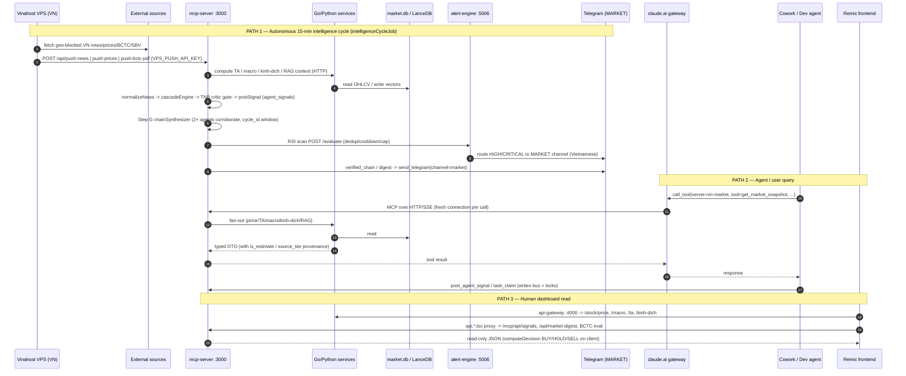
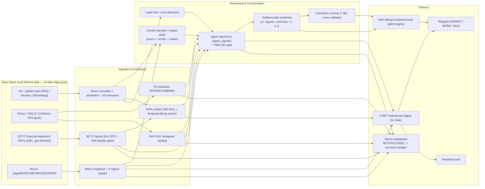

# Codebase Knowledge — VN Market Intelligence MCP

> Master knowledge document for the `VN-Market-Intelligence-MCP` monorepo. Self-contained: a reader with no repo access can understand the whole system from this file. Per-zone deep dives live under [`codebase-analysis-docs/sections/`](sections/); standalone diagram sources under [`codebase-analysis-docs/assets/`](assets/).
>
> All file paths are relative to the repository root. Volatile counts (tool count, cron count) are taken from `docs/data/project-stats.json` at the time of writing — see [§8 Assumptions](#8-assumptions--open-questions) for drift caveats.

---

## 1. High-Level Overview

**What it is.** A real-time **Vietnamese stock-market intelligence platform** that turns raw inputs — live news, prices, macro series, SSC filings, and Vietnamese financial-statement PDFs (BCTC) — into deduplicated, confidence-scored, **multi-agent-corroborated trading signals**, and pushes the high-conviction ones to **Telegram in plain Vietnamese**. It also serves a read-only **Remix dashboard** with per-stock BUY/HOLD/SELL synthesis and a distinctive **Kinh Dịch (I-Ching) hexagram** overlay.

**Domain & users.** Single-user, single-operator system for one **non-technical retail investor based in France** tracking a ~30-ticker / 10-sector Vietnamese watchlist (the market is GMT+7; the operator is GMT+1/+2). Because the operator runs from France, most Vietnamese sources are **geo-blocked** — so a Vietnam-resident **VPS proxy** is load-bearing, not optional.

**Core value.** The **verified-chain / critic-gate pipeline**: a signal escalates to the user only when **2+ independent analysis agents corroborate the same ticker within one 15-minute window**, gated by a deterministic quality critic (the "TNB" methodology critic) and a data-freshness SLA monitor. A standing project goal is **no fake data** — every served metric is real fetched data with per-field provenance (`is_estimate` / `source_tier`); non-empty is the floor, plausibility is still required.

**Tech-stack summary.**

| Layer | Technology |
|---|---|
| MCP core + news + TA/macro reference | TypeScript on **Bun** runtime (`bun:sqlite`, `@modelcontextprotocol/sdk` pinned `1.29.0`, `zod`) |
| Edge & compute microservices | **Go 1.22** (api-gateway, stock-price, technical-analysis, macro-indicators, kinh-dich-service, alert-engine) — stdlib `net/http` + `go-chi`; CGO only where SQLite is opened |
| OCR / embeddings | **Python 3.11/3.12** FastAPI (pdf-extractor: Tesseract + PaddleOCR + PDF-Extract-Kit; rag-service: sentence-transformers + LanceDB) |
| Frontend | **Remix v2 / React 18 / Tailwind / shadcn-Radix** (server-rendered, read-only) |
| Storage | **SQLite** (WAL, Docker named volume) + **LanceDB** (384-dim vectors) |
| Orchestration | **Markdown-as-program** agent flows interpreted by Claude (Claude Code CLI Dev Team + Claude Cowork cloud Cowork Team), coordinated via cron + signal files + git on `main` + Telegram |
| Delivery / infra | Docker Compose (11 services), Cloudflare tunnel → `zenmidi.com`, Vinahost VPS geo-block proxy, Telegram Bot API (3 channels) |

**Architecture type.** A **multi-service Docker monorepo** (pnpm workspace; `apps/*` services + `packages/*` shared libs) fronted by an **MCP gateway** (the `claude.ai gateway` `call_tool` wrapper), driven by a **multi-agent orchestration OS** (the "two-team" agent control plane documented under `docs/` + `.claude/`). DDD layering (`domain ← application ← interface ← scheduler`, inward-only) is enforced per service by lint import fences.

---

## 2. System Architecture

### 2.1 Component diagram

Diagram source: [`assets/system-architecture.mmd`](assets/system-architecture.mmd).

```mermaid
graph TB
    subgraph clients["Clients / Control Plane"]
        USER["User (investor in France)<br/>Telegram + Claude Desktop"]
        COWORK["Cowork Team agents<br/>(Claude Cowork cloud, cron)<br/>CHEF / news-scout / market-watcher /<br/>alert-commander / digest-predict / ..."]
        DEVTEAM["Dev Team agents<br/>(Claude Code CLI, hourly cron)<br/>PO -> BA -> Architect -> PM -> Dev -> QA -> Fixer"]
    end

    GATEWAY["claude.ai MCP gateway<br/>call_tool wrapper<br/>(vn-market NOT in .mcp.json)"]

    subgraph edge["Public Edge (zenmidi.com)"]
        CF["Cloudflare tunnel<br/>/vn-market/* + /webhook"]
        NGINX["nginx + self-signed TLS<br/>(not a compose service)"]
    end

    subgraph docker["Docker Fleet (11 services, 8GB cap, France host)"]
        MCP["mcp-server :3000<br/>TS/Bun — MCP core + ~164 tools<br/>scheduler, signal bus, VPS ingest"]
        APIGW["api-gateway :4000<br/>Go — reverse proxy + health"]
        FE["frontend :3001<br/>Remix — read-only dashboard"]
        STOCK["stock-price :5000 (5010)<br/>Go CGO — 3-tier price waterfall"]
        TA["technical-analysis :5003<br/>Go — RSI/MACD/BB/MA"]
        MACRO["macro-indicators :5004<br/>Go — macro regime + VN series"]
        KD["kinh-dich-service :5005<br/>Go — 64-hexagram readings"]
        ALERT["alert-engine :5006<br/>Go CGO — dedup/cooldown/route"]
        PDF["pdf-extractor :5001<br/>Python — BCTC OCR/layout"]
        RAG["rag-service :5002<br/>Python — embeddings + LanceDB"]
        NEWS["news-fetch :5008<br/>TS/Bun — Reuters/Bloomberg scrape"]
        FLARE["flaresolverr :8191<br/>Cloudflare JS-challenge solver"]
    end

    subgraph storage["Shared Data Plane (named volume market_data -> /app/data)"]
        MARKETDB[("market.db<br/>SQLite WAL — OHLCV, signals,<br/>watchlist, alerts, BCTC, macro")]
        COORDDB[("coordination.db<br/>task_locks cross-session")]
        LANCE[("LanceDB rag_entries<br/>384-dim vectors")]
        OTHERDB[("alert_engine.db / stock_price.db /<br/>pdf_extractor.db / rag_service.db")]
        ORCH[("docs/data/orch/orch-state.json<br/>kanban + signal_queue + .head")]
    end

    VPS["Vinahost VPS (Vietnam) 125.212.251.27<br/>:8765 app proxy (X-API-Key)<br/>:3128 tinyproxy CONNECT<br/>9 systemd fetchers"]
    TG["Telegram Bot API<br/>MARKET / WORK / BUG channels"]
    EXT["External sources<br/>VnDirect, Yahoo, FRED, SSC,<br/>HOSE/HNX, RSS, Polymarket, SBV"]

    USER --> CF
    USER -->|asks| GATEWAY
    COWORK --> GATEWAY
    DEVTEAM --> GATEWAY
    GATEWAY --> MCP

    CF --> NGINX
    NGINX -->|/vn-market/*| MCP
    NGINX -->|/gateway/*| APIGW
    CF -->|/webhook| MCP

    FE -->|all backend calls| APIGW
    FE -->|BCTC eval direct| MCP
    APIGW -->|reverse proxy + health| MCP
    APIGW --> STOCK
    APIGW --> TA
    APIGW --> MACRO
    APIGW --> KD
    APIGW --> ALERT
    APIGW --> PDF
    APIGW --> RAG
    APIGW --> NEWS

    MCP -->|HTTP| STOCK
    MCP -->|HTTP| TA
    MCP -->|HTTP| MACRO
    MCP -->|HTTP| KD
    MCP -->|HTTP| ALERT
    MCP -->|HTTP| PDF
    MCP -->|HTTP| RAG
    MCP -->|HTTP /fetch-article| NEWS
    KD -->|price history via gateway| APIGW
    MCP -->|RSI scan POST /evaluate| ALERT

    MCP --> MARKETDB
    MCP --> COORDDB
    MCP --> ORCH
    STOCK -->|RO read / write cache| MARKETDB
    TA -->|RO read| MARKETDB
    MACRO -->|RO read| MARKETDB
    KD -->|RO read| MARKETDB
    ALERT --> OTHERDB
    PDF -->|RO read| MARKETDB
    PDF --> OTHERDB
    RAG --> LANCE
    RAG --> OTHERDB
    NEWS -->|RO read| MARKETDB

    VPS -->|POST /api/push-*| MCP
    MCP -->|pull queue :8765| VPS
    MACRO -->|geo-block proxy :3128| VPS
    VPS --> EXT
    MCP -->|live commodity/FX/FRED| EXT
    STOCK -->|VnDirect finfo| EXT

    MCP -->|send_telegram| TG
    ALERT -->|sendMessage| TG
    TG -->|webhook replies| MCP
    NEWS --> FLARE
```

### 2.2 Data-flow narrative

There are three intersecting flows (sequence source: [`assets/data-flow.mmd`](assets/data-flow.mmd)):

1. **Autonomous intelligence cycle (the heartbeat).** Every 15 minutes the `mcp-server` scheduler runs `intelligenceCycleJob` (`apps/mcp-server/src/scheduler/news-analysis/intelligenceCycleJob.ts`). Real Vietnamese data is **pushed in from the Vinahost VPS** (`POST /api/push-news|push-prices|push-bctc-pdf|push-sbv-rates|push-foreign-flow`, authed by `VPS_PUSH_API_KEY`) because the France host is geo-blocked. The cycle normalizes news → runs the causal cascade engine → applies the TNB critic gate → writes findings to the `agent_signals` bus → Step G synthesizes a **verified chain** when 2+ agents corroborate the same ticker in the same `cycle_id` window. RSI scans POST to `alert-engine` for dedup/cooldown/routing; HIGH/CRITICAL alerts and verified chains go to the **Telegram MARKET channel in Vietnamese**.

2. **Agent / user query.** Cowork and Dev agents (and the user via Claude Desktop) never call the MCP server directly — they go through the **`claude.ai gateway` `call_tool` wrapper** (`mcp__claude_ai_gateway__call_tool(server="vn-market", tool=...)`). The gateway dials a fresh SSE/HTTP connection per call into `mcp-server`, which fans out to the Go/Python services and reads `market.db` / LanceDB, returning typed DTOs stamped with provenance (`is_estimate`, `source_tier`). Agents post findings back via `post_agent_signal` and claim exclusive work via `task_claim`.

3. **Human dashboard read.** The Remix `frontend` is presentation-only: every backend call goes through `api-gateway :4000` (`app/lib/api/client.ts`), except BCTC financial-statement eval which talks directly to `mcp-server` (`bctc-eval-client.ts`). `~29` `api.*.tsx` resource routes act as transparent server-side proxies so the browser only ever talks to the frontend origin. The per-stock `computeDecision()` engine fuses TA, RSI, Kinh Dịch and price delta into a BUY/HOLD/SELL label on the client.

### 2.3 Deployment topology (from `docker-compose.yml`)

11 containers + 3 named volumes on a single 16 GB Mac (Docker capped ~8 GB). Ports below are container ports; `(host)` shows host remaps.

| Service | Host:Container ports | Mem limit | CPU limit | Notes |
|---|---|---|---|---|
| `mcp-server` | `3000:3000`, `4004:3000` | 2 g | 2.0 | Writes `market.db`; mounts `mcp.config.json:ro`, `docs/data`, `docs/signals`, SSH key `:ro` |
| `api-gateway` | `4000:4000` | 512 m | 0.75 | `NOT_DEPLOYED_SERVICES` env SSOT; mounts `system-map.json:ro` |
| `frontend` | `3001:3001` | 512 m | 0.75 | `depends_on: api-gateway`; `API_GATEWAY_URL`, `MCP_SERVER_BASE_URL` |
| `stock-price` | `5010:5000` | 512 m | 0.75 | CGO SQLite; `STOCK_PRICE_DB_PATH`; reads `market.db` RO |
| `technical-analysis` | `5003:5003` | 512 m | 0.75 | `DB_READONLY=true` |
| `macro-indicators` | `5004:5004` | 1.5 g | 0.5 | `VPS_HTTP_HOST/PORT=…:3128` (tinyproxy); `COMMODITY_LIVE_MODE=true` |
| `kinh-dich-service` | `5005:5005` | 512 m | 0.75 | `PRICE_HISTORY_URL=http://api-gateway:4000`; `DB_READONLY` |
| `alert-engine` | `5006:5006` | 512 m | 0.75 | `ALERT_ENGINE_DB_PATH`; CGO SQLite |
| `pdf-extractor` | `5001:5001` | 2.5 g | **2.0** | `cpus:2.0` deliberate so Tesseract can't starve uvicorn (ARCH-A20); `pek_model_cache`, `bctc-page-images` volumes |
| `rag-service` | `5002:5002` | 768 m | 1.0 | Model baked offline into image; `LANCEDB_PATH` on `market_data` |
| `news-fetch` | `5008:5008` | 1 g | 0.75 | `market_data:/app/data:ro`; mounts `mcp.config.json:ro` (SSRF allowlist) |
| `flaresolverr` | `8191:8191` | 512 m | 0.5 | Cloudflare JS-challenge solver |

**Named volumes:** `market_data` (the SSOT data plane — `market.db`, `coordination.db`, LanceDB, plus the isolated `*_extractor.db`/`*_service.db`/`stock_price.db`/`alert_engine.db`), `pek_model_cache` (OCR/YOLO/Paddle weights), `bctc-page-images` (rasterized BCTC PNGs). `docker-compose.dev.yml` is a **merge-only override** that changes only `mcp-server` (port `3099`, `APP_ENV=dev`, `market.dev.db`); **dev and prod must never run simultaneously** on the 16 GB host.

> The `frontend` runs in compose but `nginx.conf` and the Cloudflare tunnel are the public edge; **nginx is NOT a compose service** — production routes the Cloudflare tunnel straight to `mcp-server:3000`. The README/`docs/ARCHITECTURE.md` describe "10 services" / "9 microservices" from earlier phases; the live `docker-compose.yml` has the 11 services + 1 challenge-solver above.

### 2.4 Cross-cutting concerns

- **Storage is a Docker named volume, not host `./data`.** The live `market.db` is inside the `market_data` volume mounted at `/app/data`. Host `./data/market.db` (and `apps/mcp-server/data/`, `infrastructure/db/vn-market.db`) are **stale 0-row decoys**. Verify live data with a `keinos/sqlite3` / `bun:sqlite` sidecar `COUNT`, never the host file.
- **Single-writer per DB.** `market.db` is written only by `mcp-server` (TA/macro/kinh-dich/news-fetch read it `:ro`); LanceDB has a single writer (`rag-service`); `alert_engine.db`, `stock_price.db`, `pdf_extractor.db`, `rag_service.db` are owned exclusively by their service. `coordination.db` serializes cross-session locks.
- **VPS geo-block proxy.** Two distinct proxies on the Vinahost VPS (`125.212.251.27`): the **`:8765` app proxy** (X-API-Key, spawns Python scrapers for SSC iboard/insider, muasamcong, BCTC discover/serve, article bodies) and **`:3128` tinyproxy** (HTTP CONNECT, used by `macro-indicators` for NSO/SBV-BOP/Customs). Do not conflate them. The MCP side **only observes DB staleness**; it never SSHes the VPS at runtime.
- **Telegram, three channels.** MARKET (user-facing, Vietnamese; alerts/digests/replies), WORK (dev/analysis status), BUG (analysis→dev bug reports). Every `send_telegram` call must name the channel explicitly. The token is never logged.
- **No-auth single-user model.** No login/multi-tenant surface; the only auth is the `VPS_PUSH_API_KEY` on `/api/push-*` and the Cloudflare edge. The Remix dashboard is read-only and owns no DB.
- **No-fake-data discipline (standing goal).** Every served metric carries provenance; degraded fetches return honest `is_estimate=true` / `degraded-200` rather than fabricated values. This invariant shows up across zones (price tier classifier, macro per-field liveness, BCTC accounting-identity quarantine, RAG dedup distance fail-safe).
- **Logging / caching.** Per-service structured logging (`log/slog` in Go, custom logger in TS/Python). Caching is mostly in-DB or short-TTL in-process (capability prober 60 s TTL, NSO Excel 6 h `macro_vmt_cache`, RAG lazy FTS index). No external cache/queue infra — SQLite + files are the substrate.

---

## 3. Subsystems / Zones

Eleven analysis zones. Each links to its full section file.

### MCP Server — Core Domain & Application Logic — [`sections/mcp-core-logic.md`](sections/mcp-core-logic.md)
The orchestration brain. Runs the 15-minute intelligence cycle, the agent signal bus, the TNB critic gate, verified-chain synthesis, the causal cascade engine, conviction scoring, the data-freshness SLA monitor, and the ask-queue dispatcher. This is where raw inputs become corroborated, confidence-scored signals.
Key files: `apps/mcp-server/src/scheduler/news-analysis/intelligenceCycleJob.ts`, `src/infrastructure/db/agentSignalStore.ts`, `src/domain/services/chainSynthesizer.ts`, `tnbCriticScorer.ts`, `convictionScorer.ts`, `cascadeEngine.ts`, `src/scheduler/system/freshnessSlaMonitorJob.ts`, `src/composition-root.ts`.

### MCP Server — Tool Interface & Infrastructure — [`sections/mcp-interface-infra.md`](sections/mcp-interface-infra.md)
The single front door: ~164 MCP tools over HTTP/SSE behind the gateway, the named-volume SQLite, the VPS ingest surface (`/api/push-*`), cross-session coordination locks (`coordination.db`), ~40 external fetchers, the cron scheduler, and the three-channel Telegram notifier.
Key files: `src/interface/mcp/server.ts`, `transport.ts`, `tools/registry.ts`, `bootstrap/agentBootstrap.ts`, `tools/system/coordinationTools.ts`, `infrastructure/db/schema.ts`, `coordinationStore.ts`, `notifiers/telegram.ts`, `microservices/clients.ts`, `fetchers/vnstockBridge.ts`, `scheduler/cronConfig.ts`, `routes/pushPricesHandler.ts`.

### Go Services — API Gateway & Stock Price — [`sections/go-price-plane.md`](sections/go-price-plane.md)
The Go edge. `api-gateway` (:4000) is the single public ingress: reverse-proxies `/:service/*` to 9 services, aggregates health, and reroutes not-deployed services through `mcp-server` instead of 502ing. `stock-price` (:5000) runs a 3-tier price waterfall (live VnDirect today → legacy VnDirect → SQLite cache) with FRESH/STALE/EXPIRED + `isEstimate` honesty labels.
Key files: `apps/api-gateway/pkg/interface/http/handlers.go`, `pkg/infrastructure/registry.go`, `pkg/domain/services.go`, `pkg/infrastructure/capability_prober.go`, `apps/stock-price/pkg/module/price_resolution/price_resolution.go`, `pkg/infrastructure/fetchers.go`, `pkg/primitive/price-staleness-classifier/classifier.go`.

### Go Services — Technical Analysis & Macro Indicators — [`sections/go-analytics-plane.md`](sections/go-analytics-plane.md)
The quantitative compute plane. `technical-analysis` (:5003) computes Wilder RSI / MACD / Bollinger / SMA-EMA / MA(5/20/50) from daily candles. `macro-indicators` (:5004) computes the macro regime (oil/gold/USDVND direction, carry-trade regime, yield spread, investment clock) plus live VN series (SBV rates/OMO, NSO IIP/CPI/trade-balance, SBV BOP), all under a strict per-field `is_estimate`/`source_tier` contract with fail-closed degrade paths.
Key files: `apps/technical-analysis/pkg/module/technical_analysis.go`, `pkg/primitive/rsi/rsi.go`, `apps/macro-indicators/cmd/server/main.go`, `pkg/application/usecases.go`, `usecases_vmt_liquidity.go`, `pkg/infrastructure/vpsFetch.go`, `cache_vmt_nso.go`, `pkg/domain/ports.go`.

### Go Services — Kinh Dich & Alert Engine — [`sections/go-signal-plane.md`](sections/go-signal-plane.md)
The server-speed signal plane. `kinh-dich-service` (:5005) maps a stock's recent 6-period momentum onto one of 64 I-Ching hexagrams → Vietnamese trading signal/trend/confidence/prose. `alert-engine` (:5006) is the fast side of the alert split: fingerprint dedup, cooldown, per-stock daily cap, mute list, then routes survivors to the right Telegram channel.
Key files: `apps/kinh-dich-service/pkg/module/reading_composer/reading_composer.go`, `hexagram_data.go`, `pkg/primitive/hao_encoder/hao_encoder.go`, `apps/alert-engine/pkg/application/evaluate.go`, `pkg/primitive/dedup-key-builder/builder.go`, `cooldown-gate/gate.go`, `signal-classifier/classifier.go`, `pkg/infrastructure/sqlite.go`.

### Frontend — Remix Dashboard — [`sections/frontend.md`](sections/frontend.md)
The single human-facing surface. Server-rendered Remix dashboard rendering per-stock BUY/HOLD/SELL synthesis (Kinh Dịch + macro + TA + agent signals with accuracy badges), the CHEF Vietnamese digest, the 30-ticker watchlist, and system/ops surfaces — all in plain Vietnamese. Read-only and presentation-only by contract; owns no DB.
Key files: `apps/frontend/app/lib/api/client.ts`, `bctc-eval-client.ts`, `app/domain/market.ts`, `app/routes/dashboard.analysis.tsx`, `app/components/QueName.tsx`, `app/lib/que-descriptions.generated.ts`, `app/components/charts/StockChart.tsx`, `app/components/TopNav.tsx`, `app/domain/health-compose.ts`.

### PDF Extractor — BCTC / OCR Pipeline — [`sections/pdf-bctc.md`](sections/pdf-bctc.md)
On-host extraction engine (:5001) converting Vietnamese financial-statement PDFs (often scanned, image-only) into machine-readable table rows. Layout-first, geometry-driven pipeline respecting multi-page B01-DN balance-sheet structure, with VAS accounting-identity gates that quarantine bad extractions instead of feeding fake numbers downstream. It is the OCR+layout+parse+push stage — discovery/download is the VPS PULL pipeline run by `mcp-server`.
Key files: `apps/pdf-extractor/main.py`, `interface/handlers.py`, `application/extract_layout_first_usecase.py`, `infrastructure/pek_engine_adapter.py`, `generic_md_table_extractor.py`, `ocr_adapter.py`, `domain/primitives/layout_invariants/primitive.py`, `infrastructure/layout_first_push_client.py`.

### RAG Service — Embeddings & Semantic Search — [`sections/rag-embeddings.md`](sections/rag-embeddings.md)
Internal FastAPI microservice (:5002) acting as the platform's semantic long-term memory: embeds every analyzed news article, BCTC extraction, macro note, and filing into 384-dim LanceDB vectors, then serves recency-weighted semantic search (exponential 7-day temporal decay) plus hybrid BM25+vector search so agents retrieve the most relevant AND recent precedents.
Key files: `apps/rag-service/main.py`, `app_factory.py`, `interface/handlers.py`, `application/usecases.py`, `domain/services.py`, `domain/primitive/temporal_decay_scorer/temporal_decay_scorer.py`, `infrastructure/repositories.py` (`LanceDBVectorStore`), `infrastructure/embedder.py`.

### News Fetch — News & Sentiment Pipeline — [`sections/news-pipeline.md`](sections/news-pipeline.md)
Ingests live VN + international news, normalizes each headline into a scored `AnalysisEntry` (sentiment, impact, affected sectors/stocks), traces causal cascade chains, detects legal/crisis/policy/insider signals, and persists to SQLite + LanceDB. **Most of the pipeline lives in `apps/mcp-server`** (all sentiment/cascade/legal logic + 12 MCP tools); the `apps/news-fetch` microservice is only Reuters/Bloomberg scraping + Playwright deep-fetch.
Key files: `apps/news-fetch/composition-root.ts`, `src/routes/fetchArticle.ts`, `apps/mcp-server/src/application/usecases/pollNews.ts`, `src/domain/services/newsNormalizer.ts`, `cascadeEngine.ts`, `legalRiskDetector.ts`, `crisisPatternDetector.ts`, `vnRelevanceFilter.ts`, `src/scheduler/news-analysis/deepFetchMainJob.ts`.

### Shared Packages & Deployment Infrastructure — [`sections/shared-and-infra.md`](sections/shared-and-infra.md)
The plumbing that lets the platform physically fetch real Vietnamese data from France: shared TS libs (`shared-config` is the only one with live consumers; `shared-db`/`shared-types`/`primitives` are Phase-0 stubs), the Docker Compose fleet, the nginx+TLS+Cloudflare edge, the Vinahost VPS proxy (`:8765` + `:3128`), macOS launchd watchdogs, and deploy/verify scripts (`verify-deploy-sha.sh`, `preflight-disk.sh`, pre-push tsc hook).
Key files: `docker-compose.yml`, `docker-compose.dev.yml`, `mcp.config.json`, `packages/shared-config/index.ts`, `nginx.conf`, `vps-scripts/vps-proxy-server.js`, `vps-scripts/vps-lib.sh`, `scripts/verify-deploy-sha.sh`, `scripts/git-hooks/pre-push`, `scripts/deploy-vinahost.sh`, `.mcp.json`.

### Multi-Agent Orchestration OS (`docs/` + `.claude/`) — [`sections/agent-os-docs.md`](sections/agent-os-docs.md)
The autonomous-agent control plane: the two-team roster (Dev Team + Cowork Team), a dispatch constitution mapping every intent/cron tick to one agent, a resumable state-machine SSOT (`orch-state.json`: kanban task board + sprint vision + signal-queue inbox + `.head` routing pointer), and a cron+signal coordination layer so a stateless LLM fleet can self-heal, self-improve, and self-publish around the clock.
Key files: `.claude/skills/dispatch/SKILL.md`, `docs/data/orch/orch-state.json`, `docs/data/system-map.json`, `docs/protocols/agent-chaining-protocol.md`, `docs/standards/task-schema.md`, `.claude/skills/signal-dashboard/SKILL.md`, `.claude/skills/commit-mutex/SKILL.md`, `docs/agents/dev-team/flow/main.md`, `docs/agents/cowork-team/flow/main.md`, `docs/agents/system-auditor/flow/main.md`.

---

## 4. Feature → Business-Purpose Map & Cross-Feature Interactions

### 4.1 Feature table

| Feature | Zone | Business goal |
|---|---|---|
| 15-minute intelligence cycle | mcp-core | Platform heartbeat: poll news/prices/macro, compute Kinh Dịch, fire alerts, synthesize chains every 15 min (reduced off-hours) |
| Agent signal bus | mcp-core / interface | Shared SQLite blackboard so independent agents corroborate signals instead of trusting any single one |
| TNB critic gate | mcp-core | Kill low-quality signals before the bus via 5 deterministic methodology checks (fail-soft on timeout) |
| Verified-chain synthesis | mcp-core | Escalate a ticker only when 2+ agents corroborate it in one window with conviction ≥ 0.7 |
| Causal cascade / impact chain | mcp-core / news | Trace a macro/news event down to which watchlist stocks move and by how much |
| Conviction scoring | mcp-core | Cross-validate up to 7 signal dimensions into one conviction score + Vietnamese level label |
| Data-freshness SLA monitor | mcp-core | Watchdog guaranteeing served metrics are real and current; escalates stale data (off-hours-aware) |
| MCP tool exposure (~164 tools) | mcp-interface | One well-described callable per capability, narrowed per agent skill |
| Cross-session coordination locks | mcp-interface | Prevent two Claude sessions doing the same exclusive work (cowork slots, task rows, commit-mutex) |
| VPS data ingest (`/api/push-*`) | mcp-interface | The authoritative real-data entry point for geo-blocked VN market/financial data |
| BCTC inspector + human-confirm | mcp-interface / pdf | Human-in-the-loop QA over machine-extracted Vietnamese financial statements |
| Three-channel Telegram fan-out | mcp-interface | Deliver market intel (VN), dev status, and bug reports to the right audience |
| Reverse-proxy routing + not-deployed reroute | go-price | One stable `:4000` surface; graceful degradation instead of 502 |
| 3-tier price resolution | go-price | Always return a price with honest provenance; cache hits never sold as live prints |
| TA indicators | go-analytics | Overbought/oversold/trend/breakout signals behind every report and alert |
| Macro snapshot + 6 regime signals | go-analytics | Single top-down regime read framing every bottom-up stock call |
| Liquidity state + VN NSO/BOP series | go-analytics | Is-liquidity-tight read + official hard-data backbone (IIP/CPI/trade/BOP) |
| Stock/market hexagram reading | go-signal | Approachable I-Ching overlay → MUA/BÁN/GIỮ/CHỜ/THẬN TRỌNG for non-technical users |
| Alert dedup/cooldown/route | go-signal | Anti-spam fast path; route critical/high → MARKET, medium/low → WORK |
| Per-stock analysis & decision | frontend | One-screen BUY/HOLD/SELL synthesis (`computeDecision`) fusing all signal sources |
| Agent signals + accuracy badges | frontend | Show why a stock was flagged and how reliable each signal type has historically been |
| Layout-first BCTC extraction + VAS gates | pdf | Correctly extract multi-page B01-DN balance sheets; quarantine bad numbers |
| Semantic search + temporal decay | rag | Retrieve most-relevant AND most-recent past analyses as precedent |
| Hybrid BM25 + vector search | rag | Ticker-exact filing recall that pure vector search misses |
| Legal-risk & crisis detection | news | Detect prosecution/asset-freeze/recall/fraud patterns from Vietnamese text |
| Deep-fetch article body | news | Enrich headlines with full body via VPS → Playwright fallback for better RAG recall |
| Dispatch & intent routing | agent-os | Turn any request or cron tick into exactly one correct agent |
| Dev Team software pipeline | agent-os | Ship and fix the platform's own code autonomously on `main` with quality gates |
| Resumable state machine | agent-os | Make a stateless LLM fleet resumable after crash/compact via `.head` + kanban |
| CHEF scheduled analysis & publishing | agent-os | 3 guaranteed daily Vietnamese narrative "dishes" + FB posts + weekly calibration |
| Detect→plan→self-heal loop | agent-os | Promote persistent infra anomalies into repair tasks (PLAN-ONLY, no destructive ops) |

### 4.2 Feature interaction diagram

Diagram source: [`assets/feature-interaction.mmd`](assets/feature-interaction.mmd).

---

## 5. Things You Must Know Before Changing Code

These are the highest-value, cross-zone traps. Read the relevant section file's "gotchas" before touching any zone.

1. **The live DB is the Docker named volume `market_data` (`/app/data`), NOT host `./data/market.db`.** The host file is a stale 0-row decoy, as are `apps/mcp-server/data/` and `infrastructure/db/vn-market.db`. Always verify rows via a SQLite sidecar (`docker exec` / `keinos/sqlite3`). Two tools sharing the same `market.db` can still see different row counts (calendar-window vs row-window, `close>0` filters) — a "tool A agrees with tool B" gate must probe BOTH live.

2. **Reach every vn-market MCP tool ONLY through the gateway wrapper.** `vn-market` is intentionally absent from `.mcp.json` (`{"mcpServers":{}}`) to keep the tool surface small. Call `mcp__claude_ai_gateway__call_tool(server="vn-market", tool="<bare_name>", ...)`. Calling `mcp__vn-market__*` directly fails. Discover via `list_server_tools("vn-market")` / `search_tools`.

3. **No fake/hardcoded data on any served metric (standing goal).** `confidence_score` defaults to 50 but producers derive it honestly (conviction×100, SLA severity 90/70, queue depth×10); macro/price values carry `is_estimate`/`source_tier`; degraded fetches return `degraded-200` not fabricated bodies; BCTC bad extractions are `quarantined`, not dropped silently. **Non-empty is the floor — plausibility (magnitudes, monthly ≤ YTD, plausible bands) is still required** before `done_verified`.

4. **The signal-queue / task-board state machine is the fleet's memory.** `docs/data/orch/orch-state.json` (~1.4 MB) holds `.head` (pipeline routing), `.task_board` (kanban+sprints), `.signal_queue` (inbox). **Never `Read` it whole** (~233 K tokens = 23 % of a 1 M context) — use `jq -c '.<section>'`. Writes are atomic temp→rename of a single section with an mtime-CAS guard; bare temp→rename silently drops a concurrent writer at `:00`/`4h` collision points.

5. **Cross-session locks are real OS-process coordination.** `coordination.db` `task_locks` are claimed via `task_claim`; `owner_session` is always server-injected (pid+startMs), never caller-supplied. After an `mcp-server` restart, locks must match on `owner_agent` or they zombie; DB-open failure → refuse-all mode (never throws). The fleet-wide git critical section is `commit-mutex:main` (TTL ~60-90 s) and is dispatcher-only.

6. **Go import fences (Fence-A/B/C) are load-bearing — and NO-CGO vs CGO is deliberate.** Primitives are stdlib-only pure compute; modules import only primitives; **only `cmd/server/main.go` imports infrastructure/SQLite/CGO.** Sandbox binaries must build `CGO_ENABLED=0`. `system-map.json` labels for kinh-dich/TA say `go1.22+cgo` but those services build **CGO-disabled** with no SQLite driver (their SQLite adapters are stubs) — only `stock-price` and `alert-engine` actually link CGO SQLite. Primitives must stay deterministic (no `time.Now()`/RNG; inject `now`/`computedAt`).

7. **The MCP SDK and Bun runtime have a known JIT trap.** `@modelcontextprotocol/sdk` is pinned at `1.29.0`; `/mcp` uses `WebStandardStreamableHTTPServerTransport` to avoid a Bun 1.3.13 JIT bug ("Cannot convert a symbol to a string") that surfaces after ~80 min. A restart clears the symptom but **not the cause** — `200/healthy` after a restart does not mean fixed; the pin stays in `package.json`.

8. **Tool count drifts across 3 SSOTs.** `project-stats.json` (`toolCount` 164), `tool-registry`, and `system-map.json` disagree after dev waves, as do the `#`-comments in `registry.ts`. Trust the live boot-probe count logged by `createBunServer`; reconcile the SSOTs via the `dev-mcp-server` agent. Tool-name uniqueness is a hard boot gate (duplicate names throw at `McpServer` startup); keep `SKILL_MANIFEST` and `toolRegistry` in lockstep.

9. **VPS proxy is the only legal path to geo-blocked VN sources, and there are two of them.** `:8765` app proxy (X-API-Key) vs `:3128` tinyproxy CONNECT — don't conflate. TLS must stay verified (`InsecureSkipVerify=false`); NSO needs the GlobalSign intermediate via `VPS_CACERT_PATH`; never use `-k`. The MCP side observes DB staleness only; it never SSHes the VPS at runtime.

10. **Step A `pollNews` is a deliberate no-op in `mcp-server`.** Local fetchers are stubbed; real news arrives via the VPS push path. Re-enabling local fetchers re-launches Chromium per tick (caused a 1,227-runaway-alert regression). Off-hours empty fetches are **expected, not an outage** (suppressed within `VPS_NEWS_STALE_MS` ≈ 2 h).

11. **Chain synthesis only sees same-`cycle_id` findings.** `cycle_id` is a 15-min UTC-floored window (`YYYYMMDD-HHMM`). Agents posting in different windows never chain. `stock_code 'unknown'` must normalize to `NULL` or it pollutes chain grouping. `postSignal` returns `-1` on dedup suppression (not an error) — callers must treat `signalId<=0` as not-inserted.

12. **`alert-engine` and the `mcp-server` signal queue are two halves of one split, not a shared DB.** Server=speed (`alert-engine` dedup/cooldown/route) vs Commander=intelligence (`mcp-server` verified-chain). The djb2 fingerprint seed `5381` is a hard constant that must match the TS producer or dedup silently breaks; the fingerprint prefix is first 50 **runes** (not bytes — Vietnamese diacritics). RSI single-digit/candle-depth(35)/zero-price fail-closed guards live in the **producer** (`taAlertScanJob.ts`), not in alert-engine.

13. **`confidence_score` scale trap (frontend).** `agent_signals.confidence_score` is an int 0-100 (`toAgentSignal` divides by 100); Kinh Dịch confidence arrives 0.0-1.0. Mixing them gives 100×-wrong bars. The dashboard never lets a `capability` value rescue a DOWN service (anti-false-green renders RED).

14. **Frontend is gateway-only.** All backend calls go through `api-gateway :4000` via `app/lib/api/client.ts`; the single deliberate exception is `bctc-eval-client.ts` → `mcp-server :3000`. Never call microservice ports 5000-5008 directly. `que-descriptions*.generated.ts` are codegen — regenerate via `bun run gen:que`, never hand-edit. `QueName.tsx` is the only hexagram tooltip renderer.

15. **BCTC: `--psm 6` and the PEK import discipline are load-bearing.** Removing `config='--psm 6'` reverts Tesseract to psm 3 column segmentation → scrambled balance sheets (even with `balance_pass=true`). **Never import `pdf_extract_kit.tasks.*`** (eager `__init__` crashes); use `_PekLayoutModel` directly and add new imports to the Dockerfile smoke gate. `/page-text` returns `source_reachable:false` on DB error, never `text:''` — empty string means genuinely empty, and masking the broken-DB case makes the refine agent fabricate.

16. **RAG has DOUBLE recency weighting.** `rag-service` applies exponential decay (7-day half-life) AND `mcp-server`'s `recencyWeighter.ts` applies a second linear (90-day) decay with a different similarity formula — tuning one side alone produces surprising rankings. The live HTTP path uses `SearchUseCase`/`SearchService`, NOT `domain/module/retrieval/RetrievalModule` (a parallel reference/sandbox pipeline). Vector dim is hardcoded 384; changing the model needs a full table rebuild.

17. **Two implementations of "the news pipeline" exist; only one is deployed.** The TS/Bun `news-fetch` (Reuters/Bloomberg + Playwright) is live; the Go port (`apps/news-fetch/cmd/`, `internal/`) is NOT in `docker-compose.yml` — changing it affects nothing in production. Cascade `SECTOR_RULES` is first-match-wins per domain with VN policy-intervention rules placed FIRST; reordering silently flips verdicts. NFC normalization + HTML-entity decode are mandatory first steps or Vietnamese keyword matching silently breaks.

18. **The orchestration OS has hard invariants.** The main terminal is **router-only** (never implements, never spawns `general-purpose`/`claude` for dev intents; there is no `dev-team` or `orchestrator` agent *type*). **Never spawn the dev-team/cowork-team dispatcher *flows* as a sub-agent** (infinite recursion). `system-auditor` is **PLAN-ONLY** (`AUD-ND-1`: no `docker stop/kill/restart`, no `rm -rf` — a false-positive once destroyed live intraday data). Every agent `.md` must start with `---` frontmatter on line 1, and any agent/flow/skill edit must first invoke the `agent-md-factory` skill.

19. **Deploy hygiene prevents the "code changed but container not rebuilt" false-green.** `scripts/verify-deploy-sha.sh` asserts the running image's `vn.market.git_sha` label == HEAD. The pre-push hook must run `tsc` from `apps/mcp-server` (phantom-passes if run from root). A red tsc hook strands ALL fleet pushes. `preflight-disk.sh` blocks `up` under <15 GB Docker disk (cold-start hang RCA). Restart only via `docker-compose` — hot reload is forbidden.

20. **Errors are swallowed into counters in several places.** Every intelligence-cycle step swallows errors into a non-fatal `errors` counter — a "green" cycle with `errors>0` is not healthy. Go fetchers return `(nil,nil)` soft-miss (a Tier-1 bug is indistinguishable from "no row"); debug by checking the returned `Source`, not by expecting an error. `/health` is liveness only (not freshness) — judge data freshness by last-success age of pull/refine jobs.

---

## 6. Technical Reference

### 6.1 Services table

| Service | Language / runtime | Container port (host) | Responsibility | Key entry files |
|---|---|---|---|---|
| `mcp-server` | TypeScript / Bun | 3000 (3000, 4004) | MCP core: ~164 tools, 15-min cycle, signal bus, VPS ingest, scheduler, Telegram | `src/index.ts`, `src/composition-root.ts`, `src/interface/mcp/server.ts`, `src/scheduler/startScheduler.ts` |
| `api-gateway` | Go 1.22 (no third-party deps) | 4000 (4000) | Reverse proxy `/:service/*`, health aggregation, not-deployed reroute | `apps/api-gateway/cmd/server/main.go`, `pkg/interface/http/handlers.go` |
| `frontend` | TS / Remix v2 (React 18) | 3001 (3001) | Read-only Vietnamese dashboard; BUY/HOLD/SELL synthesis | `app/root.tsx`, `app/routes/dashboard.analysis.tsx`, `app/lib/api/client.ts` |
| `stock-price` | Go 1.22 (CGO SQLite) | 5000 (5010) | 3-tier price waterfall with FRESH/STALE/EXPIRED + `isEstimate` | `apps/stock-price/cmd/server/main.go`, `pkg/module/price_resolution/price_resolution.go` |
| `technical-analysis` | Go 1.22 (CGO-disabled) | 5003 (5003) | RSI/MACD/Bollinger/MA(5/20/50) from daily candles | `apps/technical-analysis/cmd/server/main.go`, `pkg/module/technical_analysis.go` |
| `macro-indicators` | Go 1.22 | 5004 (5004) | Macro regime + VN series (SBV/OMO, NSO IIP/CPI/trade, BOP, liquidity) | `apps/macro-indicators/cmd/server/main.go`, `pkg/application/usecases.go` |
| `kinh-dich-service` | Go 1.22 (CGO-disabled) | 5005 (5005) | 64-hexagram readings → VN trading signal/trend/confidence | `apps/kinh-dich-service/cmd/server/main.go`, `pkg/module/reading_composer/reading_composer.go` |
| `alert-engine` | Go 1.22 (CGO SQLite) | 5006 (5006) | Dedup/cooldown/daily-cap/mute + Telegram channel routing | `apps/alert-engine/cmd/server/main.go`, `pkg/application/evaluate.go` |
| `pdf-extractor` | Python 3.12 / FastAPI | 5001 (5001) | BCTC layout-first OCR (Tesseract/PaddleOCR/PEK) + VAS gates | `apps/pdf-extractor/main.py`, `application/extract_layout_first_usecase.py` |
| `rag-service` | Python 3.11 / FastAPI | 5002 (5002) | 384-dim embeddings + LanceDB semantic/hybrid search | `apps/rag-service/main.py`, `application/usecases.py` |
| `news-fetch` | TS / Bun (+ Playwright) | 5008 (5008) | Reuters/Bloomberg scrape + deep-fetch article bodies | `apps/news-fetch/src/index.ts`, `composition-root.ts`, `src/routes/fetchArticle.ts` |
| `flaresolverr` | (image) | 8191 (8191) | Cloudflare JS-challenge solver | `ghcr.io/flaresolverr/flaresolverr:latest` |

### 6.2 Storage / DB reference

All live data lives in the **`market_data` named volume → `/app/data`** (host `./data/*.db` are decoys).

| Store | Owner (writer) | Readers | Notable tables / contents |
|---|---|---|---|
| `market.db` (SQLite WAL) | `mcp-server` | TA, macro, kinh-dich, news-fetch (`:ro`); stock-price (RO) | `watchlist`, `market_prices`, `daily_ohlcv`, `financial_reports`, `bctc_*`, `agent_signals`, `alerts`, `rag_analyses`, `mention_velocity`, `macro_indicators`, `sbv_rates`, `commodity_prices`, `kinhdich_readings`, `prediction_claims`, `signal_outcomes`, `sla_breach_audit`, `cron_job_runs`, `vps_push_log` |
| `coordination.db` (SQLite) | `mcp-server` | — | `task_locks` (cross-session locks; server-injected `owner_session`) |
| LanceDB (`rag_entries`) | `rag-service` | `rag-service` | 16-col store: `id, level, title, summary, vector[384], tags, action_code, created_at` + 8 Phase-1 metadata cols (`ticker`/`sector`/`source_domain`/`depth_tier`/`doc_type`/`published_at`/`confidence`/`impact_score`); FTS on title+summary |
| `alert_engine.db` | `alert-engine` | — | `alert_engine_records`, `alert_mutes` |
| `stock_price.db` | `stock-price` | — | `market_prices_cache` (fire-and-forget) |
| `pdf_extractor.db` | `pdf-extractor` | — | `pdf_documents` (+ deprecated `/inspect` junk) |
| `rag_service.db` | `rag-service` (wired but off hot path) | — | lightweight metadata index (NOT in `create_app()`) |
| `docs/data/orch/orch-state.json` | `mcp-server` `orchStateStore` (atomic temp→rename) | all agents (jq) | `.head`, `.task_board`, `.sprint_goal`, `.signal_queue`, `.decision_journal`, `.narrative` |
| `docs/signals/*.json` + `signals.db` | cowork agents | dev-team (FIFO drain) | cowork→dev request bus, SQLite dedup fingerprint |
| Filesystem | `pdf-extractor` / `mcp-server` | — | `data/pdfs/` (input PDFs), `bctc-page-images` volume (page PNGs @150 DPI), `pek_model_cache` (model weights) |

**Schema management:** `mcp-server` schema grows via idempotent `initDatabase()` running 9 slice files (`schema-market-data.ts`, `schema-news.ts`, `schema-alerts.ts`, `schema-macro.ts`, `schema-financial-reports.ts`, `schema-portfolio.ts`, `schema-briefings.ts`, `schema-system.ts`) + guarded `try{ALTER TABLE}catch{}` migrations + ad-hoc data fixups **on every boot**. The canonical schema lives here; `packages/shared-db` is a stub registry (`DB_SCHEMA_MODULES`).

### 6.3 MCP tool-surface overview

~164 tools registered in `apps/mcp-server/src/interface/mcp/tools/registry.ts` (the SSOT array of `registerXxxTools` fns), organized into ~12 domain modules. Each agent sees a **skill-gated** subset (`agentBootstrap.getToolsForSkills` narrows the surface via `SKILL_MANIFEST` and always injects ~7 `ALWAYS_ON_TOOLS`). Representative tools by category:

| Category | Examples |
|---|---|
| Market data | `get_market_snapshot`, `compare_stocks`, `get_technical_indicators`, `get_sentiment_trend`, `get_foreign_flow` |
| Financial reports (BCTC) | `get_bctc_full`, `get_financial_summary`, `get_earnings_calendar`, `get_bctc_page_text`, `get_bctc_page_image`, `get_bctc_pending_refine` |
| News / analysis | `fetch_and_analyze`, `run_impact_chain`, `search_similar_context` |
| Agent signal bus | `post_agent_signal`, `get_agent_signals`, `get_open_chain_findings`, `record_signal_outcome`, `get_signal_effectiveness` |
| Coordination | `task_claim`, `heartbeat`, `release`, `list_held`, `force_release_orphan`, `get_week_period` |
| Macro | `get_macro_snapshot`, `get_policy_signals`, `get_liquidity_state`, `get_vn_trade_balance`, `get_vn_bop`, `get_cpi_components` |
| Notification / system | `send_telegram`, `get_system_status`, `get_data_freshness`, `get_source_health`, `get_pipeline_health`, `get_cron_health`, `get_vps_proxy_health`, `get_cycle_bootstrap` |

### 6.4 Internal & external API notes

**`mcp-server` HTTP surface** (beyond `/mcp` + `/sse`):
- `GET /health` — liveness (used by Docker healthcheck + gateway).
- `POST /mcp` — `WebStandardStreamableHTTPServerTransport` (Bun JIT workaround).
- `POST /webhook` — Telegram bot webhook (via Cloudflare tunnel `zenmidi.com/vn-market/webhook`).
- `POST /api/push-prices|push-foreign-flow|push-news|push-sbv-rates|push-bctc-pdf` — VPS ingest (require `VPS_PUSH_API_KEY`; error bodies suppressed by HOTFIX 1288c).
- `GET /api/bctc-fetch-queue` — VPS pulls pending BCTC items (target-quarter math boundary-sensitive: Jan–Apr → prev-year Q4).
- `POST /api/push-bctc-layout|md-tables|table` — pdf-extractor callbacks.
- `~25 GET /api/*` read DTO endpoints consumed by the frontend.

**Go service routes:** `api-gateway` `GET /health`, `/healthz`, `/health-dashboard`, catch-all `/:service/*` proxy + `/api/*` mcp-server alias. `stock-price` `POST /price/fetch`, `GET /price/history`. `technical-analysis` `POST /ta/indicators`. `macro-indicators` `POST /snapshot`, `GET /external`, `POST /liquidity-state|bop|cpi-components|trade-balance|macro-indicators`. `kinh-dich-service` `GET /reading/{code}`, `/market`, `/hexagram/{n}/explain`. `alert-engine` `POST /evaluate`.

**Python service routes:** `pdf-extractor` `POST /extract-layout-first|pek-extract|extract-tables|extract-md-tables`, `GET /page-text`, `POST /rasterize`. `rag-service` `POST /search|index`, `GET /health`, `/embed/health`, `POST /admin/rebuild-fts`.

**External integrations:** Telegram Bot API (3 channels + webhook); VnDirect finfo (prices); Yahoo Finance (commodity/FX); FRED (`EFFR`); SBV (rates/OMO/BOP); NSO (Excel via VPS); SSC `congbothongtin.ssc.gov.vn` (filings, via VPS); HOSE/HNX; CafeF/VnExpress/VnEconomy/Reuters/Bloomberg RSS; Polymarket; vnstock (VCI Python subprocess). All geo-blocked VN sources route through the Vinahost VPS.

---

## 7. Glossary

Merged from the zone glossaries and `docs/GLOSSARY_VI.md`.

### 7.1 Platform / architecture terms

| Term | Definition |
|---|---|
| **MCP gateway / `call_tool` wrapper** | `mcp__claude_ai_gateway__call_tool` — the sole path to the `vn-market` server's ~164 tools; `vn-market` is deliberately unregistered in `.mcp.json` |
| **named volume (`market_data`)** | Docker volume mounted at `/app/data` holding the live `market.db`, `coordination.db`, LanceDB — the authoritative data plane (host `./data/*.db` are stale decoys) |
| **VPS proxy (`:8765`)** | Node HTTP app proxy on the Vinahost VN VPS bypassing geo-blocks (SSC, BCTC, muasamcong, AGM, board, article-body) behind X-API-Key |
| **tinyproxy (`:3128`)** | Separate HTTP-CONNECT forward proxy on the VPS used by `macro-indicators` for NSO/SBV/Customs macro fetches |
| **Cloudflare tunnel / `zenmidi.com`** | Public edge exposing `mcp-server` + the Telegram webhook without opening the host firewall (path prefix `/vn-market`) |
| **`agent_signals` (bus)** | SQLite table acting as a TTL-bound inter-agent message blackboard; substrate for cross-agent corroboration |
| **`cycle_id`** | 15-min UTC-floored window id (`YYYYMMDD-HHMM`, minute 0/15/30/45) grouping findings for chain synthesis |
| **verified_chain** | Signal type posted by Step G synthesis when 2+ independent agents corroborate the same ticker in one window with conviction ≥ 0.7; sent to alert-commander |
| **TNB critic gate** | Deterministic 5-check (×0.2, threshold 0.6) quality scorer (Tran-Ngoc-Bau methodology) run before a signal write; fail-soft on timeout |
| **conviction** | 0–1 score for cross-agent/cross-dimension agreement; ≥0.8 → BUY/SELL, ≥0.6 → WATCH, else HOLD |
| **`confidence_score`** | 0–100 signal field (default 50); honestly derived from conviction×100 / SLA severity / queue depth (no-fake-data goal) |
| **`causal_root_id`** | Stable id linking all signals from one macro event so Alert Commander sends one Telegram per event |
| **impact / causal chain** | Traced path from a macro/news seed event to per-watchlist-stock impact scores via sector rules (`cascadeEngine.buildCausalChain`) |
| **freshness SLA** | Per-source data-age threshold; breach audited in `sla_breach_audit` and escalated unless off-hours for market-only sources |
| **3-tier price waterfall** | stock-price order: VnDirect today → VnDirect latest → read-only SQLite cache; first non-nil quote wins |
| **Tier3-cannot-be-FRESH** | A cache-tier win is forced to STALE minimum (FRESH requires a live-tier answer); drives `isEstimate` |
| **`is_estimate` / `source_tier`** | Per-field provenance flags enforcing the no-fake-data contract (tier 1 live-direct, tier 2 administered/published, tier 4 fixture) |
| **degraded-200** | HTTP 200 with `Status='degraded'` for upstream-fetch/parse gaps (honest, resumable); distinct from HTTP 500 (nil-provider/wiring fault) |
| **carry regime** | `carrySpread = VND deposit − Fed Funds`; >2.5pp HOT_MONEY_INFLOW, ≥0.5pp NEUTRAL, else FII_OUTFLOW_RISK; UNKNOWN on fixture input |
| **Fence-A/B/C** | DDD import-fence policy: A = primitives stdlib-only pure compute; B = modules import only primitives; C = only composition root touches infrastructure/CGO |
| **Alert split (Server=speed / Commander=intelligence)** | `alert-engine` does fast dedup/cooldown/route; `mcp-server` does slower verified-chain intelligence — two independent halves, not a shared DB |
| **djb2 / seed 5381** | Dedup fingerprint hash; seed 5381 must match the TS producer or dedup silently breaks |
| **BCTC** | Báo cáo tài chính — Vietnamese quarterly/annual financial statements (PDFs → `financial_reports` / `bctc_table_rows`) |
| **B01-DN / B01-TCTD** | Standard VAS balance-sheet form codes; B01-DN drives the Tier-3 accounting-identity + Mã-số whitelist gates |
| **Mã số** | The numeric line code (100/270/440…) in a VN balance sheet; used for monotonicity, whitelist, identity checks |
| **Layout-first (Tier 0-3)** | Document-structure-first BCTC extraction: group pages → zone columns (continuation pages inherit schema) → OCR into grid → invariant gate |
| **PEK** | PDF-Extract-Kit — vendored layout/table toolkit; only its DocLayout-YOLO + PaddleOCR paths are used (never `tasks.*`) |
| **`needs_vision_verify`** | Escalation-only marker when checksum/whitelist gates fail; triggers LLM vision read of the flagged page (never blanket vision) |
| **psm 6** | Tesseract page-segmentation "single uniform block"; mandatory for BCTC (psm 3 scrambles the three-block layout) |
| **Temporal decay** | RAG re-rank multiplying similarity by `0.5^(age/half_life)`; default half-life 7 days |
| **Hybrid search (DFR-P3)** | BM25 FTS + vector ANN fused with LanceDB `RRFReranker`; FTS index built lazily (first call ~30 s) |
| **`search_similar_context`** | MCP tool that calls rag-service `/search` (hybrid:true) for historical-precedent retrieval |
| **`orch-state.json` / `.head` / `signal_queue`** | ~1.4 MB state-machine SSOT: `.head` pipeline routing pointer, `.task_board` kanban, `.signal_queue` agent inbox |
| **`docs/signals/`** | One-file-per-signal cowork→dev request bus, deduped via `signals.db` fingerprints; drained FIFO by dev-team |
| **task_claim / commit-mutex** | Distributed locks in `coordination.db` (TTL+overwrite); `commit-mutex:main` serializes git add→commit→push, dispatcher-only |
| **AUD-ND-1 / DJ-GATE-1 / BGFAN-1** | Orchestration invariants: PLAN-ONLY auditor (no destructive ops); decision-journal-before-DONE; background-spawn mandate |
| **CHEF** | The unified-agent role producing 3 guaranteed daily Vietnamese "dishes" (Morning/EOD/Evening) via the TNB 6-layer methodology |
| **Dev Team / Cowork Team** | Local Claude Code CLI agents (ship/fix code) vs cloud Claude Cowork agents (scheduled analysis/publishing) |
| **system-map.json** | Structural SSOT (agents, microservices, channels, zones, data sources, watchlist) — queried with jq, never hardcoded |
| **VMT** | VN-MACRO-TOOLING sprint prefix tagging the VN-specific macro features (trade-balance, BOP, IIP, CPI, liquidity, fetch-deadline) |
| **FetchBudgetSec (8 s)** | SSOT outbound-fetch deadline sized below the ~15-20 s gateway timeout; the whole NSO 3-fetch chain shares one 8 s window |

### 7.2 Vietnamese financial / Kinh Dịch domain terms (`docs/GLOSSARY_VI.md`)

| Vietnamese | English |
|---|---|
| Báo cáo tài chính (BCTC) | Financial report |
| Bảng cân đối kế toán | Balance sheet |
| Báo cáo KQHĐKD | Income statement |
| Báo cáo lưu chuyển tiền | Cash flow statement |
| Doanh thu thuần | Net revenue |
| Lợi nhuận sau thuế (LNST) | Net profit after tax |
| Vốn chủ sở hữu | Equity |
| Quý (Q1–Q4) | Quarter |
| VN-Index | Vietnamese main stock index (HOSE) |
| MUA / BÁN / GIỮ / CHỜ / THẬN TRỌNG | Buy / Sell / Hold / Wait / Caution signal |
| Tăng / Giảm / Ổn định | Increase (bullish) / Decrease (bearish) / Stable (neutral) |
| Quẻ (chính) | Hexagram (primary, I-Ching / Kinh Dịch) |
| Hào | Line within a hexagram (6 per hexagram) |
| Lão Dương / Lão Âm | Moving/changing yang or yin line |
| Thiếu Dương / Thiếu Âm | Static yang or yin line |
| Hồ Quẻ | Nuclear hexagram (inner trigrams) |
| Biến Quẻ | Transformed hexagram (after line changes) |
| Ngũ Hành (Kim/Mộc/Thủy/Hỏa/Thổ) | Five Elements |
| Tương sinh / Tương khắc | Generative (productive) / Destructive (conflicting) cycle |

**BCTC number formatting:** values in **triệu đồng** (million VND) unless stated; negatives as `(1.234.567)`; thousands separator `.`, decimal separator `,`.

---

## 8. Assumptions & Open Questions

### 8.1 Assumptions

| Claim | Confidence | Basis |
|---|---|---|
| Tool count ≈ 164 | Medium | `docs/data/project-stats.json#toolCount=164`; known to drift across 3 SSOTs after dev waves — trust the live boot probe |
| Cron-job count ≈ 81 | Medium | `project-stats.json#cronJobCount=81` (generated, volatile) |
| 42 agents / 11 microservices / 3 channels / 34-ticker watchlist | High | `docs/data/system-map.json` live counts at time of writing |
| The live data plane is the `market_data` named volume, not host `./data` | High | Stated in `docker-compose.yml`, `docs/ARCHITECTURE.md`, and repeated across zone gotchas + memory |
| `nginx` is not a compose service; prod routes Cloudflare → `mcp-server:3000` directly | High | `nginx.conf` exists but is absent from `docker-compose.yml`; shared-infra section + memory confirm |
| Only `stock-price` and `alert-engine` link CGO SQLite; TA/kinh-dich build CGO-disabled with stub SQLite adapters | Medium | go-analytics/go-signal gotchas; `system-map.json` `go1.22+cgo` label is stale for those two |
| Step A `pollNews` in `mcp-server` is an intentional no-op; real news is the VPS push path | High | mcp-core + news-pipeline gotchas; tasks 1187/1228/1843 referenced |
| The Go `news-fetch` port and the `nginx`/`socat-bridge` plists are present but not deployed | High | Absent from `docker-compose.yml`; shared-infra + news gotchas |
| The README "10 services / Phase 3" topology lags the live 11-service compose | High | README/`docs/ARCHITECTURE.md` predate the `frontend`+`flaresolverr` additions visible in `docker-compose.yml` |
| `shared-db` / `shared-types` / `primitives` are Phase-0 stubs with no live importers | High | Stated in shared-infra section; only `shared-config` has consumers |

### 8.2 Open questions

- **Authoritative tool/cron counts.** Three SSOTs (`project-stats.json`, tool-registry, `system-map.json`) plus registry `#`-comments disagree. The only ground truth is the boot-probe count logged by `createBunServer` — not capturable from static files. A reconciliation pass via `dev-mcp-server` would settle it.
- **Watchlist size: 30 vs 33 vs 34.** Sources disagree (`system-map.json` lists 34; frontend `WATCHLIST_STOCKS` has 33 rows with `VEA active:false`; prose says "30 active"). Likely 34 configured / ~30 active — worth confirming against `mcp.config.json` `market.watchlist`.
- **`macro-indicators` build flags.** Compose/`system-map` label `go1.22+cgo` but the section reports the live build is CGO-disabled; the actual Dockerfile flag should be verified before any SQLite-driver change.
- **VPS service count.** Different docs cite "5", "7", "9" systemd fetcher services on Vinahost; the exact live count (and which are active vs investigate/blocked) should be read from `deploy-vinahost.sh` + `vps-status.sh` on the host.
- **`bctc-eval-client.ts` direct-to-mcp-server exception scope.** The frontend is gateway-only except for BCTC eval; whether any other route quietly bypasses the gateway is worth a fence audit.
- **RAG SQLite repo activation.** `SQLiteAnalysisRepository` is implemented/tested but NOT wired into `create_app()` and lacks the 8 Phase-1 metadata columns — is it dead code or a planned second index?

---

*Generated as the master synthesis of 11 per-zone analyses under [`sections/`](sections/). For any zone-level detail (full file lists, line-level invariants, complete gotcha lists), open the linked section file.*
