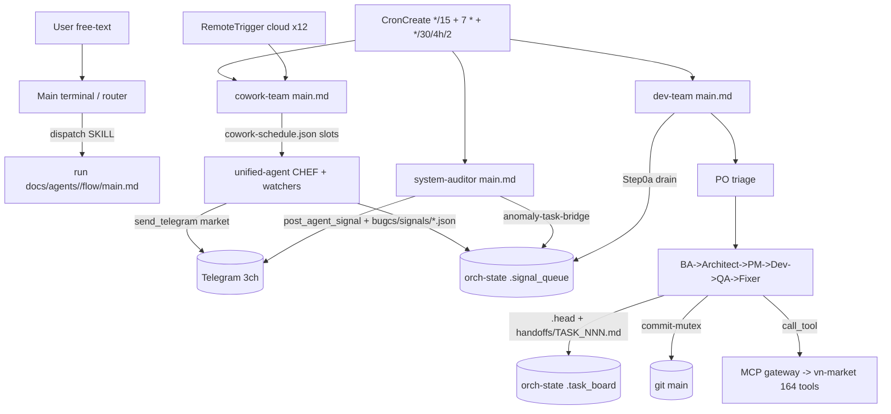

# Multi-Agent Orchestration OS (docs/ + .claude/)

> Zone id: `agent-os-docs` · Primary paths: `docs/agents/`, `docs/policies/`, `docs/protocols/`, `docs/standards/`, `docs/data/system-map.json`, `docs/data/orch/orch-state.json`, `docs/ARCHITECTURE.md`, `docs/AGENT_CREATION_GUIDE.md`, `.claude/agents/`, `.claude/skills/`, `.claude/commands/`

## Purpose & business need

This zone is the **operating system that runs the rest of the platform** — not the market-intelligence code itself (that lives in `apps/mcp-server/` and the 10 sibling microservices), but the autonomous-agent control plane that builds, fixes, monitors, and publishes from that code without a human in the loop.

The market-intelligence product is a 24/7 Vietnamese-stock pipeline (prices, foreign flow, BCTC financial reports, news, macro, Kinh Dịch signals → Telegram alerts in plain Vietnamese). It runs around the clock across time zones (the operator is in France, the market is GMT+7), so the human cannot babysit it. This zone delivers that autonomy:

- A **two-team agent roster** (a "Dev Team" that writes/ships/fixes the code, and a "Cowork Team" that does market analysis and publishes the user-facing dishes) — 42 declared agents in `docs/data/system-map.json .project.agents[]`.
- A **dispatch constitution** (`.claude/skills/dispatch/SKILL.md`) that maps any user intent or cron tick to exactly one agent — so "the market is broken" reliably reaches `ops`, "add a feature" reaches `po`, "what's the news" reaches `market-analyst`.
- A **state-machine SSOT** (`docs/data/orch/orch-state.json`) — a kanban task board + sprint-vision log + signal-queue inbox + pipeline-routing `head` that lets a stateless agent fleet resume an in-flight software sprint after a crash, compact, or session restart.
- A **cron + signal coordination layer** so that detect→plan→build→verify→publish loops fire on schedule and agents coordinate purely through files (no agent can call another directly).

The business value: the platform self-heals (system-auditor → anomaly-task-bridge → dev-team), self-improves (gated improvement-proposal loop), and self-publishes (chef dishes + FB posts), turning a one-person lab into an always-on market-intelligence desk.

## Tech stack

This zone is **not a compiled program** — it is a corpus of Markdown flow files, JSON state, and Claude Code skill definitions interpreted at runtime by the Claude Code CLI and Claude Cowork (cloud). Notable elements:

- **Markdown-as-program:** every agent's behavior is a set of `.md` "flow" files (`docs/agents/<agent>/flow/*.md`) executed step-by-step by an LLM. The `.claude/agents/<agent>.md` files are thin YAML-frontmatter stubs (`name`, `color`, `description`, `tools`, `model`) that point at the flow.
- **Claude Code CLI** (local) runs the Dev Team; **Claude Cowork** (cloud, cron-scheduled) runs the Cowork Team. See `docs/AGENT_CREATION_GUIDE.md §1`.
- **JSON SSOT files** queried with `jq` — never hardcoded. `docs/data/system-map.json` (structure), `docs/data/orch/orch-state.json` (volatile state, ~1.4 MB), `docs/data/cowork-schedule.json`, `docs/data/project-stats.json`, `docs/data/cron-registry.json`.
- **Skills** (`.claude/skills/<name>/SKILL.md`, 58 of them) — reusable, lazy-loaded behavior modules invoked via the `Skill` tool or `→ skill:` pointers inside flows.
- **CronCreate / RemoteTrigger** — the Claude Code scheduler API (session-scoped crons) and claude.ai cloud triggers (session-independent backstop).
- **MCP gateway (`mcp__claude_ai_gateway__call_tool`)** — the only path from an agent to the 164 backend `vn-market` tools (e.g. `task_claim`, `send_telegram`, `post_agent_signal`, `get_pipeline_health`). The `vn-market` server is deliberately NOT registered in `.mcp.json` to keep the tool surface small; everything routes through the gateway wrapper (`CLAUDE.md § MCP Tools`).
- **`task_claim`/`task_release`/`task_heartbeat`** distributed locks backed by the server's `coordination.db` (TTL + overwrite semantics) — the concurrency primitive for the whole fleet.
- **Telegram** (3 channels) as the human-visible output bus; **git on `main` only** (no branches) as the durable artifact store.

## Entry points

There is **one universal entry per agent**: `docs/agents/<agent>/flow/main.md`, a thin dispatcher that reads the clock / trigger / caller intent and jumps to the right sub-flow (`.claude/skills/dispatch/SKILL.md § Auto-Switch Protocol`).

Three classes of entry trigger the fleet:

1. **Main terminal (router) — user free-text.** `CLAUDE.md` makes the main terminal a **router only** ("Never implement directly. Always delegate."). It reads the dispatch table in `.claude/skills/dispatch/SKILL.md`, matches intent → agent, and spawns it with prompt `run docs/agents/<agent>/flow/main.md`.

2. **Cron ticks (CronCreate, session-scoped).** Registered by two re-arm skills run at session start:
   - `/cron-cowork-team` (`.claude/skills/cron-cowork-team/SKILL.md`) → registers the master `*/15 * * * *` dispatcher `run docs/agents/cowork-team/flow/main.md`.
   - `/cron-detect-loop` (`.claude/skills/cron-detect-loop/SKILL.md`) → registers 4 crons: dev-team hourly (`7 * * * *`), system-auditor Tier-1 (`*/30 * * * *`, `AUDIT_TIER=1`), Tier-2 (`0 */4 * * *`, `AUDIT_TIER=2`), Tier-3 (`0 2 * * *`, `AUDIT_TIER=3`).
   - Per-agent cron skill files live in `.claude/commands/crons/cron-*.md` (13 files: dev-team, cowork-team, code-janitor, system-auditor, claude-manager-helper, tran-ngoc-bau, unified-agent, digest-predict, news-scout, market-watcher, fb-market-poster, refine-bctc, agent-father).
   - The full cron catalog (UTC/VN/France times, model, rationale) is in `docs/standards/cron-jobs.md § Claude Code Agent Crons`.

3. **RemoteTrigger (claude.ai cloud, session-independent).** 12 cloud triggers are the persistence backstop for guaranteed cowork slots when the CLI session is down (`.claude/skills/cron-cowork-team/SKILL.md § Notes`; slots carry `trigger_id`/`trigger_status` in `docs/data/cowork-schedule.json`).

Two **dispatcher flows** are the team-level entry points (and must never be spawned as sub-agents — see Gotchas):
- `docs/agents/dev-team/flow/main.md` — the hourly Dev Team orchestration loop.
- `docs/agents/cowork-team/flow/main.md` — the `*/15` master Cowork dispatcher.

## Architecture & key modules

### The two agent families (`docs/AGENT_CREATION_GUIDE.md §1`)

| Family | Runtime | Trigger | Communicates via | Examples |
|--------|---------|---------|------------------|----------|
| **Dev Team** | Claude Code CLI (local) | spawned by main terminal / dev-team cron | `orch-state.json .head` + handoff files | po, ba, architect, pm, developer, qa, fixer, ops, dev-mcp-server, dev-frontend, … |
| **Cowork** | Claude Cowork (cloud) | cron (`cowork-schedule.json`) | `docs/signals/*.json` + `orch-state.json .signal_queue` | news-scout, market-watcher, alert-commander, unified-agent (CHEF), digest-predict, tran-ngoc-bau, fb-market-poster |

**Invariant (`docs/protocols/agent-chaining-protocol.md`): the main terminal is the only spawner.** Sub-agents cannot spawn each other (Claude Code blocks it). The main terminal stays alive, reads each agent's structured RETURN block, and spawns the next agent with full context.

### Per-agent file layout

Every agent occupies two zones (`docs/AGENT_CREATION_GUIDE.md`, Quick-Start Recipes):
- `.claude/agents/<id>.md` — definition stub: YAML frontmatter (`name`, `color`, `description`, `tools`, `model`) + a one-line pointer to its init/flow. Example `.claude/agents/po.md` (model `opus`, tools `Read, Edit, Write, Glob, Grep, Bash, mcp__claude_ai_gateway__call_tool`) just says "Read `docs/agents/po/init.md` immediately".
- `docs/agents/<id>/` — `init.md` (bootstrap) + `flow/main.md` (dispatcher) + sub-flows (`sprint-kickoff.md`, `cycle.md`, `eod.md`, etc.). E.g. `docs/agents/po/flow/` has 10 sub-flows; `docs/agents/cowork-team/flow/` has 11 (the master dispatcher fully decomposed into `leader-lock.md`, `match-slots.md`, `pressure-*.md`, `slot-claim.md`, `spawn-fanout.md`, `telemetry.md`).

### Skills (`.claude/skills/`, 58)

Reusable behavior modules loaded on demand. Categories visible in the catalog:
- **Coordination:** `dispatch`, `signal-dashboard`, `commit-mutex`, `task-lock`, `dispatch-claim`, `cron-cowork-team`, `cron-detect-loop`, `anomaly-task-bridge`.
- **Boundaries / safety:** `cowork-boundary`, `cowork-error-boundary`, `gateway-availability-gate`, `anti-hallucination`, `fail-loud`-related, `agent-md-factory`, `commit-boundary`.
- **Lifecycle:** `cycle-bootstrap`, `step-0-cowork`, `notebook-read`, `notebook-write`, `decision-journal`, `cowork-end-cycle`, `session-log-cowork`, `doc-self-heal`, `doc-heal-system`, `self-critique`.
- **Domain (TNB methodology):** `rapid-market-cap-screen`, `balance-sheet-first-read`, `ownership-governance-screen`, `four-factor-synthesis`, `value-trap-avoidance`, `management-track-record`, `macro-health-read`, `trade-fx-pressure-decomp`, `regime-extraction`.
- **Comms / token economy:** `caveman`, `token-economy`, `telegram-channel-routing`, `jump-to`, `handoff-delta-read`, `fb-jargon-gate`, `system-map-query`.

### Policy / protocol / standard corpus

- `docs/policies/` — `commit-convention.md` (+ examples/exemptions/format), `dev-standards.md`, `restart-policy.md`, `alert-policy.md`, `qa-checklist.md`, `docs-organization*.md`.
- `docs/protocols/` — `agent-chaining-protocol.md` (the pipeline constitution), `head-lock-self-cure.md`, `task-lock-protocol.md`, `fail-loud-protocol.md`, `cowork-master-cron-runbook.md`, `chef-pipeline-runbook.md`, `bug-reporting-*.md`, `smart-compact-protocol*.md`, `system-audit-runbook.md`.
- `docs/standards/` — `orch-state-access.md`, `task-schema.md`, `cron-jobs.md`, `gateway-call-contract.md`, `mcp-tools.md`, `telegram-commands.md`, `daily-document-spec.md`, `tnb-methodology*.md`.
- `docs/ARCHITECTURE.md` — the canonical 4-layer / monorepo / ports / DDD / VPS / data-flow reference (also covers the sibling `apps/` zone).
- `docs/AGENT_CREATION_GUIDE.md` — generic recipe for adding agents/skills/crons.

## Feature-by-feature breakdown

### 1. Dispatch & routing (intent → agent)

**Business purpose:** turn any human request or cron tick into a single, correct agent so nothing is dropped or mis-handled.
**Path:** main terminal reads `.claude/skills/dispatch/SKILL.md § Dispatch Table` → matches intent (e.g. "bug (infra)"→`ops`, "add/build feature"→`po`, "analyze stock"→`market-analyst`, "earnings report"→`report-analyzer`, "system health audit"→`system-auditor`) → spawns `run docs/agents/<agent>/flow/main.md`. The agent's `main.md` self-dispatches to a sub-flow by clock/caller (e.g. `docs/agents/market-watcher/flow/main.md` picks `cycle.md` vs `eod.md` by UTC window).
**Edge cases:** "There is no `dev-team` or `orchestrator` agent type" — those are dispatcher flows, not agents. Unknown intent → spawn `po` (it knows what to do next). Cowork-cron agents (news-scout, market-watcher, …) are NOT directly spawned by user text that "sounds like" them — that routes to `market-analyst` instead (`dispatch/SKILL.md` final note).

### 2. Dev Team software pipeline (PO → BA → Architect → PM → Developer → QA → Fixer)

**Business purpose:** ship and fix the market-intelligence code autonomously, with quality gates, on `main`.
**Path:** `docs/agents/dev-team/flow/main.md` runs hourly. It (a) self-arms the detect-loop crons; (b) acquires a single-flight session lock `task_claim(task_id="dev-team-cron-singleton", ttl=5400s)` so two terminals don't double-run; (c) PREFLIGHT clears stale `.git/HEAD.lock` and prunes worktrees (`docs/protocols/head-lock-self-cure.md`); (d) drains `docs/signals/` and `orch-state.json .signal_queue` (`drain-signals.md`); (e) runs a CI health probe; (f) resumes any in-flight pipeline from `.head`; (g) PO-triages new work; (h) plans by task type (FIX / SPIKE / SPRINT-S/M/L / NEW-SERVICE / NEW-FEATURE / UNBLOCK / CLEAN — see the planning matrix in `main.md § Step 2`); (i) executes via `execute-tier.md` with zone routing + parallel fan-out; (j) post-cycle scan + `/compact`.
**Handoff mechanism (`docs/protocols/agent-chaining-protocol.md § Pipeline Map`):** each stage ends with a structured RETURN (`DONE / NEXT / HANDOFF / PIPELINE`). Context is carried in `docs/handoffs/TASK_NNN.md` (progressive `[Architect]`/`[PM]`/`[Developer]`/`[QA]`/`[Fixer]` blocks, deleted on archive) and routing state in `orch-state.json .head`.
**Side-effects:** git commits on `main` (mutex-guarded), `orch-state.json .task_board` lane transitions, WORK Telegram on fix-shipped / sprint-complete / idle.
**Edge cases:** WIP ≤ 2 (`main.md § Invariants`); ≤ 80 active tasks per sprint; Fixer ceiling = 2 rounds → escalate to architect; BLOCKED head task resets to idle so resume never re-spawns it (WF-1 guard); 24h-stale `head.status=in_progress` treated as crash → reset idle.

### 3. State machine — `orch-state.json` (the kanban/inbox/router SSOT)

**Business purpose:** make a stateless LLM fleet resumable. Top-level keys: `head`, `task_board`, `sprint_goal`, `signal_queue`, `narrative`, `decision_journal`, `dashboard_section_cache`, `session_handoff_status`.
- **`.head`** — pipeline routing pointer: `{status, active_task_id, next_agent, next_action, updated_at, updated_by}`. Owner = dev-team pipeline agents; written atomically before each RETURN (`agent-chaining-protocol.md § Rule 6`).
- **`.task_board`** — kanban lanes: `backlog`, `ready`, `in_progress`, `review`, `qa`, `done`, `done_verified`, `archive`, plus `active_sprints[]` / `closed_sprints[]`. Each task conforms to the canonical schema in `docs/standards/task-schema.md` (authority = TS interface `OrchStateTaskBoardTask` in `apps/mcp-server/src/infrastructure/orchStateStore.ts`): mandatory `id/title/owner/status/zone/created_at`; `status` is a closed 7-value enum (`TODO|IN_PROGRESS|REVIEW|DONE|BLOCKED|CANCELLED|DEFERRED`); banned fields `desc/label/summary/resolvedId`. Note: live rows carry rich extra fields (`po_decision`, `verification_gate`, `gate_status`, `reverify_gate`, `recurrence_count`) — the platform's "ship the outcome, not the mechanism" verification discipline (an `IN_PROGRESS` umbrella held open across a market-day re-verify gate is a real example).
- **`.sprint_goal.entries[]`** (cap 15, owner PO) — sprint vision history (`vision/scope_in/scope_out/success_metric/product_decision`, often in Vietnamese for user-facing features).
- **`.signal_queue`** — the cowork-to-anyone inbox (see Feature 4).
- **`.decision_journal`** — array of decision rationale blocks (`{by, task_id, ts, decision, root-cause, what-considered, why-change}`) written via `.claude/skills/decision-journal/SKILL.md`; the DJ-GATE-1 gate blocks any DONE flip without a matching entry.
**Access rule (`docs/standards/orch-state-access.md`):** NEVER `Read` the file (≈233K tokens = 23% of a 1M context). Always `jq -c '.<section>'`. Writes use atomic temp→rename, modifying only the target section.

### 4. Signal bus — cowork coordination (`orch-state.json .signal_queue` + `docs/signals/`)

**Business purpose:** let agents that cannot call each other coordinate. Two complementary buses:
- **`docs/signals/*.json`** (one file per signal, `{from,to,type,payload,priority,createdAt}`) — cowork→dev-team request channel. Dev-team drains FIFO at Step 0a; dedup via `docs/signals/signals.db` (SQLite fingerprint index) + filesystem move to `processed/` (`agent-chaining-protocol.md § Cross-Team Signal Directory`).
- **`.signal_queue.rows[]`** (cap 200) — cowork-to-cowork + auditor-to-PO inbox, governed by `.claude/skills/signal-dashboard/SKILL.md`. Row shape `{id,ts,from,to,type,summary≤120,severity,status,payload_ref}`. Lifecycle `NEW → READ → RESOLVED`, then PRUNE to `.archive[]`. Receivers table: `po`←tran-ngoc-bau/agents-architect/system-auditor; `tran-ngoc-bau`←unified-agent/market-watcher; `unified-agent`←market-watcher/news-scout/digest-predict; `alert-commander`←market-watcher/news-scout.
**Concurrency:** three writer classes collide (dev-team `:07`, cowork `*/15`, system-auditor `0 */4h`). The TS path uses `appendSignalQueueRow()` (mtime-compare-retry CAS, 3 retries); shell paths must replicate the mtime guard. Bare temp→rename silently drops the first writer (`signal-dashboard/SKILL.md § CONCURRENT WRITERS WF-2`).
**Example live rows:** `system-auditor → po` data_stale/db_integrity_breach signals; `mcp-server/walCheckpointJob → ops` WAL_ESCALATION (one resolved row was a *simulated* 15 MB WAL test artifact neutralized so drain wouldn't false-dispatch a P0).

### 5. Cowork Team — scheduled market analysis & publishing

**Business purpose:** produce the user-facing intelligence (narrative "dishes", event alerts, FB posts) on a schedule.
**Path:** `docs/agents/cowork-team/flow/main.md` fires every 15 min, reads `docs/data/cowork-schedule.json` (16 slots), matches UTC ±2 min, and parallel-fans-out due agents (`spawn-fanout.md`, all `run_in_background=true`). Slot policy is rich: leader-lock, drift guard, pressure-state cadence (`pressure-*.md`), per-slot `task_claim(task_kind=cowork-slot, ttl=900s)` collision guard, calendar suppression, telemetry emit.
**Key roles & cadence (`docs/standards/cron-jobs.md § Chef Cook Schedule`):**
- `unified-agent` = **CHEF** — 3 guaranteed daily "dishes" (Morning 05:15 / EOD 08:45 / Evening 19:45 UTC) + conditional intraday convergence scan; 2-4-paragraph Vietnamese narrative walking the TNB 6-layer methodology.
- `market-watcher` — every-cycle macro/market read; writes `docs/signals/` only (REMOVED as a MARKET-channel sender).
- `news-scout` — news fetch + dedup; `alert-commander` — event-only MARKET alerts (3-condition position-danger / 4-condition watchlist-opportunity, ≤140 chars); `digest-predict` — weekly Sunday calibration + portfolio thesis; `tran-ngoc-bau` — daily TNB methodology audit of the chef narrative.
**Side-effects:** MARKET-channel Telegram (chef dishes, alerts), `docs/signals/` writes, FB post files (`docs/social/fb-post-YYYY-MM-DD.md`), `cowork-schedule.json .slots[].last_fired` stamps.

### 6. Telegram channels (the human output bus)

**Business purpose:** all human-visible output flows through 3 channels (SSOT `docs/data/system-map.json .project.channels` + `docs/policies/alert-policy.md`):
- **`market`** (`TELEGRAM_MARKET_CHAT_ID`) — user-facing chef dishes, event alerts, weekly calibration, `/ask` answers. Restricted senders: unified-agent, alert-commander, digest-predict, qa-responder. Rule: NEVER errors/status/heartbeats here.
- **`work`** (`TELEGRAM_WORK_CHAT_ID`) — agent cycle status, heartbeats, quality reports. All senders. Format `[Agent] HH:MM UTC — summary`.
- **`bug`** (`TELEGRAM_BUG_CHAT_ID`) — errors/failures/incidents. All senders. Rule: check `get_recent_fixes(limit=20)` before sending (skip if already fixed). Routing via `.claude/skills/telegram-channel-routing/SKILL.md` — every `send_telegram` must pass `channel=` explicitly.

### 7. Detect → plan → self-heal loop (system-auditor)

**Business purpose:** find infra/data anomalies and turn persistent ones into repair tasks — without ever performing destructive ops.
**Path:** `docs/agents/system-auditor/flow/main.md` runs 3 tiers (Tier-1 runtime ping `*/30`, Tier-2 freshness sweep `0 */4h`, Tier-3 deep DB integrity `0 2`). It is **PLAN-ONLY (AUD-ND-1)** — forbidden from docker stop/kill/rm/restart, kill/pkill, rm -rf (the invariant carries a literal incident anchor: a false-positive `docker stop` during VN trading hours on 2026-06-01 permanently destroyed intraday data). Findings emit a 3-step sequence: `post_agent_signal` → `send_telegram(channel="bug", dedup 7d)` → append `.signal_queue` row to PO. Checks A-xx (runtime), B-xx (freshness), C-01..C-16 (DB integrity, run via `docker exec … bun:sqlite readonly`). Tier-2/3 then call `.claude/skills/anomaly-task-bridge/SKILL.md`, which promotes unacked anomalies (>2h) into `repair_task_request` signals → PO triage → `task_board.backlog`.
**Edge cases:** the live DB is the **named volume** `vn-market-intelligence-mcp_market_data` (mounted `/app/data`), NOT host `apps/mcp-server/data/` (a 0-row orphan decoy). SLA thresholds, expected cadences, and the intended container set are all read from `system-map.json` (never hardcoded). A RAW-CITE gate forbids citing `orch-state.json .head.next_action` narrative as config evidence.

### 8. Distributed locking (`task_claim` family)

**Business purpose:** safe concurrency across a fleet that shares one git index and one orch-state file.
- **commit-mutex** (`.claude/skills/commit-mutex/SKILL.md`) — only the holder of `commit-mutex:main` may run `git add → diff-verify → commit → push`. TTL 90s, exponential backoff (6 retries ~125s), fail-closed paths C-2 (MCP unavailable → skip) and C-2b (`claimed=false` with no `current_holder` → schema/enum drift, skip). **DISPATCHER-ONLY** (INV-GATEWAY-1): specialist sub-agents lack the gateway binding and commit directly with explicit paths.
- **Single-flight / slot / on-demand locks** — `task_kind` enum is `cowork-slot | sprint-task | dashboard-row | commit-mutex` (`dev-team` is NOT a valid kind). dev-team wraps every on-demand maintenance/cowork spawn in `task_claim` keyed on agent-id+date.

### 9. Self-improvement & doc self-heal

**Business purpose:** the system upgrades its own flows/docs. system-auditor Tier-2 emits structured `docs/improvement-proposals/IMP-*.md` (3-lane: auto-md / code-gate / escalate) with `self-critique`; agents run `doc-self-heal` (per-cycle, files touched) and `doc-heal-system` (full-subtree) to fix doc drift; `agent-md-factory` enforces SSOT/DRY/frontmatter discipline before any agent-`.md` edit.

## Data stores

| Store | Kind | Key contents |
|-------|------|--------------|
| `docs/data/orch/orch-state.json` | JSON SSOT (~1.4 MB) | `.head` (routing), `.task_board` (kanban + sprints), `.sprint_goal` (vision, cap 15), `.signal_queue` (inbox, cap 200), `.decision_journal`, `.narrative`. Authority = `apps/mcp-server/src/infrastructure/orchStateStore.ts`. |
| `docs/data/system-map.json` | JSON SSOT (~50 KB) | `.project.{agents[42], microservices[11], channels[3], zones, data_sources, watchlist[34], infrastructure{databases,docker,vps}}`. Maintained by PM / system-auditor. |
| `docs/data/cowork-schedule.json` | JSON SSOT | 16 `slots[]` (`slot_id, cron, agent_id, flow_path, trigger_prompt, guaranteed, last_fired, trigger_id, trigger_status`). |
| `docs/data/project-stats.json` | JSON (generated) | volatile counts: `toolCount` (164), `cronJobCount` (81), `devAgentCount` (17), `microserviceAgentCount` (9), sprint state. GENERATED via `bun scripts/gen-project-stats.ts` — never hand-edited. |
| `docs/data/cron-registry.json` | JSON | 65 backend cron job entries. |
| `docs/signals/signals.db` | SQLite | signal-dedup fingerprint index (replaces O(N) dir scan). |
| `docs/handoffs/TASK_NNN.md` | Markdown | progressive per-task pipeline context; deleted on archive. |
| `docs/agent-memory/notebooks/<agent>.md` | Markdown | per-agent learning notebooks (≤200 L, newest-first, section-overwrite via `notebook-write`). |
| `docs/agent-memory/decisions/sprint-<id>-<agent>.md` | Markdown | decision-journal footprints (DJ-GATE-1 gate target). |
| `coordination.db` (backend) | SQLite | `task_claim` lock state (TTL, overwrite semantics) — reached only via gateway. |
| **Named volume** `vn-market-intelligence-mcp_market_data` | Docker volume → `/app/data` | the LIVE `market.db` etc. that auditor checks read (NOT host `apps/mcp-server/data/`). |

## External integrations

- **MCP gateway (`claude.ai gateway`)** — sole path to the `vn-market` server's 164 tools (`task_claim`, `send_telegram`, `post_agent_signal`, `get_pipeline_health`, `get_cron_health`, `get_vps_proxy_health`, …). `vn-market` is intentionally unregistered in `.mcp.json` (`CLAUDE.md § MCP Tools`). Preflight contract: `docs/standards/gateway-call-contract.md` (6 error classes).
- **Telegram** — 3 channels (market/work/bug) via the backend `send_telegram` tool.
- **CronCreate** (Claude Code, session-scoped) + **RemoteTrigger** (claude.ai cloud, 12 session-independent backstop triggers).
- **Vinahost VPS Vietnam** — geo-block proxy (5 systemd services) feeding the pipeline this OS monitors; auditor observes DB staleness only, NEVER SSHes (`docs/ARCHITECTURE.md § VPS Proxy`).
- **git on `main`** — durable artifact store; commit convention `docs/policies/commit-convention.md`; no branches (`CLAUDE.md`).
- **Facebook** — `fb-market-poster` writes `docs/social/fb-post-*.md` (Phase 2 = Graph API).

## Cross-zone interactions

| Counterparty zone | Direction | Mechanism |
|---|---|---|
| `apps/mcp-server/` (backend) | this zone → backend | every agent action that touches data is a `call_tool` through the gateway; `orch-state.json` schema authority lives in `orchStateStore.ts` |
| `apps/mcp-server/src/scheduler/*` | backend → this zone | server crons (`devTeamHeartbeatJob`, `walCheckpointAlert`, `vpsProxyWatchdogJob`) write `.signal_queue` rows / fire BUG alerts that dev-team drains |
| 10 sibling microservices (`apps/*`) | this zone → them | dev-`<svc>` specialist agents own `docs/architecture/microservice/<svc>/` and zone-route via `system-map.json .project.zones[].specialist` |
| Cowork ↔ Dev Team | bidirectional | `docs/signals/*.json` (cowork→dev request) + `.signal_queue` (cross-team visibility); dev-team drains at Step 0a |
| Telegram (human) | this zone → human | `send_telegram` channel routing; `/ask` FIFO answered by qa-responder on MARKET |

The OS never imports backend code; it drives it entirely through (a) gateway tool calls, (b) shared JSON SSOT files, and (c) git.

## Gotchas — must know before changing

1. **Main terminal is router-only.** `CLAUDE.md` forbids it from implementing, from writing `orch-state.json`/`handoffs`, and from spawning `general-purpose`/`claude` for dev intents. Always match `dispatch/SKILL.md` → spawn the real agent. There is no `dev-team` or `orchestrator` agent *type*.
2. **NEVER spawn the `dev-team` or `cowork-team` dispatcher flows as a sub-agent** — they are team dispatchers; spawning them recurses infinitely (`dev-team/flow/main.md § Team Boundary`). Individual agents are safe; the dispatcher FLOWS are not.
3. **NEVER `Read` `orch-state.json`** — it is ~233K tokens (23% of a 1M context). Use `jq -c '.<section>'` only (`docs/standards/orch-state-access.md`). The full-file `cat` exception exists only inside a bash-only write pipeline never surfaced to the model.
4. **All orch-state writes are atomic temp→rename of a single section** — never overwrite sibling sections. The `.signal_queue` needs the mtime-CAS guard or concurrent writers silently drop rows (three writer classes collide at `:00`/4h).
5. **commit-mutex is DISPATCHER-ONLY** (INV-GATEWAY-1) — dev-*/qa/ba/pm/architect specialists lack the gateway binding; they commit directly with explicit paths. Calling the skill from a specialist fails.
6. **`task_claim` kind enum is closed:** `cowork-slot|sprint-task|dashboard-row|commit-mutex`. `"dev-team"` is NOT valid. A `claimed=false` with NO `current_holder` means mechanism broken (schema drift), NOT contention — fail closed, do not back off.
7. **CronCreate is session-scoped** and evaporates on CLI exit regardless of `durable:true`. Re-arm with `/cron-cowork-team` + `/cron-detect-loop` at every session start; the 12 RemoteTriggers are the cloud backstop.
8. **system-auditor is PLAN-ONLY (AUD-ND-1).** No docker stop/kill/restart, no rm -rf, ever — a false-positive once destroyed live intraday market data. Findings → signal + Telegram + dashboard, then EXIT. Remediation is ops/developer's job.
9. **The live DB is the named volume, not host `apps/mcp-server/data/`** (that is a 0-row decoy). Auditor reads via `docker exec … bun:sqlite {readonly}`.
10. **No hardcoded structural data.** Services/agents/zones/channels/sources/watchlist live in `system-map.json`; volatile counts in `project-stats.json` (GENERATED — run `gen-project-stats.ts`, never hand-edit). The 3 count SSOTs (project-stats / tool-registry / system-map) drift after dev waves — reconcile via dev-mcp-server.
11. **`.claude/agents/<id>.md` MUST start with `---` (frontmatter) on line 1**, and any edit to an agent `.md` / flow `.md` / `SKILL.md` must first invoke `agent-md-factory` (SSOT/DRY/lazy-load discipline).
12. **DJ-GATE-1:** no task_board row may flip to REVIEW/DONE without a decision-journal entry stamped with its task-id (cowork/ambient agents are exempt — they hold no rows).
13. **Background spawn mandate (BGFAN-1):** all spawns from dispatcher flows use `run_in_background=true`. Background ≠ parallel — gated chains still serialize on completion notification.
14. **Vietnamese is the user-facing output language** (MARKET + FB); English for agent-internal work/sign-offs. Sprint visions for user features are authored in Vietnamese.
15. **"Ship the outcome, not the mechanism."** A task can be mechanism-complete yet held `IN_PROGRESS` across a market-day re-verify gate (`gate_status`/`reverify_gate` fields) — closing on green-steady-state instead of LIVE-raw evidence is the recurring anti-pattern the verification gates exist to prevent.

## Internal flow (Mermaid)

