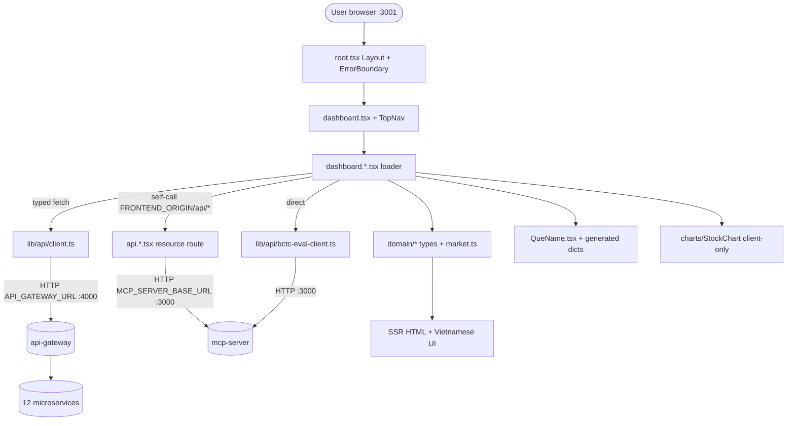

# Frontend — Remix Dashboard

## Purpose & business need

`apps/frontend` is the **single human-facing surface** of the VN-Market-Intelligence platform — a server-rendered Remix dashboard that lets a non-technical Vietnamese retail investor read everything the backend agents and microservices produce, in **plain Vietnamese**, without touching the MCP tool layer.

It delivers market-intelligence value by aggregating, into one navigable UI:
- **Per-stock decision view** (`/dashboard/analysis`) — fuses Kinh Dịch hexagram readings, macro signals, technical-analysis (RSI/MACD/MA/Bollinger), 90-day OHLCV candlestick charts, agent signals (with **accuracy badges**), cascade macro→stock impact, and an AI deep-dive brief into a synthesized BUY/HOLD/SELL verdict.
- **CHEF market digest** (`/dashboard` overview) — the auto-synthesized Vietnamese market bulletin.
- **30-ticker watchlist overview** grouped by 10 sectors, each tile showing price/direction/signal-count/hexagram.
- **System/ops surfaces** — service health, fetch-ops freshness, VPS-proxy health, agent orchestration board, quality-audit, and the BCTC (financial-statement) inspection/evaluation viewers.

The frontend is **read-only and presentation-only by contract**: it owns no business logic about *what* a signal means (that lives in the services) — it only fetches, type-guards, formats, and renders. Every served value must be REAL fetched data (project standing goal: no fake/placeholder metrics), so the code is dense with staleness/provenance handling and graceful-degradation paths.

## Tech stack

- **Language:** TypeScript (strict), 94 `.tsx` + 76 `.ts` files under `app/`.
- **Framework:** Remix v2 (`@remix-run/node`, `@remix-run/react`, `@remix-run/serve`) on Node ≥20, with `v3_singleFetch` + `v3_lazyRouteDiscovery` future flags (`apps/frontend/vite.config.ts`). SSR-first: all data fetching happens in server-side **loaders**.
- **Build:** Vite 5 (`remix vite:build`) → `build/server/index.js` served by `remix-serve` (`apps/frontend/package.json` scripts).
- **Styling:** Tailwind CSS 3 + `tailwindcss-animate`, dark slate theme. CSS variables defined in `app/styles/theme.css`, mapped to Tailwind tokens in `apps/frontend/tailwind.config.ts`. `darkMode: ["class"]`; the `<html>` is hardcoded `className="dark" lang="vi"` in `app/root.tsx`.
- **Components:** shadcn/ui (Radix primitives) — `components.json` configures `style:default`, `baseColor:slate`, `iconLibrary:lucide`. UI primitives in `app/components/ui/` (card, tooltip, badge, table, button, collapsible, input).
- **Charts:** `lightweight-charts` v5 (TradingView), dynamically imported client-side only.
- **Icons:** `lucide-react`; class helpers via `clsx` + `tailwind-merge` (`app/lib/utils.ts`).
- **Testing:** Vitest (jsdom) unit/loader tests in `app/__tests__/`; Playwright e2e in `tests/e2e/` (`smoke.spec.ts`, `render-check.spec.ts`); config `playwright.config.ts`, `vite.config.ts` (`test` block).
- **Architecture enforcement:** `eslint-plugin-boundaries` DDD fence in `eslint.config.mjs`.

## Entry points

- **HTTP server / main:** `remix-serve ./build/server/index.js` (CMD in `apps/frontend/Dockerfile`), port **3001**, `API_GATEWAY_URL=http://api-gateway:4000` default.
- **Composition root:** `app/root.tsx` — defines `Layout` (HTML shell, theme stylesheet) and a chunk-aware `ErrorBoundary` that auto-reloads once on stale-bundle/`ChunkLoadError` (guarded by `sessionStorage` flag to avoid reload loops).
- **Client entry:** `app/entry.client.tsx`.
- **Root index route:** `app/routes/_index.tsx` — landing page; loader calls `fetchGatewayHealth()`.
- **Dashboard layout route:** `app/routes/dashboard.tsx` — renders `<TopNav />` + `<Outlet />` for all `/dashboard/*` children.
- **Navigation SSOT:** `app/components/TopNav.tsx` exports `ANALYST_NAV` (26 analyst tabs), `SYSTEM_NAV` (7 ops tabs, collapsed under "Hệ Thống"), and `NAV_ITEMS` (union). `comingSoon` tabs render as disabled spans (no dead links).
- **Routes (65 total):** ~34 `dashboard.*.tsx` page routes + ~29 `api.*.tsx` **resource routes** (server-side proxies; no UI). Each page route exports a `loader` (and `meta`); resource routes export `loader`/`action` returning raw `Response`.
- **Code generation:** `scripts/gen-que-descriptions.ts` (run via `bun run gen:que`) regenerates the two `que-descriptions*.generated.ts` files from `apps/kinh-dich-service/dashboard/que-reference.js`. No cron/scheduler is registered inside this zone — it is purely request-driven.

## Architecture & key modules

The app follows a **Remix-adapted DDD layering** with a lint fence (`eslint.config.mjs`) enforcing dependency direction:

| Layer | Path | Role | Fence rule |
|---|---|---|---|
| domain (types) | `app/domain/**` | Pure TS types + pure helpers (`market.ts`, `news.ts`, `health.ts`, `bctc-eval.ts`, `health-compose.ts`) | may not import api-client |
| formatters | `app/domain/formatters/**` | Pure display formatting (`change-pct`, `direction-arrow`, `signal-type-label`, `stale-badge`) — Fence-A: no I/O, no components, no routes | enforced |
| view-models | `app/lib/view-models/**` | Pure loader-data → display-model transforms (`analysis-vm.ts`) — Fence-B | enforced |
| api-client (I/O) | `app/lib/api/**` | ALL outbound fetch (`client.ts`, `bctc-eval-client.ts`) — Fence-C: never imported by domain/view-model/formatter | enforced |
| components | `app/components/**` | React UI (`QueName`, `TopNav`, `PageHeader`, `ClientTimestamp`, `charts/StockChart`, `ui/*`, `bctc-eval/*`) | — |
| routes | `app/routes/**` | Remix loaders/actions + page React | — |
| composition-root | `app/root.tsx` | HTML shell + ErrorBoundary | — |

Key modules:

- **`app/lib/api/client.ts`** — the typed gateway client. Every backend call goes through **api-gateway** (`API_GATEWAY_URL`, default `:4000`); the module hard-comments that microservice ports 5000–5008 must never be called directly. `apiGet<T>` throws `ApiError` on non-2xx. Exposes typed wrappers: `fetchGatewayHealth`, `fetchServiceHealth` (camel/snake tolerant), `fetchReuters/BloombergHeadlines`, `fetchFetchStatus`, `fetchMacroExternal`, `fetchPriceHistory`, `fetchKinhDichMarket/Reading`, `fetchKinhDichReadingNonFatal` (null on 503), `fetchTASnapshot`, `fetchStockSignals`, `fetchCascadeSignals`, `fetchWatchlistPrices`, `fetchAccuracyDigest`, `fetchMacroSnapshot`. Also exports pure, unit-tested helpers: `parseAccuracyFromResponse`, `accuracyBadgeProps`, `deriveAccuracyDigestState`, `digestRateColor`, plus row-mappers `toAgentSignal`, `toWatchlistTileData`, `toPricePoint`, `toHeadline`.
- **`app/lib/api/bctc-eval-client.ts`** — the one client that bypasses api-gateway and hits **mcp-server directly** (`MCP_SERVER_BASE_URL`, default `:3000`) for financial-statement eval endpoints. Throws `BctcEvalApiError`.
- **`app/domain/market.ts`** — the central domain model. Holds `StockQuote`, `PricePoint`, `MacroSnapshot`/`MacroSignals`, `KinhDichMarket`/`KinhDichReading`, `AgentSignal`/`SignalAccuracy`, `AccuracyDigestStats`, `FetchStatus`/`VpsProxyStatus`, `TASnapshot`, and the **hardcoded canonical `WATCHLIST_STOCKS` array (33 entries; VEA `active:false`)** plus `groupBySector`, `formatSourceAge`, `sourceStatusColor/Label`, `parseMacroSources`.
- **`app/components/QueName.tsx`** — SSOT for ALL hexagram name+tooltip rendering (see Features).
- **`app/components/charts/StockChart.tsx`** + `charts/indicators.ts` — client-only multi-pane chart.
- **`app/components/TopNav.tsx`** + `PageHeader.tsx` + `ClientTimestamp.tsx` — shared chrome (`ClientTimestamp` defers timestamp rendering to client to avoid SSR hydration mismatch).

## Feature-by-feature breakdown

### 1. Market Overview / CHEF digest (`/dashboard`)
- **Business purpose:** the auto-updated Vietnamese market bulletin synthesized by the CHEF agent — the default landing card-feed for the user.
- **Path:** `app/routes/dashboard._index.tsx` loader → `fetch(${FRONTEND_ORIGIN}/api/market-digest)` (self-call to its own origin, default `http://localhost:3001`) → resource route `app/routes/api.market-digest.tsx` → `fetch(${MCP_SERVER_BASE_URL}/api/market-digest)` → mcp-server `:3000` (reads agent-published digest rows from the signals/digest DB). Renders `DigestCard` per item with `AgentBadge`/`TypeBadge`/`ClientTimestamp`.
- **Edge cases:** empty `items[]` is a friendly empty state (`Chưa có bản tin`), NOT an error; upstream 5xx → red banner, never throws; proxy converts upstream fetch failure to **502** but forwards upstream 4xx/5xx status verbatim.

### 2. Stock analysis & decision (`/dashboard/analysis`) — the flagship page
- **Business purpose:** one-screen BUY/HOLD/SELL synthesis per ticker for the retail user.
- **Path (no `?stock`):** loader (`app/routes/dashboard.analysis.tsx`) `Promise.allSettled` of `fetchKinhDichMarket`, `fetchMacroSnapshot`, `fetchAccuracyDigest(30)`, 8 sample `fetchKinhDichReading`; then `fetchWatchlistPrices(ACTIVE_TICKERS)` (batch `/stock/price/batch`) and per-ticker `fetchKinhDichReadingNonFatal` enrichment — renders `WatchlistOverviewGrid` (tiles by sector with `KdTilePill` confidence bar + `QueName`).
- **Path (`?stock=CODE`):** additional `Promise.allSettled` of `fetchKinhDichReading`, `fetchPriceHistory(code,90)`, `fetchTASnapshot` (POST `/ta/ta/indicators`), `fetchStockSignals(code,10)` (GET `/mcp/api/signals/stock/:code`), `fetchCascadeSignals(code,5)` (`?type=chain_catalyst`); plus a self-call to `/api/analysis-brief/:ticker` for the AI deep-dive. Renders `StockDetailPanel`: `StockChart`, `AnalysisDecision`, `InfoSourcePanel`, `MacroImpactPanel`, `StockSignalsPanel`, Kinh Dịch + price tables.
- **Decision engine:** `computeDecision(ta, reading, prices)` (exported, unit-tested) — a deterministic scoring function combining TA trend (±2), RSI bands, Kinh Dịch signal keywords MUA/BÁN/THẬN TRỌNG (±2/±1), and 5-session price delta (±1) → labels `MUA MẠNH`/`MUA`/`GIỮ`/`BÁN`/`BÁN MẠNH`. **This is the only place in the frontend that produces an investment verdict from raw inputs.**
- **Signals + accuracy:** `StockSignalsPanel` shows last-10 agent signals; confidence is normalized from DB integer 0–100 to 0.0–1.0 in `toAgentSignal`. `AccuracyBadge` uses `accuracyBadgeProps` thresholds (≥0.70 green / 0.40–0.69 amber / <0.40 red "Low" / sample<3 grey "New"). Accuracy is **optional** — absent until the backend "Sprint B" outcome-feedback loop is deployed.
- **Accuracy digest card:** `AccuracyDigestCard` renders a 6-state machine driven by `deriveAccuracyDigestState` (loading/empty/all-neutral/insufficient-sample/partial/normal) — top-3/bottom-3 signal types by rate + system overall (n/a until ≥10 resolved).
- **Edge cases:** every secondary fetch is non-fatal (`allSettled`, null/empty fallback); `errors[]` is surfaced but the page always renders; `signals===null` means "endpoint did not respond" vs `[]` "no signals yet" — distinct UI strings.

### 3. Kinh Dịch hexagram hover (QueName)
- **Business purpose:** explain each of the 64 I-Ching hexagrams in plain Vietnamese on hover/keyboard-focus, the project's distinctive divination-overlay signal.
- **Path:** `app/components/QueName.tsx` is the mandated SSOT — every render site (`dashboard.analysis.tsx` table/tiles/panels, kinh-dich pages) must use it; zero duplicate tooltip markup allowed. It reads two **generated** dictionaries: `app/lib/que-descriptions.generated.ts` (`QUE_DESCRIPTIONS`, 3-field tooltip contract) and `app/lib/que-descriptions-detail.generated.ts` (`QUE_DETAIL`, 12-field + 6 phases). Renders `#{id} — {name}` trigger (dotted underline, `tabIndex=0`) + Radix `Tooltip` with `coreMeaning`/`stateInterpretation`/`favorable`/`warning`/`marketTrendLabel`; `withDetailLink` adds a deep link to `/dashboard/kinh-dich-reference#que-{id}`.
- **Hidden dependency:** the generated files are produced by `scripts/gen-que-descriptions.ts` from `apps/kinh-dich-service/dashboard/que-reference.js` (itself emitted by the Go service via `go run ./cmd/sandbox -emit-reference`). Editing the `.generated.ts` files by hand is forbidden (header banner). Missing-id → graceful plain `` fallback, no tooltip.

### 4. Charts (StockChart)
- **Business purpose:** TradingView-grade candlestick + indicator overlays for the selected ticker.
- **Path:** `app/components/charts/StockChart.tsx` dynamically `import("lightweight-charts")` **inside `useEffect`** — never runs on SSR. Three panes: candle+MA20+MA50+Bollinger / RSI(14) with 30/70 lines / MACD(12,26,9). Indicators computed locally in `app/components/charts/indicators.ts`.
- **Edge cases:** `sanitizePrices()` (indicators.ts) is defense-in-depth: drops non-trading-day poison rows (`close===0 && volume===0`) and clamps 1000×-scale outliers (>10× median deviation → forward-fill). Y-domain is data-driven (`autoscaleInfoProvider`, pad 6%, never forced to 0) — fix for the FIX-FE-CHART-PRICE-DOMAIN regression.

### 5. System / ops surfaces
- **Service health** (`dashboard.services.tsx`) — `fetchGatewayHealth`/`fetchServiceHealth`; display state via `composeRowDisplayState`/`composeOverallStatus` in `app/domain/health-compose.ts`. **Anti-false-green invariant:** a DOWN service always renders RED `deployed_down` and capability never rescues it. `not_deployed_*` states were removed after GO-FLEET-DEPLOY (all 12 services genuinely deployed).
- **Fetch ops** (`dashboard.fetch.tsx`) — `fetchFetchStatus()` → `/api/fetch-status`; source freshness via `sourceStatusColor/Label` (fresh/stale/very-stale by age).
- **VPS proxy** (`dashboard.vps.tsx`) — `VpsProxyStatus` for 5 feeds (news/bctc/prices/sbv/foreign-flow).
- **Orchestration** (`dashboard.orchestration.tsx`) — self-call → `api.orchestration.tsx` proxy → mcp-server agent task board.
- **BCTC eval/inspect** — `dashboard.bctc-eval.*.tsx` via `bctc-eval-client.ts` (direct mcp-server); `dashboard.bctc-inspect.tsx` is a raw-HTML viewer whose nav link uses `reload:true` (full document load so its scripts execute), backed by the splat proxy `api.bctc-inspect.$.tsx` (binary-safe for PDF/PNG).
- **Quality audit** (`dashboard.quality-audit.tsx`) via `api.quality-checklist.tsx`.

### 6. API resource-route proxy pattern (~29 routes)
- **Business purpose:** keep ALL backend access server-side; the browser only ever talks to the frontend origin.
- **Path:** `api.*.tsx` loaders forward to `${MCP_SERVER_BASE_URL}/api/<name>` (e.g. `api.market-digest`, `api.alerts`, `api.orchestration`, `api.kinh-dich-signals`, `api.sector-cascade`, `api.analysis-brief.$ticker`, `api.price-history.$ticker`, `api.bctc-inspect.$`). They are transparent: relay upstream Content-Type verbatim, pipe body as `arrayBuffer` (binary-safe), forward query params, **forward upstream 4xx/5xx as-is, never convert to 500** (only a fetch *exception* becomes 502). Used both by page loaders that self-call `${FRONTEND_ORIGIN}/api/*` and by client-side fetches from raw-HTML viewers.

## Data stores

The frontend owns **no database** — it is stateless. Its "stores" are:
- **Compile-time constants:** `WATCHLIST_STOCKS` (33 rows) in `app/domain/market.ts` — mirrors `docs/data/system-map.json project.watchlist`; embedded at build time, never read from FS at runtime.
- **Generated dictionaries:** `app/lib/que-descriptions.generated.ts` (`QUE_DESCRIPTIONS[1..64]`) and `que-descriptions-detail.generated.ts` (`QUE_DETAIL[1..64]`, each with `coreMeaning`, `stateInterpretation`, `favorable`, `warning`, `marketTrendLabel`, `phases[6]`).
- **Client-side ephemeral:** `sessionStorage` chunk-reload flag (`app/root.tsx`).
- **All real data** lives behind api-gateway / mcp-server: signals (`agent_signals` table — `id`, `stock_code`, `signal_type`, `direction`, `confidence_score` int 0–100, `detail`/`payload`, `created_at`), market digest, accuracy outcomes, price history, BCTC eval rows — read-only via HTTP. No named volume, LanceDB, or SQLite is mounted into this container.

## External integrations

- **api-gateway (`:4000`, env `API_GATEWAY_URL`)** — primary backend for `app/lib/api/client.ts`. Routes used: `/health`, `/health/:service`, `/macro/external`, `/macro/snapshot`, `/stock/price/history`, `/stock/price/batch`, `/kinh-dich/market`, `/kinh-dich/reading/:code`, `/ta/ta/indicators`, `/mcp/api/signals/stock/:code`, `/mcp/api/accuracy/digest`, `/api/fetch-status`, `/news/{reuters,bloomberg}/headlines`. The gateway fans out to the 12 sibling microservices (stock-price, technical-analysis, kinh-dich-service, macro-indicators, news-fetch, alert-engine, etc.) and to mcp-server.
- **mcp-server (`:3000`, env `MCP_SERVER_BASE_URL`)** — reached two ways: directly by `bctc-eval-client.ts`, and via the `api.*.tsx` proxy routes (market-digest, alerts, orchestration, kinh-dich-signals, sector-cascade, bctc-inspect, analysis-brief, etc.). mcp-server is the agent/intelligence layer and the data-serving API for signals, digests, and BCTC artifacts.
- **VPS proxy** — surfaced only as health data (`VpsProxyStatus` 5 legs) through `/api/fetch-status`; the frontend never calls the VPS directly.
- **kinh-dich-service** — indirect: its `dashboard/que-reference.js` is the build-time source for the generated hexagram dictionaries.
- **Telegram / webhooks / jobs:** **none** — the frontend produces no side effects, sends no Telegram, writes no DB, and runs no cron. It is purely a read path.

## Cross-zone interactions

- **Frontend → api-gateway (HTTP):** all `client.ts` calls; the contract is the gateway's response shapes (documented inline + `docs/architecture/microservice/frontend/domain-model.md`).
- **Frontend → mcp-server (HTTP):** `bctc-eval-client.ts` direct; `api.*.tsx` proxies. Self-referential calls (`${FRONTEND_ORIGIN}/api/*`) loop back through the frontend's own resource routes before reaching mcp-server.
- **Called by:** end-users' browsers (only); Playwright e2e `render-check`/`smoke` in CI; the cowork "kinh-dich hover" verification path (per memory `feedback_kinhdich_hover_wrong_surface`) targets this Remix `:3001` `QueName.tsx`, NOT the standalone kinh-dich-service JSON port.
- **Mechanism summary:** strictly HTTP (REST/JSON, plus binary passthrough for PDF/PNG). No shared DB, no MCP `call_tool`, no signal-queue writes from this zone.
- **SSOT couplings to watch:** `WATCHLIST_STOCKS` ↔ `docs/data/system-map.json`; generated hexagram dicts ↔ `apps/kinh-dich-service/dashboard/que-reference.js`; gateway/mcp response field names ↔ row-mapper type guards in `client.ts`.

## Gotchas — "must know before changing"

- **api-gateway only — never call ports 5000–5008 from `client.ts`.** Enforced by comment + the whole-app `eslint.config.mjs` Fence-C (api-client layer is I/O-isolated). `bctc-eval-client.ts` is the deliberate exception (direct mcp-server).
- **DDD lint fence is real and load-bearing** (`eslint.config.mjs`, `mode:"full"`, `checkUnknownLocals:true`). Adding a `~/lib/api` import into `app/domain/**`, `app/domain/formatters/**`, or `app/lib/view-models/**` fails lint. Formatters import with `.js` extensions (ESM) that resolve to `.ts` — keep that convention or the resolver/fence misclassifies files.
- **Generated files are NOT hand-editable.** `que-descriptions*.generated.ts` must be regenerated via `bun run gen:que` from the kinh-dich-service reference; editing them directly will be overwritten and breaks the SSOT chain.
- **QueName is the ONLY hexagram tooltip renderer.** Do not inline hexagram name/tooltip markup anywhere else (operator mandate in the component header).
- **`WATCHLIST_STOCKS` is hardcoded** (33 rows, VEA `active:false`) and must be kept in sync with `docs/data/system-map.json`. `ACTIVE_TICKERS`/`KD_SAMPLE_TICKERS` derive from it.
- **Confidence scale mismatch:** DB stores `confidence_score` as integer 0–100; `toAgentSignal` divides by 100. Kinh Dịch `confidence` arrives already 0.0–1.0. Mixing them silently produces 100× wrong bars.
- **Charts are client-only.** `StockChart` imports lightweight-charts inside `useEffect`; any attempt to render chart logic during SSR throws. `sanitizePrices` is defense-in-depth, not the upstream fix — bad candle data should still be corrected at source.
- **Hydration safety:** timestamps and locale-formatted numbers use `<ClientTimestamp>` / `suppressHydrationWarning` to avoid SSR/client mismatch (server vs browser timezone/locale). Removing these reintroduces hydration errors.
- **Proxy error semantics:** resource routes return **502 only on a fetch exception**; all real upstream statuses (incl. 4xx/5xx) are forwarded verbatim. A page that treats "non-200" as fatal will mis-handle legitimate empty/seeding states.
- **Anti-false-green health:** `composeRowDisplayState` never lets a "capability" value rescue a DOWN container — a down service is RED. Do not reintroduce `not_deployed_*` rescue states.
- **`bctc-inspect` nav uses `reload:true`** intentionally (full browser navigation) so the raw-HTML viewer's scripts execute; converting it to a client-side `NavLink` breaks the viewer.
- **Root ErrorBoundary auto-reloads once** on chunk/stale-bundle errors, guarded by a per-pathname `sessionStorage` flag — do not remove the guard or you get reload loops.
- **No secrets, no DB, no Telegram in this zone.** If a change "needs" to write data or post a message, it belongs in a backend service, not the frontend.

## Internal flow (Mermaid)

