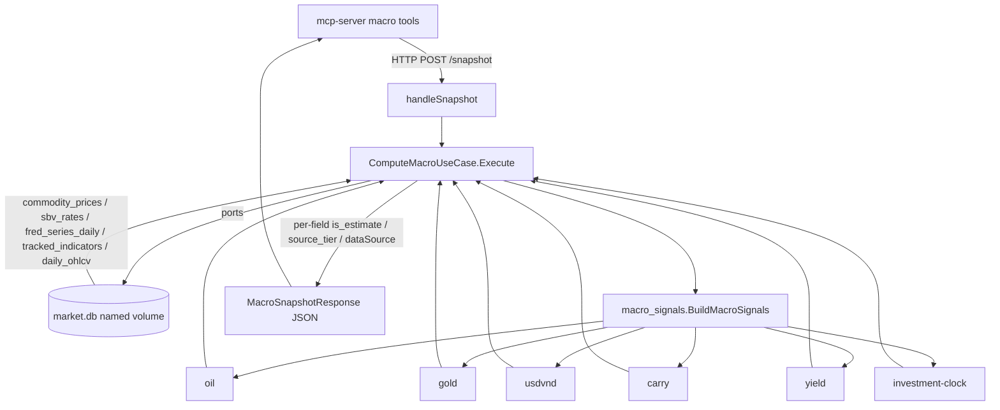

# Go Services — Technical Analysis & Macro Indicators

> Zone id: `go-analytics-plane` · Primary paths: `apps/technical-analysis/` (port 5003), `apps/macro-indicators/` (port 5004)

## Purpose & business need

This zone is the **quantitative compute plane** of the VN-Market-Intelligence platform. It contains two stateless Go microservices that turn raw price/economic data into the numeric and categorical signals every downstream agent (alert-commander, financial-analyst, market-watcher, the FB poster, the daily digest) reasons about:

- **`technical-analysis` (port 5003)** — computes price-derived indicators from daily candles: Wilder RSI(14), MACD(12,26,9), Bollinger Bands(20, 2σ), simple/exponential moving averages, fixed MA(5/20/50), and MACD-line-vs-signal crossovers. This is the "is this stock overbought / breaking out" layer. Business value: deterministic, well-tested indicator math extracted out of the TypeScript `mcp-server` into a fast, pure-Go service so reports and alerts are computed identically everywhere.
- **`macro-indicators` (port 5004)** — computes the **macro regime**: oil/gold/USDVND direction, the carry-trade regime (VND deposit vs Fed Funds), the equity yield-spread (earnings yield vs deposit rate), an investment-clock tier, plus a suite of "VMT" Vietnam-specific economic series fetched live from official sources (SBV policy rates & OMO, NSO monthly Excel for IIP/CPI/trade-balance, SBV Balance-of-Payments). This is the top-down "what regime are we in" layer that frames every bottom-up stock call.

Both services share a project-wide **"no fake data"** standing goal (memory `feedback_no_fake_data_real_fetch`): every served metric must be real fetched data or be explicitly stamped `is_estimate=true` with a `source_tier`. A large fraction of the macro-indicators code exists specifically to enforce that honesty contract (per-field provenance, fixture-fallback flags, fail-closed degrade paths).

## Tech stack

- **Language:** Go 1.22 (`go 1.22` + `toolchain go1.22.0` in both `go.mod`).
- **HTTP framework:** `github.com/go-chi/chi/v5` (router + `middleware.RequestID`, `middleware.Recoverer`).
- **SQLite driver:** `modernc.org/sqlite` v1.29.9 — **pure-Go, no CGO** (`CGO_ENABLED=0` in both Dockerfiles). Note `docs/data/system-map.json` lists runtime as `go1.22+cgo`, but the Dockerfiles build CGO-disabled — the system-map label is stale.
- **Excel parsing (macro only):** `excelize` for NSO monthly `.xlsx` (IIP/CPI/trade-balance sheets).
- **HTML parsing (macro only):** `golang.org/x/net/html` for SBV Liferay policy-rates / OMO pages.
- **Logging:** stdlib `log/slog` JSON handler, level from `LOG_LEVEL` env.
- **Architecture style:** strict DDD / hexagonal with enforced import "fences" (see Gotchas). Layers: `pkg/domain` (pure), `pkg/primitive` (pure math/classifiers), `pkg/module` (primitive composition), `pkg/application` (use cases + ports), `pkg/infrastructure` (adapters), `pkg/interface/http` (handlers/router), `cmd/server` (composition root).
- The legacy TypeScript implementations survive as **deprecated reference**: `apps/technical-analysis/src/**` and `apps/macro-indicators/src/_deprecated/**`. The Go services are the live path; the Go classifiers carry comments naming the exact TS function they replaced.

## Entry points

These services expose **HTTP routes only** — there are **no MCP tool registrations, no crons, and no Telegram/webhook side-effects inside the Go code**. `docs/data/system-map.json` confirms `"tools": []`, `"crons": []` for both. The MCP tool surface lives in `apps/mcp-server` and calls these services over HTTP.

### technical-analysis — `apps/technical-analysis/cmd/server/main.go`
- `main()` wires `infrastructure.NewTACalculator()` + `infrastructure.NewSQLitePriceRepository()` → `application.NewComputeTAUseCase` → `httpinterface.NewRouter`. Reads only `PORT` (default `5003`) and `LOG_LEVEL`. Charter security clause: **zero secrets in this process env**.
- Router (`pkg/interface/http/router.go`):
  - `GET /health` → `{"status":"ok","service":"technical-analysis","port":5003}`.
  - `POST /ta/indicators` → `handleIndicators` → `ComputeTAUseCase.Execute`.
- `cmd/sandbox/main.go` (1804 LOC) is a **credential-free scenario test runner** for the dashboard, NOT a production server — `go run ./cmd/sandbox -tier=primitive|module|service -scenario=...`, emits one JSON GREEN/RED block. Zero DB / network / secrets.

### macro-indicators — `apps/macro-indicators/cmd/server/main.go`
- `main()` is a large composition root that env-gates adapters (`COMMODITY_LIVE_MODE`, `DB_PATH`, `VPS_HTTP_HOST/PORT`, `VPS_CACERT_PATH`) and wires six use cases into a `RouterConfig`. Reads only `PORT` (default `5004`) and `LOG_LEVEL` as the security-relevant env (plus DB path / proxy config). Defines all the `*Adapter` bridge types inline to keep the Fence-C rule (only the composition root imports `pkg/infrastructure`).
- Router (`pkg/interface/http/router.go` `NewRouter(RouterConfig)`), routes registered conditionally on non-nil use case:
  - `GET  /health`
  - `POST /snapshot` → `ComputeMacroUseCase.Execute` (the canonical carry/yield/oil/gold/usdvnd/clock source).
  - `GET  /macro-calendar` → fixture (intentionally deferred, OQ-10).
  - `GET  /external` → cached `MacroData` shape from `Execute()` (no live scrapers on page load).
  - `POST /bop` → SBV Balance-of-Payments (VMT-2).
  - `POST /macro-indicators` → NSO monthly IIP (VMT-3b).
  - `POST /cpi-components` → NSO monthly CPI basket (VMT-4).
  - `POST /trade-balance` → NSO monthly exports/imports/HS/FDI (VMT-1a + VMT-1b).
  - `POST /liquidity-state` → SBV policy rates + SJC gold gap + FX coupling + IRS + OMO + interbank (VMT-5a + VMT-5b).
- `cmd/sandbox/main.go` (831 LOC) — same credential-free scenario runner pattern.

## Architecture & key modules

### technical-analysis layering
| File | Role |
|---|---|
| `cmd/server/main.go` | Composition root; DI wiring; graceful shutdown (5 s). |
| `pkg/interface/http/router.go` | chi router; `handleHealth`, `handleIndicators` (decode → validate `closes`/`symbol` → `useCase.Execute`). |
| `pkg/application/usecases.go` | `ComputeTAUseCase.Execute` — two paths (pure-compute vs DB-backed). `TACalculator`/`PriceRepo` ports. |
| `pkg/application/dtos.go` | `ComputeTARequest` (`symbol`,`period`,`closes`), `ComputeTAResponse`. |
| `pkg/infrastructure/calculator.go` | `TACalculator` adapter — thin mapper delegating to `pkg/module`. |
| `pkg/infrastructure/repositories.go` | `SQLitePriceRepository.GetCandles` — reads `daily_ohlcv` from market.db. |
| `pkg/module/technical_analysis.go` | `module.Compute` — composes all 5 primitives; **non-fatal policy** (one primitive failing leaves its field nil). `defaults()` fills standard periods. |
| `pkg/primitive/rsi/rsi.go` | `rsi.Calculate` — Wilder RSI, SMA-seeded then Wilder smoothing. Needs `period+1` closes. |
| `pkg/primitive/macd/macd.go` + `ema.go` | `macd.Calculate` + unexported `calcEMA` (SMA-seeded standard EMA, k=2/(p+1)). Needs `slow+signalPeriod` closes. |
| `pkg/primitive/bollinger_bands/bollinger_bands.go` | `bb.Calculate` — **population** std dev (divisor N, per Bollinger's canonical spec). |
| `pkg/primitive/moving_average/moving_average.go` | `CalculateSMA` (sliding-window), `CalculateEMA`, `CalculateMovingAverage` dispatcher. |
| `pkg/primitive/detect_cross/detect_cross.go` | `DetectCross` — sign-change scan of two parallel series → bullish/bearish `CrossEvent`. |
| `pkg/domain/{models,services,ports}.go` | `CandleStick`, `TechnicalIndicators`, `CrossSignal`; `CalculateTAService` (stubbed — HTTP path bypasses it); `PriceHistoryRepository` / `TAIndicatorCalculator` ports. |

The primitives are **pure functions** (zero I/O, deterministic) each with a sibling `_test.go`. `module.Compute` always also computes MA5/MA20/MA50 regardless of the requested `MAPeriod`.

### macro-indicators layering
| File | Role |
|---|---|
| `cmd/server/main.go` | Composition root; 6 use-case wiring + all Fence-C bridge adapter types (`policyRatesAdapter`, `sjcFXAdapter`, `omoAdapter`, `bopParserAdapter`, `iipParserAdapter`, `cpiParserAdapter`, `tradeBalanceParserAdapter`, `bopURLBuilderAdapter`). |
| `pkg/interface/http/router.go` + `handlers_*.go` | chi router; one handler file per VMT endpoint (`handlers_snapshot`*, `handlers_external`, `handlers_vmt_bop/cpi/trade/macro/liquidity`, `handlers_calendar`). |
| `pkg/application/usecases.go` | `ComputeMacroUseCase.Execute` — the snapshot brain; resolves live inputs, runs the 6-primitive module, tracks per-field liveness, builds provenance-stamped DTOs. |
| `pkg/application/usecases_vmt_*.go` | One use case per VMT feature: `BOPUseCase`, `MacroIndicatorsGSOUseCase`, `CPIComponentsUseCase`, `TradeBalanceUseCase`, `LiquidityStateUseCase`. Each is pure orchestration (Fence-B: imports only `pkg/domain`). |
| `pkg/module/macro_signals/macro_signals.go` | `Signals.BuildMacroSignals` — composes the 6 regime primitives in one call (investment clock via injected `Classifier` port; the other 5 via package funcs). |
| `pkg/primitive/macro_*/` | 6 pure classifiers (see Feature breakdown). Each is a Go rewrite of a named TS service, **with `time.Now()`/`Math.random()` removed** for determinism. |
| `pkg/domain/{models,ports,services_vmt_*}.go` | Domain value objects + ports (`CommodityFetcherPort`, `SBVRatePort`, `MarketIndexPort`, `CarryYieldInputsPort`, `VpsFetchPort`) + pure domain services (`ComputeSJCGoldGap`, `BuildFXCoupling`, `BuildOMOSuccess/Failed`, `BuildIRSField`, `BuildInterbankRate`, `ConvertWorldGoldToMnVND`). |
| `pkg/infrastructure/repositories.go` | SQLite adapters: `SQLiteCommodityRepository`, `HTTPCommodityFetcher`, `SBVRateSQLiteAdapter`, `SQLiteMarketIndexRepository`, `CarryYieldInputsSQLiteAdapter`. |
| `pkg/infrastructure/vpsFetch.go` | `VpsFetchAdapter` — the VPS HTTP-proxy egress for geo-blocked VN sources. |
| `pkg/infrastructure/cache_vmt_nso.go` | `NSOExcelFetcher.GetOrFetchNSOMonthlyExcel` — shared 6 h cache + 3-step NSO discovery, serves VMT-1a/1b/3b/4. |
| `pkg/infrastructure/adapters_vmt_sjc_fx.go` | `SJCGoldFXAdapter` (market.db reads) + SBV policy-rates HTML fetch/parse. |
| `pkg/infrastructure/parsers_vmt_*.go` | Excel/HTML/JSON parsers for BOP, CPI, IIP/GSO, trade, SBV interbank+OMO. |

## Feature-by-feature breakdown

### TA-1 · Compute technical indicators (`POST /ta/indicators`)
- **Business purpose:** the numeric overbought/oversold/trend/crossover signals behind every stock report and alert.
- **Path:** `handleIndicators` → `ComputeTAUseCase.Execute` → `TACalculator.Calculate` → `module.Compute` → 5 primitives → mapped to `ComputeTAResponse`.
- **Two input paths** (`usecases.go`): (1) **pure-compute** when `closes[]` is supplied (no DB, credential-free); (2) **DB-backed** when only `symbol` is given → `GetCandles(symbol, 60)` reads `SELECT date, close FROM daily_ohlcv WHERE code=? ORDER BY date ASC LIMIT 60`.
- **Edge cases:** insufficient data is **non-fatal** — `module.Compute` leaves a primitive's field `nil` (RSI needs `period+1`, MACD needs `slow+signal`=35, MA50 needs 50 closes) so a short series still returns partial indicators. Structural-param errors (`RSIPeriod<2`, `BBMultiplier<=0`, unknown `MAType`) are the only hard errors. Negative/NaN prices are rejected per primitive.
- **The "38-vs-39.5 candle-count sensitivity" (hidden dependency):** the same `market.db` can yield **different candle counts to different readers**, which shifts RSI by ~1 point and flips MA50 between numeric and N/A. The fix lives in the **consumer**, `apps/mcp-server/.../technicalIndicatorTools.ts`: it pre-fetches closes with the **exact same query** (`ORDER BY date ASC LIMIT 60`, plus `AND close > 0`) and passes them as `closes[]` so both the Go service and the TS report compute on byte-identical data, "eliminating the ~1pt RSI drift from calendar-window vs row-count divergence." Related project memory: `feedback_same_db_tools_diverge_rowcount` and `feedback_nonzero_values_need_plausibility_check`. The minimum-candle floor (≥15) that prevents bogus RSI on thin data is enforced in the TS `defaultComputeTa`, not in Go.

### MACRO-1 · Macro snapshot & 6 regime signals (`POST /snapshot`, `GET /external`)
- **Business purpose:** the single top-down regime read — oil/gold/USDVND direction, carry-trade regime, equity yield-spread, investment-clock tier — consumed by the macro-health-read skill and every cowork agent's "Layer 1" paragraph.
- **Path:** `ComputeMacroUseCase.Execute` resolves inputs from ports (commodity prices, SBV USDVND, VN-Index, prev-session close, VND deposit, Fed Funds, earnings yield), builds `MacroSignalsInput`, calls `macro_signals.BuildMacroSignals`, then assembles a provenance-stamped `MacroSnapshotResponse`.
- **The 6 primitives** (all pure, deterministic, fixed thresholds):
  - `macro_oil_impact_classifier.Classify` — `>100` BEARISH, `<60` BULLISH, else NEUTRAL.
  - `macro_gold_direction_classifier.Classify` — `>2200` BULLISH, `<1800` BEARISH, else NEUTRAL.
  - `macro_usdvnd_direction_classifier.Classify` — `>25000` BEARISH, `<23000` BULLISH, else NEUTRAL.
  - `macro_carry_trade_signal.Compute` — `carrySpread = vndDeposit − fedFunds`; `>2.5` HOT_MONEY_INFLOW, `≥0.5` NEUTRAL, else FII_OUTFLOW_RISK; zero-input guard → NEUTRAL.
  - `macro_yield_spread_signal.Compute` — `spread = earningYield − depositRate`; `>2` CHEAP, `>0` FAIRLY_VALUED, else EXPENSIVE; zero-input guard → UNKNOWN.
  - `macro_investment_clock.Classify` — keyword/exact-match tiering (VN_DIRECT=8/CORE_VN, REGIONAL=5, US_DOMESTIC=2).
- **Provenance & honesty (load-bearing):** per-input liveness is tracked. `dataSource="live"` only when **all five** of oil+gold+usdVnd+fedFunds+vndDeposit are live; otherwise `"estimate"`. `FetchedAt` is **nil unless at least one live source contributed** (FDA-3 — never fresh-stamp fixture data). Each headline value carries `*_is_estimate` + `*_source_tier` (tier 1 live, tier 4 fixture). The **carry signal is suppressed** to `regime="UNKNOWN"`, `carrySpread=null` when any carry input is a fixture fallback (`buildCarryDTO`, DSI-INV-1) — fixture arithmetic must never be served as actionable `FII_OUTFLOW_RISK`. `fetched_at_source` on carry is the **FRED MAX(date)**, never `time.Now()`.
- **Fixture fallbacks** (`usecases.go` consts) are kept explicitly as documented safe-degrade defaults: `fixtureVNIndex=1280.5`, `fixtureOilUSD=82.5`, `fixtureGoldUSD=2350`, `fixtureUSDVnd=24500`, `fixtureVNDDepositRate=4.7`, `fixtureFedFundsRate=5.33`, `fixtureEarningYield=8.2`. Comment warns: deleting + inlining a literal would silently re-hardcode.
- **`GET /external`** reuses the same `Execute()` over cached DB reads (never runs the 8–90 s live scrapers on page load) and remaps to the frontend `MacroData` shape.

### MACRO-2 · Liquidity state (`POST /liquidity-state`, VMT-5a + VMT-5b)
- **Business purpose:** SBV policy stance + domestic-vs-world gold gap + FX coupling + OMO net injection — the "is liquidity tight or loose" read.
- **Path:** `LiquidityStateUseCase.Execute` composes **six blocs**, each independently fail-closed:
  1. `policy_rates` — `policyRatesAdapter.FetchPolicyRates`: SBV Liferay HTML (direct, **no VPS proxy**) → refi/discount/lombard; on parse fail, falls back to `sbv_rates` DB (`is_estimate=true`, lombard=0).
  2. `sjc_gold_gap` — `SJCGoldFXAdapter` market.db reads → `domain.ComputeSJCGoldGap` (`is_estimate=true` while no SJC crawler row exists — `SJCPriceMnVND` is currently always 0).
  3. `fx_coupling` — `domain.BuildFXCoupling` from `sbv_rates` + `commodity_prices` (center/DXY/CNY; usd_vnd buy/sell = 0, not in DB).
  4. `irs` — `domain.BuildIRSField`, **always `is_estimate=true`** (DD-6 PERMANENT — HNX OTC IRS not machine-readable).
  5. `omo` — `omoAdapter.FetchOMO`: SBV `nghiep-vu-thi-truong-mo` Liferay HTML → `BuildOMOSuccess/Failed`; net = add − absorb.
  6. `interbank_1w` — `domain.BuildInterbankRate`, **always `is_estimate=true`, `rate_1w_pct=null`, no fetch attempted** (architect Decision B — `dttktt.sbv.gov.vn` 100% packet loss from VPS).
- **Degrade contract:** `degradedLiquidityResponse` returns HTTP **200** with `Status="degraded"` for upstream gaps; `errorLiquidityResponse` returns HTTP **500** only for nil-provider/wiring faults. The IRS/interbank invariants are re-asserted on **every** path (success, degraded, error).

### MACRO-3 · NSO monthly series — IIP / CPI / trade-balance (`/macro-indicators`, `/cpi-components`, `/trade-balance`, VMT-3b/4/1a/1b)
- **Business purpose:** Vietnam industrial production, CPI basket, and exports/imports/HS-breakdown/FDI-bloc-split — the hard-data backbone of the macro read.
- **Shared download:** all three (plus the FDI sheet) read **one** NSO monthly Excel via `NSOExcelFetcher.GetOrFetchNSOMonthlyExcel` — a 6 h `macro_vmt_cache` cache + a 3-step discovery chain (index page → `bai-top/YYYY/MM/` press release → `.xlsx` link). Entry-11 decision: one VPS fetch per release cycle; cache hits cost no fetch.
- **Sheet selection (gotcha):** trade parser (`parsers_vmt_trade.go`) selects sheets by **Vietnamese content match** (`xuất khẩu`/`nhập khẩu`/`đầu tư`) rather than the drifting numeric names like `14.XK`/`15.NK` — labels change month-to-month (FIX-NSO-TRADE-SHEET). `bloc_split` FDI share is **permanently `is_estimate=true`** (Customs SPA inaccessible; cross-join estimate only). Related memory `feedback_nonzero_values_need_plausibility_check` (the June-import-59%-of-YTD scale check → FIX-NSO-TRADE-VALUE-SCALE).

### MACRO-4 · Balance of Payments (`POST /bop`, VMT-2)
- **Business purpose:** quarterly BOP with FX-incidence discriminator and offshore-parked heuristic — explains whether a trade deficit actually pressures FX.
- **Path:** `BOPUseCase` → `vpsFetchAdapter` (SBV Liferay headless article API `https://www.sbv.gov.vn/o/article/v1.0/articles`) → `infrastructure.ParseBOPResponse`. Liferay returns 3–4 locale-duplicate rows per article → **dedup by `articleId`**. Always `is_estimate=true`.

### Cross-cutting · Bounded-fetch deadline (VMT-8 / F-MACRO-FETCH-DEADLINE)
Every outbound VPS fetch is bounded by `domain.FetchBudgetSec = 8` (single SSOT in `pkg/domain/ports.go`). The whole NSO 3-fetch chain is wrapped in **one** `context.WithTimeout(ctx, 8s)` (not 3×8 s), and `VpsFetchAdapter` clamps any per-request timeout to ≥1 s / FetchBudgetSec. When an origin hangs, `ctx.DeadlineExceeded` surfaces → the use case emits a degraded-200 rather than starving the gateway timeout (memory `feedback_graceful_degrade_needs_bounded_fetch`). **Never change `FetchBudgetSec` without adjusting the gateway timeout.**

## Data stores

Both services are stateless compute; their state lives in the **shared `market.db` SQLite file** (a Docker **named volume**, not host `./data` — memory `feedback_live_db_is_named_volume_not_host_data`). `DB_PATH` defaults: technical-analysis `./data/market.db`, macro-indicators `/app/data/market.db`.

| Table | Read by | Key columns |
|---|---|---|
| `daily_ohlcv` | TA `GetCandles`; macro `FetchPrevSessionVnIndex` | `code, date, open, high, low, close, volume` (TA reads `date, close` only) |
| `commodity_prices` (source='yahoo') | macro commodity + SJC/FX | `brent_crude_usd, gold_usd_per_oz, usd_vnd_rate, dxy, cny_vnd_rate, fetched_at` |
| `sbv_rates` (source='sbv') | macro SBV USDVND, deposit rate, policy fallback | `usd_vnd_official, max_deposit_rate_pct, fetched_at` |
| `fred_series_daily` (series='EFFR') | macro Fed Funds | `series, date, value` |
| `tracked_indicators` (indicator='market_earning_yield') | macro earnings yield | `indicator, value, extracted_at` |
| `market_prices` / `macro_indicators` | macro `FetchVNIndex` | `price` / `value` |
| `macro_vmt_cache` | macro NSO Excel cache (read-write, created on demand) | `endpoint, period, fetched_at, payload BLOB`, PK `(endpoint, period)` |

**Staleness bounds (hardcoded, load-bearing):** `commodityStaleBound=26h`, `sbvStaleBound=6h`, `sjcFXStaleBound=26h`, `depositYieldStaleBound=26h`, `effrStaleBound=168h` (was 96h; widened to 7 days because FRED publishes only on business days — FIX-MACRO-GO-FIXTURE-FALLBACK). Rows older than these → safe-degrade to fixture with `is_estimate=true`.

## External integrations

- **Vinahost VPS proxy** (`VpsFetchAdapter`): Squid/HTTP proxy at `125.212.251.27:3128` (env `VPS_HTTP_HOST/PORT`). All geo-blocked VN sources (NSO, Customs, the SBV BOP article API) egress through it. TLS is hardened (`InsecureSkipVerify` **always false**); `VPS_CACERT_PATH` loads a combined system+GlobalSign-intermediate PEM (NSO `nso.gov.vn` SAN mismatch / `project_bctc_hnx_ssl_outage`). Fail-closed: never fabricates a body.
- **SBV (State Bank of Vietnam)** — policy rates + OMO HTML fetched **directly** (no proxy, `www.sbv.gov.vn` reachable); BOP via the Liferay article API.
- **NSO (General Statistics Office)** — monthly Excel via VPS proxy + 6 h cache.
- **Yahoo Finance / FRED** — landed into `market.db` by the mcp-server scheduler; the Go macro service only **reads** those rows (it does not call Yahoo/FRED itself; the deprecated TS scrapers in `src/_deprecated/` did).
- **System-map / data-source registry:** `docs/data/system-map.json` registers both services (ids `technical-analysis` / `macro-indicators`, ports 5003/5004), the `sbv-vps` proxy source, and `fred` / `yahoo-finance` sources.

## Cross-zone interactions

The **only** caller is the TypeScript `apps/mcp-server` zone, over **HTTP** (no shared signal queue, no direct MCP registration in Go):

- `apps/mcp-server/src/infrastructure/microservices/clients.ts` holds the base URLs: `ta` → `TA_SERVICE_URL ?? http://localhost:5003`, `macro` → `MACRO_INDICATORS_URL ?? http://localhost:5004`.
- **TA consumer:** `apps/mcp-server/src/interface/mcp/tools/market-data/technicalIndicatorTools.ts` registers the `get_technical_indicators` MCP tool → `POST /ta/indicators` (primary), with a **local pure-math + local-DB fallback** when the Go service is down. It pre-fetches closes (candle-window alignment fix, see TA-1). `defaultComputeTa` in `assembleBriefing.ts` is the report-side mirror.
- **Macro consumers:** `apps/mcp-server/src/interface/mcp/tools/macro/macroHttpClient.ts` (base URL) and the per-feature tool files (`macroTools`, `policyTools`, `carryTools`, `liquidityStateTools`, `tradeBalanceTools`, `cpiComponentsTools`, `bopTools`, `macroIndicatorsVnTools`, `dinhGiaTools`) call `/snapshot`, `/external`, `/liquidity-state`, `/trade-balance`, `/cpi-components`, `/macro-indicators`, `/bop`. The scheduler (`macroIndicatorRefreshJob.ts`, `parallelServiceDispatcherJob.ts`) drives periodic refresh.
- **api-gateway path-stripping:** incoming `GET /macro/external` arrives as `GET /external` (the gateway strips the leading `/:service` segment — `handlers_external.go` design note).
- The HTTP-response contract is pinned by Go contract tests (`handlers_snapshot_contract_test.go`) and mirrored in the TS client types.

## Gotchas — "must know before changing"

1. **DDD import fences are enforced and load-bearing.** Fence-A: `pkg/primitive` & `pkg/domain` import **only stdlib**. Fence-B: `pkg/application` imports `pkg/domain`/`pkg/module` but **never `pkg/infrastructure`**. Fence-C: **only `cmd/server/main.go`** imports `pkg/infrastructure` — that's why main.go is full of inline `*Adapter` bridge types. Adding an infra import anywhere else breaks the architecture lint (`.golangci.yml`).
2. **Determinism is mandatory (R-1).** Primitives carry **no `time.Now()` and no randomness** — `computedAt` is an injected parameter; the investment-clock uses a fixed-score lookup (the TS original used `Math.random()`). This is required so the JSON scenario sandbox is reproducible. Do not reintroduce wall-clock or RNG into a primitive.
3. **Bollinger uses POPULATION std dev (divisor N), not sample N−1** — intentional per Bollinger's canonical spec. Changing it silently shifts every band.
4. **MACD/MA EMA is standard (k=2/(p+1)); RSI is Wilder (1/period).** They are deliberately different smoothings — don't "unify" them.
5. **The 38-vs-39.5 candle drift is a same-DB / row-count problem, not a math bug.** Two readers of the same `market.db` can see different candle counts (close>0 filter, calendar vs row window). The alignment fix is in the **TS consumer** (pass `closes[]`); the ≥15-candle RSI floor is also TS-side. Don't try to "fix RSI" in Go.
6. **`is_estimate` / `source_tier` / `FetchedAt=nil` are the no-fake-data contract.** Tier 1 = live, tier 4 = fixture. `dataSource="live"` requires **all five** snapshot inputs live; carry regime is **suppressed to UNKNOWN** on any fixture carry input; `FetchedAt` is nil when fully fixture. Never widen "live" or fresh-stamp fixture data.
7. **Permanent `is_estimate=true` invariants — never flip:** IRS (DD-6), interbank_1w (`rate=null`, no fetch — architect Decision B `dttktt.sbv.gov.vn` 100% packet loss), and trade `bloc_split` FDI share. These are re-asserted on success/degraded/error paths.
8. **Degraded-200 vs error-500 distinction is deliberate:** upstream-fetch/parse gaps → HTTP 200 `Status="degraded"` (honest, resumable); only nil-provider/wiring faults → HTTP 500. A 200 can therefore be a degraded payload — verify `status`/`is_estimate`, not just the HTTP code (memory `feedback_graceful_premise_verify_error_path`).
9. **`FetchBudgetSec=8` is the SSOT fetch deadline tied to the ~15–20 s gateway timeout.** The NSO 3-fetch chain must be bounded as **one** 8 s window, not 3×8. Changing it without the gateway is a hang/starvation regression.
10. **NSO sheet names drift monthly** — select by Vietnamese content (`xuất khẩu`/`nhập khẩu`/`đầu tư`), never by `14.XK`-style numeric labels.
11. **TLS: `InsecureSkipVerify` must stay false; never use `-k`.** NSO needs the GlobalSign intermediate via `VPS_CACERT_PATH` because `gso.gov.vn` SAN ≠ `nso.gov.vn`.
12. **DB is the named Docker volume, and `./data/market.db` on the host is a stale 0-row decoy** — query the named volume (via a `keinos/sqlite3` sidecar) when verifying live values.
13. **`CalculateTAService` (technical-analysis `pkg/domain/services.go`) is a stub** wired but unused by the HTTP path (`main.go` discards it). The live path is the application use case. Don't mistake the stub for the live compute.
14. **`cmd/sandbox` is NOT a server** — it's the credential-free scenario runner for the dashboard; don't deploy it or expect a port.
15. **The TS code under `src/**` (TA) and `src/_deprecated/**` (macro) is reference only** — the Go service is live. Some Go classifier comments still name the TS function they replaced; the system-map `go1.22+cgo` runtime label is also stale (build is CGO-disabled).

## Internal flow (macro snapshot)

