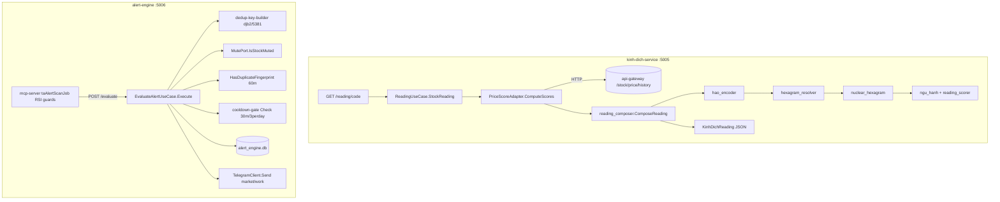

# Go Services — Kinh Dich & Alert Engine

Zone id: `go-signal-plane`. Two Go 1.22 microservices that form the **server-speed signal plane**: `apps/kinh-dich-service` (I-Ching hexagram → trading-signal readings, JSON over HTTP, port 5005) and `apps/alert-engine` (multi-source signal aggregation → dedup → cooldown → Telegram distribution, port 5006). Both are pure-Go HTTP services built on the same DDD layered template (`primitive → domain → application → module → interface`) with explicit import "fences" enforced by `depguard`.

## Purpose & business need

- **kinh-dich-service** delivers a culturally-resonant overlay on top of raw price momentum: it maps a stock's recent 6-period returns onto one of the 64 I-Ching hexagrams (quẻ), then derives a Vietnamese-language trading recommendation (`MUA`/`BÁN`/`GIỮ`/`CHỜ`/`THẬN TRỌNG`), a trend label (`THUẬN LỢI`/`BẤT LỢI`/`TRUNG TÍNH`), a confidence score, and a prose "overall reading". This is the data source behind the Kinh Dịch hexagram-hover feature in the Remix dashboard (see memory note `kinhdich_hover_wrong_surface` — this service serves **JSON only**; the hover prose is rendered by the Remix frontend from this service's payload). It targets a non-technical Vietnamese retail user who finds a quẻ narrative more approachable than RSI/MACD jargon.
- **alert-engine** is the **fast path** of the platform's "Server=speed; Commander=intelligence" alert split (memory `project_alert_split`). It receives already-detected signals (e.g. RSI overbought/oversold, Bollinger breaks, macro, news) and decides — deterministically and within a single HTTP round-trip — whether each one should actually reach the user, after applying fingerprint deduplication, a per-stock+signal cooldown window, a per-stock daily cap, and a mute list, then routes survivors to the correct Telegram channel. Its job is to prevent alert spam while guaranteeing genuinely new, high-severity signals are not throttled.

## Tech stack

- **Language:** Go 1.22 (`toolchain go1.22.0`) for both services.
- **HTTP framework:** `github.com/go-chi/chi/v5 v5.2.1` (router + `middleware.Logger`/`Recoverer`/`SetHeader`) in both services.
- **alert-engine persistence:** `github.com/mattn/go-sqlite3 v1.14.24` (CGO-required driver) over `database/sql`; WAL mode, single connection.
- **alert-engine logging:** stdlib `log/slog` JSON handler (structured logs, `LOG_LEVEL=DEBUG` toggle).
- **kinh-dich-service persistence:** **none compiled in** — `go.mod` requires only `go-chi`. The SQLite "adapters" are stubs (see Gotchas). Built `CGO_ENABLED=0` (pure-Go) per its Dockerfile despite the system-map labelling it `go1.22+cgo`.
- A large `src/_deprecated/**` TypeScript/Bun tree remains in kinh-dich-service (the pre-reboot implementation) and an equivalent `pkg/domain/_deprecated/services_v1.go` in alert-engine — both are dead code retained for reference, not built.

## Entry points

### kinh-dich-service (port 5005, env `PORT`)
- `apps/kinh-dich-service/cmd/server/main.go` — composition root (DI wiring only, ≤80 lines). Wires `infrastructure.NewSQLiteMarkovAdapter()`, `infrastructure.NewHTTPPriceHistorySource()` → `NewPriceScoreAdapter`, `domain.NewReadingService`, `application.NewReadingUseCase`, `httpintf.NewRouter`, then `http.ListenAndServe`.
- `apps/kinh-dich-service/cmd/sandbox/main.go` — offline scenario runner (`-tier`/`-module`/`-scenario`), zero DB/creds, `CGO_ENABLED=0`.
- HTTP routes registered in `pkg/interface/http/router.go` (`NewRouter`):
  - `GET /health`
  - `GET /reading/{code}` → `ReadingUseCase.StockReading`
  - `GET /market` → `ReadingUseCase.MarketReading` (VNINDEX)
  - `GET /readings/{code}/history?days=` → `ReadingHistory` (**stubbed**, returns empty)
  - `GET /hexagram/{number}/transitions?stock=&topN=` → `HexagramTransitions` (**stubbed**)
  - `GET /backtest/{code}?days=` → `Backtest` (**stubbed**, zeroed)
  - `GET /hexagram/{number}/explain` → `HexagramExplain` (fully wired against the 64-hexagram reference table)

### alert-engine (port 5006, env `PORT`)
- `apps/alert-engine/cmd/server/main.go` — composition root. Loads `infrastructure.LoadConfig()`, opens `alert_engine.db` (`OpenAlertDB`), runs idempotent DDL (`InitAlertTables`), wires `SQLiteAlertRepository`, `SQLiteMuteRepository`, `TelegramClient`, builds the `alert_pipeline.New(...)` module **and** an `application.NewEvaluateAlertUseCase(...)`, then serves via chi with 15s read/write timeouts and SIGINT/SIGTERM graceful shutdown (5s drain).
- `apps/alert-engine/cmd/sandbox/main.go` — primitive/module scenario runner; ZERO-CREDS + `CGO_ENABLED=0` gates (pure-function tiers only).
- HTTP routes in `pkg/interface/http/router.go` (`NewRouter`):
  - `GET /health` (returns `{status, service, port:5006}`)
  - `POST /evaluate` → `EvaluateAlertUseCase.Execute`

No MCP tools and no crons are registered by either service (`tools: []`, `crons: []` in `docs/data/system-map.json`); they are stateless HTTP services driven by callers.

## Architecture & key modules

Both services use the same five-tier layout with one-way dependency flow. Imports are fenced (`Fence-A` = primitives are stdlib-only pure compute; `Fence-B` = modules import only primitives + domain + stdlib; `Fence-C` = only the composition root touches infrastructure/CGO).

### kinh-dich-service
| File | Role |
|---|---|
| `cmd/server/main.go` | DI composition root. |
| `pkg/domain/models.go` | Pure types: `HaoState`, `NguHanh(Dynamic)`, `HaoReading`, `QueChinh`, `QueSecondary`, `KinhDichReading` (the full JSON payload shape), `MarkovData`. |
| `pkg/domain/ports.go` | `KinhDichRepositoryPort`, `PriceScorePort`, `MarkovPort`. |
| `pkg/domain/services.go` | `ReadingService` — thin holder injecting `MarkovPort` + `PriceScorePort`. |
| `pkg/application/usecases.go` | `ReadingUseCase` — `StockReading`, `MarketReading`, `HexagramExplain` (wired) + `ReadingHistory`/`HexagramTransitions`/`Backtest` (stubbed); `markovAdapter` bridges domain↔module Markov shapes; sentinel errors `ErrInvalidCode`, `ErrInvalidHexagram`, `ErrInsufficientData`, `ErrNotImplemented`. |
| `pkg/application/dtos.go` | Response DTOs (`ReadingResponse`, `MarketReadingResponse`, `ExplainResponse`, …). |
| `pkg/module/reading_composer/reading_composer.go` | **Core orchestrator** — `ComposeReading(stockCode, scores[6], deps)` runs the 11-step pipeline turning 6 normalised scores into a `KinhDichReading`. |
| `pkg/module/reading_composer/hexagram_data.go` | `trigrams` map, `queMetaList` (64 entries: id/name/chinese/upper/lower), `queDataMap` (64 entries: coreMeaning + trend + 6 `lineData{outcome,action}`). |
| `pkg/module/reading_composer/hexagram_reference.go` | Auto-generated localized EN/VI reference for all 64 hexagrams (`queReference`, `GetQueReference(id)`); backs `/hexagram/{number}/explain` and the dashboard reference panel. |
| `pkg/module/reading_composer/ports.go` | Module-local slim `MarkovPort` + `MarkovData` (blending shape, distinct from domain's prediction shape). |
| `pkg/primitive/hao_encoder/` | `EncodeHaos`/`ClassifyHao` — score → 4-state hào (`LAO_DUONG`/`THIEU_DUONG`/`THIEU_AM`/`LAO_AM`) + binary + isChanging + positional label. |
| `pkg/primitive/hexagram_resolver/` | `ResolveHexagram(signals[6])` — trigram-pair lookup → hexagram 1–64; `HexagramCount()`. |
| `pkg/primitive/nuclear_hexagram/` | `ComputeHoQue(signals)` (nuclear/inner hexagram) + `ComputeBienQue(haos)` (transformed hexagram from changing lines). |
| `pkg/primitive/ngu_hanh_classifier/` | `ClassifyNguHanh(lower,upper)` — five-element generation/destruction relationship + score + interpretation. |
| `pkg/primitive/reading_scorer/` | `ExtractOutcomeScore`, `ExtractTrendScore`, `ExtractAction`, `MajorityVote` — text → numeric/action, with default-on-unknown. |
| `pkg/infrastructure/price_history_http.go` | `HTTPPriceHistorySource` — fetches OHLCV from `PRICE_HISTORY_URL` (default `http://api-gateway:4000`), 8s timeout, maps `close→Price`. |
| `pkg/infrastructure/price_score.go` | `PriceScoreAdapter.ComputeScores` — last 7 closes → 6 returns normalised to [-1,+1] (÷0.05 clamp). |
| `pkg/infrastructure/markov.go` | `SQLiteMarkovAdapter` — **stub**, always returns nil. |
| `pkg/infrastructure/repositories.go` | `SQLiteReadingRepository` (stub source). |
| `dashboard/` | Static `index.html` + `que-reference.js` (file:// dev sandbox; not the production hover surface). |

### alert-engine
| File | Role |
|---|---|
| `cmd/server/main.go` | DI composition root + graceful shutdown. |
| `pkg/domain/models.go` | `AlertSeverity` (low/medium/high/critical + `IsValid`), `TelegramChannel` (market/work/bug), `AlertRequest`, `CooldownConfig` + `DefaultCooldownConfig{30min, 3/day}`, `StoredAlert`, `EvaluateAlertResult`. |
| `pkg/domain/ports.go` | `AlertRepositoryPort`, `MutePort`, `TelegramPort`. |
| `pkg/domain/errors.go` | `ErrAlertEngine`, `ErrAlertSuppressed`. |
| `pkg/application/evaluate.go` | `EvaluateAlertUseCase.Execute` — the live HTTP path: fingerprint → mute → dedup(60min) → cooldown-gate → store → optional Telegram. |
| `pkg/application/dtos.go` | `EvaluateAlertRequest`/`EvaluateAlertResponse`. |
| `pkg/module/alert_pipeline/pipeline.go` | `Pipeline.Run(ctx, req, now)` — the alternative full-story orchestrator (classify→fingerprint→dedup→cooldown→mute→format→route→store) with **injected `now`** for determinism. |
| `pkg/module/alert_pipeline/ports.go` | Slim module-local `AlertRepositoryPort`/`MutePort`/`TelegramPort` (structural subset). |
| `pkg/primitive/signal-classifier/classifier.go` | `Classify(severity)` → channel: critical/high→market, medium/low→work, unknown→invalid. |
| `pkg/primitive/dedup-key-builder/builder.go` | `BuildKey(stock, signalTypes, message)` — djb2 (seed **5381**) 8-hex fingerprint over `stock|sorted(signals)|message[:50runes]`. |
| `pkg/primitive/cooldown-gate/gate.go` | `Check(alert, recentAlerts, cfg, now)` — pure suppression decision (critical-bypass, cooldown overlap, daily cap). |
| `pkg/infrastructure/sqlite.go` | `OpenAlertDB`, `InitAlertTables` (3-phase migration), `SQLiteAlertRepository`, `SQLiteMuteRepository`, alert-outcome store. |
| `pkg/infrastructure/telegram.go` | `TelegramClient.Send` — Bot API POST, silent-skip when token/chat-id empty. |
| `pkg/infrastructure/config.go` | `LoadConfig` — env → `ServiceConfig`. |
| `data/alert_engine.db` (+ `-wal`/`-shm`) | Local SQLite store. |

## Feature-by-feature breakdown

### F1 — Stock / market hexagram reading (kinh-dich)
- **Purpose:** turn a ticker's recent price momentum into an I-Ching reading + Vietnamese trading recommendation.
- **Path:** `GET /reading/{code}` or `GET /market` → `router.go` handler → `ReadingUseCase.StockReading/MarketReading` (`usecases.go`) → `PriceScoreAdapter.ComputeScores(code, 30)` which calls `HTTPPriceHistorySource.GetPriceHistory` → `GET {PRICE_HISTORY_URL}/stock/price/history?code=&days=30` → takes the **last 7 closes**, computes 6 returns, normalises each by ÷0.05 and clamps to [-1,+1] → `reading_composer.ComposeReading(code, scores[6], deps)`.
- **Pipeline inside `ComposeReading`:** (1) `EncodeHaos` classifies each score into a hào state via thresholds `>0.75→LAO_DUONG`, `≥0.10→THIEU_DUONG`, `<-0.75→LAO_AM`, else `THIEU_AM`; (2) extract binary signals; (3) `ResolveHexagram` → quẻ chính number; (4) `ComputeHoQue` (nuclear) and (5) `ComputeBienQue` (transformed); (6) `ClassifyNguHanh` on the two trigram elements; (7) `ExtractTrendScore`+`ExtractOutcomeScore` on active (changing) lines, defaulting to line 5 when none change; (8) `MajorityVote` over per-line actions → trading signal; (9) base confidence `min(|combinedScore|/0.8, 1.0)`; (10/11) optional Markov blend `conf*0.7 + markovWeight*0.3`. Output `KinhDichReading` is mapped to `ReadingResponse`/`MarketReadingResponse`.
- **Edge cases:** insufficient/empty price history (<7 points, or fetch error) → `ComputeScores` returns nil → `ErrInsufficientData` → HTTP **503** (fail-loud, no fabricated reading); empty code → `ErrInvalidCode` → 400; a zero `prevPrice` yields score 0 for that period (not a crash).
- **Hidden dependency:** correctness of the whole reading rests on the `apps/api-gateway`/stock-price `/stock/price/history` contract (`{code, history:[{date,…,close,…}]}`). The fetch timeout is 8s — a slow upstream surfaces as 503, not a hang past that.

### F2 — Hexagram explanation (kinh-dich)
- **Purpose:** static EN/VI reference for any of the 64 hexagrams (trend label, core meaning, trading context).
- **Path:** `GET /hexagram/{number}/explain` → `HexagramExplain(number)` → `reading_composer.GetQueReference(number)` against the auto-generated `queReferenceMap`. Range-validated [1,64] → else `ErrInvalidHexagram` (400). This is the only "history/reference" route fully wired; `ReadingHistory`, `HexagramTransitions`, `Backtest` are deliberate stubs returning valid-but-empty payloads (no DB layer wired).

### F3 — Alert evaluation & distribution (alert-engine, the live path)
- **Purpose:** gate inbound signals and route survivors to Telegram.
- **Path:** `POST /evaluate` → `router.go` `handleEvaluate` (decodes JSON, `DisallowUnknownFields`, trims+uppercases `stock`, validates severity ∈ {low,medium,high,critical}, non-empty message) → `EvaluateAlertUseCase.Execute`:
  1. `dkb.BuildKey` → fingerprint.
  2. `mutePort.IsStockMuted(stock)` → if muted, `Fired:false, reason "<stock> is muted"`.
  3. `alertRepo.HasDuplicateFingerprint(fp, 60)` → dedup within 60 min → suppress.
  4. `alertRepo.GetRecentAlerts(stock, 30)` → `cg.Check(...)` cooldown gate (critical bypass unless `ActionCode=="MACRO"`; cooldown overlap; daily cap 3) → suppress with reason.
  5. `alertRepo.StoreAlert(...)` (RFC3339Nano `triggered_at`).
  6. If `SendTelegram`: channel = market for critical/high else work; `telegram.Send(ctx, channel, "[severity] stock: message")`.
- **Output/side-effects:** a row in `alert_engine_records`; a Telegram message (or silent skip if creds empty); response `{fired, cooldownSec, reason, fingerprint, alertId, code, telegramSent}`.
- **Edge cases:** malformed/unknown-field JSON → 400; the live use case dedups over **60 min** while the cooldown gate uses **30 min** (`DefaultCooldownConfig`) — two different windows on the same request. Telegram failures are swallowed (`sent, _ := Send`); `telegramSent:false` is the only signal of a send miss.

### F4 — Cooldown / daily-cap suppression (cooldown-gate primitive)
- **Purpose:** deterministic anti-spam.
- **Path:** `cooldowngate.Check(alert, recentAlerts, cfg, now)` — **never reads the wall clock**; the caller injects `now`. Rule order: critical+non-MACRO bypass → Rule 1 cooldown (same `Stocks`, parseable `TriggeredAt` within window, signal-type overlap — empty `SignalTypes` counts as overlap) → Rule 2 daily cap (same-calendar-day count ≥ `MaxAlertsPerStockPerDay`). Reason strings are byte-identical to the brownfield TS to keep fixtures stable. Unparseable timestamps are skipped (continue-on-error).

### F5 — Deduplication fingerprint (dedup-key-builder primitive)
- **Purpose:** identity of "the same alert".
- **Path:** `BuildKey` sorts `signalTypes` alphabetically, joins with `,`, takes first 50 message runes, forms `stock|signals|msg`, hashes with djb2 seed **5381** → 8-hex lowercase. **The seed is load-bearing** — changing it silently breaks dedup parity with the TS producer.

### F6 — Severity → channel classification (signal-classifier primitive)
- `Classify` maps critical/high→`market`, medium/low→`work`, unknown→`Valid:false`. Note: the primitive only emits market/work; the `bug` channel exists in domain/telegram but is not produced by `/evaluate` (reserved for infra alerts).

### F7 — Alert-outcome scoring (alert-engine infra)
- **Purpose:** post-hoc labelling of whether a fired alert was "right".
- **Path:** `ReadPendingOutcomeAlerts(db, limit)` returns rows with NULL `outcome` from the last 90 days; `WriteAlertOutcome(db, id, outcome, detail)` is an **idempotent** UPDATE (`WHERE id=? AND outcome IS NULL`) — second call returns `false`. Backed by a partial index `idx_alerts_outcome_pending ON alert_engine_records(outcome) WHERE outcome IS NULL`. No HTTP route exposes this yet; it is a library surface for a batch/cron consumer.

## Data stores

- **`alert_engine.db`** (alert-engine; named-volume mount at `/app/data`, DSN `file:…?_journal=WAL&_busy_timeout=5000&_foreign_keys=on`, `SetMaxOpenConns(1)` single-writer):
  - `alert_engine_records(id PK AUTOINCREMENT, stocks, signal_types, message, fingerprint, severity, triggered_at, sent_telegram, outcome, outcome_at, outcome_detail)` — indexes on `(stocks, triggered_at)`, `(fingerprint, triggered_at)`, and partial `(outcome) WHERE outcome IS NULL`.
  - `alert_mutes(stock PK, muted_until)`.
  - DDL applied in 3 ordered phases by `InitAlertTables` (base tables → idempotent `ALTER TABLE … ADD COLUMN outcome*` → partial index) to migrate TS-era DBs that lacked the outcome columns.
- **kinh-dich-service:** **no live data store.** It reads price history over HTTP and holds the 64-hexagram tables as in-memory Go literals (`queMetaList`, `queDataMap`, `queReferenceMap`). The `SQLiteMarkovAdapter`/`SQLiteReadingRepository` are stubs; `config.go`'s `DB_PATH`/market.db references in the deprecated TS code are not used by the Go path.

## External integrations

- **Price source (kinh-dich):** `HTTPPriceHistorySource` → `PRICE_HISTORY_URL` (default `http://api-gateway:4000`) `GET /stock/price/history`. The api-gateway fronts the `stock-price` service.
- **Telegram (alert-engine):** `https://api.telegram.org/bot{TELEGRAM_BOT_TOKEN}/sendMessage`, `parse_mode:HTML`, chat IDs from `TELEGRAM_INFO_MARKET_GROUP_ID` / `TELEGRAM_INFO_WORK_CHANNEL_ID` / `TELEGRAM_REPORT_BUG_CHANNEL_ID`. Silent-skips when token or chat id is empty (dev/test safety).
- **api-gateway:** registers both services in its proxy registry (`apps/api-gateway/cmd/server/main.go`: `"kinh-dich": http://kinh-dich-service:5005`, `"alert": http://alert-engine:5006`; `pkg/infrastructure/registry.go` health path `/health`). External callers reach them as `/api`-style proxied routes; both can be flagged `NOT_DEPLOYED` for reroute-through-mcp.
- **MCP gateway:** these are downstream HTTP services, not MCP tool servers — they expose no `mcp__vn-market__*` tools (`tools: []`).

## Cross-zone interactions

- **mcp-server → alert-engine (producer→consumer):** `apps/mcp-server/src/scheduler/market-data/taAlertScanJob.ts` is the RSI scan **producer** that detects overbought (RSI>70) / oversold (RSI<30) conditions per watchlist ticker and writes alerts. Its client config (`apps/mcp-server/src/infrastructure/microservices/clients.ts`) points `alertEngine` at `ALERT_ENGINE_URL` (default `http://localhost:5006`). The **RSI single-digit guard and the candle-depth/zero-price fail-closed logic referenced for this zone live in that producer, not in the Go alert-engine** (see Gotchas): `MIN_CANDLES = 35` skips tickers without enough warm-up window, preventing degenerate saturated (100.0) or single-digit RSI artefacts (the `FIX-ALERT-ENGINE-RSI-SINGLEDIGIT` root-cause fix). alert-engine itself is signal-agnostic — it dedups/cooldowns whatever `/evaluate` receives.
- **api-gateway → both:** HTTP proxy + health aggregation.
- **kinh-dich-service → stock-price (via api-gateway):** HTTP `GET /stock/price/history` for the score input.
- **kinh-dich-service → Remix frontend:** the dashboard consumes this service's JSON to render the hexagram-hover prose (memory `kinhdich_hover_wrong_surface`).
- **alert-engine ↔ mcp-server alert table:** the mcp-server keeps its own `alerts`/`signal_queue` store (`apps/mcp-server/src/infrastructure/db/alertStore.ts`) and emits `verified_decision` signals from the "Commander/intelligence" side; alert-engine is the independent "Server/speed" side. The two are not a shared DB — they are the two halves of the alert split.

## Gotchas — must know before changing

- **Two divergent suppression windows per request.** `EvaluateAlertUseCase.Execute` dedups over **60 min** (hardcoded `HasDuplicateFingerprint(fp, 60)`) but the cooldown gate uses `DefaultCooldownConfig.CooldownMinutes` = **30 min**. They are intentional but easy to conflate.
- **Two parallel orchestrators in alert-engine.** `cmd/server/main.go` constructs both `alert_pipeline.New(...)` (assigned to `_`, i.e. wired-but-unused) **and** `application.NewEvaluateAlertUseCase(...)`. **Only the use case serves `/evaluate`.** The `alert_pipeline` module (with its injected-`now` determinism and the `classify` step) is exercised by tests/sandbox but is not the live HTTP path — changing pipeline behaviour will not affect production unless the router is rewired to it.
- **djb2 seed 5381 is a hard constant.** It must match the TS producer's `computeFingerprint`, or dedup parity breaks silently (no error, just duplicate alerts). Same for the cooldown-gate reason strings (fixture-stable).
- **Message prefix is rune-based (first 50 runes), not bytes** — Vietnamese diacritics count as single runes; a byte-based change would alter every fingerprint.
- **cooldown-gate must stay clock-free.** `Check` never calls `time.Now()`; `now` is injected. The live `Execute` passes `time.Now()`, but tests rely on injection — do not reintroduce a wall-clock read inside the primitive.
- **kinh-dich CGO/runtime mismatch.** `docs/data/system-map.json` labels kinh-dich-service `go1.22+cgo`, but its `Dockerfile` builds `CGO_ENABLED=0` and `go.mod` has **no SQLite driver at all**. The Markov/reading SQLite adapters are stubs returning nil. Any "wire the DB" change requires adding a driver dependency and reconciling the system-map label.
- **kinh-dich Markov path is a no-op.** `SQLiteMarkovAdapter.GetMarkovData` always returns nil, so the Step 10/11 confidence blend never fires; confidence is purely `min(|combinedScore|/0.8,1)`. Three routes (`history`, `transitions`, `backtest`) are stubs returning empty/zeroed payloads — they answer 200, not 501, which can read as "working" in a smoke test (see memory `graceful_premise_verify_error_path`).
- **The `THIEU_DUONG` threshold is 0.10, not 0.25.** The hao_encoder header flags this explicitly: the original handoff spec's 0.25 was wrong and rejected. Changing it shifts every hexagram classification.
- **Fail-loud, never fabricate.** `ReadingUseCase` returns `ErrInsufficientData`→503 rather than inventing a reading from <7 prices — aligned with the project's "no fake data" standing goal. Preserve this when refactoring the price path.
- **Telegram errors are swallowed in the live path.** `sent, _ := uc.telegram.Send(...)` discards the error; only `telegramSent:false` indicates a miss. The `bug` channel is configured but never selected by `/evaluate`.
- **The dashboard `index.html` is a file:// dev sandbox**, not the production hover surface (memory `kinhdich_hover_wrong_surface`); do not treat it as the deployed UI.
- **`src/_deprecated/**` (kinh-dich TS) and `pkg/domain/_deprecated/services_v1.go` (alert-engine) are dead code** kept for parity reference; the live behaviour is the Go `pkg/**` tree.

## Internal flow (alert-engine `/evaluate` + kinh-dich `/reading`)

