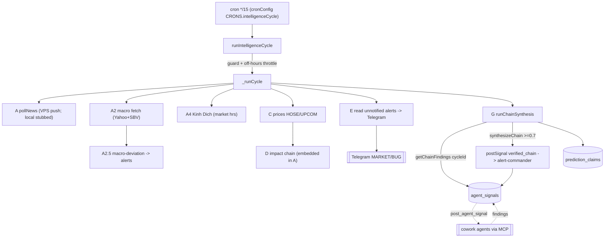

# MCP Server — Core Domain & Application Logic

## Purpose & business need

This zone is the **orchestration brain** of the VN-Market-Intelligence platform. It turns a stream of raw market inputs (news, prices, macro data, SSC filings, financial reports) into **deduplicated, confidence-scored, multi-agent-corroborated trading signals** and pushes the actionable ones to Telegram in plain Vietnamese.

Its central business value is the **verified-chain / critic-gate signal pipeline**: instead of letting any single analysis agent fire an alert, the platform requires that **two or more independent agents post findings for the same ticker inside the same 15-minute window**, then synthesizes those findings into one `verified_chain` signal with a conviction score. Only high-conviction (≥0.7) chains are escalated. A deterministic **TNB critic gate** (5 quality checks) and a **freshness SLA monitor** further guard against low-quality or stale-data signals. The net effect: fewer, higher-precision alerts, with an auditable causal narrative behind each one.

The domain follows **Domain-Driven Design** layering (`domain/` → pure logic, `application/usecases/` → orchestration, `scheduler/` → cron drivers, `infrastructure/` → I/O). The DDD constraint is enforced in code comments and import discipline (e.g. `domain/services/*` are pure, no infra imports; `scheduler/news-analysis/intelligenceCycleJob.ts` header explicitly forbids importing from `domain/`).

## Tech stack

- **Language / runtime:** TypeScript on **Bun** (uses `bun:sqlite` native driver, `Bun.env`, Bun test runner). Entry: `apps/mcp-server/src/index.ts`.
- **Protocol:** Model Context Protocol (MCP) over an HTTP+SSE transport (`interface/mcp/server.ts`), 166 `server.tool(...)` registrations across `interface/mcp/tools/**`.
- **DB:** SQLite (WAL mode) via `bun:sqlite`; vectors live in a separate LanceDB-backed `rag-service` (HTTP, port 5002) — not in this zone.
- **Scheduling:** cron expressions (`scheduler/cronConfig.ts`) driven by `scheduleCron` in `scheduler/startScheduler.ts`.
- **Validation:** `zod` (e.g. `SignalTypeSchema` in `agentSignalStore.ts`).
- **External fetch:** Yahoo Finance, SBV, HOSE/HNX, SSC, VPS push pipeline (Vinahost), Telegram Bot API.

## Entry points

- **Process main:** `apps/mcp-server/src/index.ts` → `bootstrapMcpServer()` in `apps/mcp-server/src/composition-root.ts`. Composition root wires: env self-check → `initDatabase()` → WAL checkpoint replay → trade-profile seed → `createBunServer()` (HTTP+SSE) → Telegram webhook registration → `startScheduler()` → background OCR hook → SIGTERM/SIGINT graceful shutdown.
- **Scheduler registration:** `apps/mcp-server/src/scheduler/startScheduler.ts` (the long `scheduleCron(...)` list). Cron expressions resolved from `apps/mcp-server/src/scheduler/cronConfig.ts` `CRONS`:
  - `intelligenceCycle` → `*/15 * * * *` (Asia/Ho_Chi_Minh) → `runIntelligenceCycle()`.
  - `askQueueCheck` → `*/12 * * * *` → `runAskQueueCheck()`.
  - `freshnessSlaMonitor` → `*/30 * * * *` (UTC) → `runFreshnessSlaMonitorJob()`.
  - plus `marketOpen` (`0 9 * * 1-5`), `marketClose` (`30 15 * * 1-5`), `eveningSummary`, `macroIndicatorRefresh` (`13 19 * * *`), etc.
- **Scheduler barrel:** `apps/mcp-server/src/scheduler/jobs.ts` re-exports `CRONS` + `startScheduler` + startup helpers.
- **MCP tool registrations** (the cross-zone API surface): `apps/mcp-server/src/interface/mcp/tools/registry.ts` imports ~70 `register*Tools` functions. Signal-bus tools live in `interface/mcp/tools/news-analysis/agentSignalTools.ts`: `post_agent_signal`, `get_agent_signals`, `record_signal_outcome`, `get_signal_effectiveness`, `get_open_chain_findings`.
- **Compound cowork entry:** `application/usecases/getCycleBootstrap.ts` — the single call cowork agents make at cycle start (parallel `get_agent_signals` + `get_market_context(24h)` + `get_system_status`).

## Architecture & key modules

```
src/
├── index.ts                     # thin Bun entry
├── composition-root.ts          # bootstrap orchestration (no domain logic)
├── domain/                      # PURE logic, no infra imports
│   ├── signals/                 # signalTypes.ts, signalBuilders.ts (SSOT signal shapes)
│   ├── services/   (93 files)   # cascadeEngine, chainSynthesizer, tnbCriticScorer,
│   │                            #   signalValidator, convictionScorer, alertCooldown,
│   │                            #   freshnessSlaChecker, earningsConflictDetector, kinhDich/…
│   ├── repositories/            # I*Repository.ts port interfaces (DDD ports)
│   └── models/                  # shared-types.ts, vnstockTypes.ts, imfIndicators.ts
├── application/
│   ├── usecases/  (36 files)    # pollNews, runImpactChain, scanMarket, getCycleBootstrap,
│   │                            #   syncVnstockData, syncSectorPeers, parseBctcReport, …
│   ├── cascadeExecutor.ts       # application-level cascade driver
│   └── services/                # imfConvictionBridge, signalQualityAudit, …
├── scheduler/  (26 dirs/files)  # cron drivers — interface/scheduler layer
│   ├── news-analysis/intelligenceCycleJob.ts   # the 7-step cycle (focus)
│   ├── system/freshnessSlaMonitorJob.ts        # 30-min SLA monitor (focus)
│   ├── system/askQueueCheckJob.ts              # 12-min /ask dispatcher (focus)
│   ├── startScheduler.ts        # cron registration (61 KB)
│   └── cronConfig.ts            # CRONS map (env-overridable expressions)
└── infrastructure/db/agentSignalStore.ts       # signal bus persistence (focus)
```

Key files and roles:

| File | Role |
|---|---|
| `scheduler/news-analysis/intelligenceCycleJob.ts` | The end-to-end 15-min intelligence cycle (steps A→G). Concurrency guard, per-step timeouts, market-hours gating, chain synthesis. |
| `infrastructure/db/agentSignalStore.ts` | CRUD for the `agent_signals` bus: `postSignal`, `postSignalWithCriticGate`, `getSignals`, `getChainFindings`, `getOpenChainFindings`, `getSignalsGroupedByCausalRoot`, `recordOutcome`, `getSignalEffectiveness`, `computeCycleId`, dedup, earnings-conflict, outcome seeding. |
| `domain/services/chainSynthesizer.ts` | Pure `synthesizeChain()` — merges 2+ agent findings into a `SynthesizedChain` (conviction, action, Vietnamese narrative, dimension flags). |
| `domain/services/tnbCriticScorer.ts` | Pure `scoreWithTnbCritic()` — 5 deterministic quality checks × 0.2, threshold 0.6. |
| `domain/services/signalValidator.ts` | Pure `validateSignalPrice()` — ±5% divergence → confidence 0–100, fallback penalty 0.8075, temporal decay. |
| `domain/services/convictionScorer.ts` | Pure `computeConviction()` — cross-validates 7 independent signal dimensions → conviction [0,1] + Vietnamese level label. |
| `domain/services/cascadeEngine.ts` | Pure `buildCausalChain()` — hardcoded sector-impact rules map macro/news events to per-stock impact scores. |
| `application/usecases/runImpactChain.ts` | Async wrapper: fetch macro context + RAG, call `buildCausalChain`, record rule hits. |
| `scheduler/system/freshnessSlaMonitorJob.ts` | 12-table data-freshness SLA check, breach audit, market-hours-aware escalation. |
| `scheduler/system/askQueueCheckJob.ts` | Signals `07-qa-responder` when `ask_queue` has pending questions (server never answers). |
| `infrastructure/db/schema-news.ts` | DDL for `agent_signals`, `rag_analyses`, `mention_velocity`, `reputation_scores`, `cascade_rule_hits`. |

## Feature-by-feature breakdown

### 1. The 15-minute intelligence cycle (`intelligenceCycleJob.ts`)

**Business purpose:** the heartbeat that keeps the whole platform current — polls news, prices, macro, computes Kinh Dịch readings, fires alerts, and synthesizes cross-agent chains.

**Technical path** (`runIntelligenceCycle()` → `_runCycle()`):
- Concurrency guard: module-level `cycleRunning` / `cycleStartedAt`; a hung cycle force-releases after `CYCLE_MAX_RUNTIME_MS` (14 min). Off-hours throttle: ≥60-min spacing.
- `isMarketHours()` gates the full vs reduced path: full cycle only Mon–Fri 09:00–15:30 GMT+7 (UTC-offset arithmetic via `VN_OFFSET_MS`).
- **Step A** `pollNews()` (always; 5-min timeout). **Note:** all local fetchers are stubbed to `async () => []` (tasks 1187/1228/1843) — real ingestion is the VPS push path (`POST /api/push-news`). `vps_push_log` freshness suppresses false "all-sources-dark" alerts.
- **Step A2** macro fetch (Yahoo + SBV, builds σ-history 24/7). **Step A2.5** macro-deviation alerts: `classifyDeviation()` → `storeAlerts()` with deterministic id `macro-{date}-{indicator}-{level}` (one alert per indicator per level per UTC day; `usdVndOfficial` skipped as duplicate of `usdVndRate`).
- **Step A3** vnstock lazy sync. **Step A4** (market hours only) per-watchlist Kinh Dịch hexagram readings with a per-stock 15-min cooldown (`_lastHexagramComputedAt`).
- **Step B** SSC document list (once/day via `_lastSscScanDate`). **Step C** HOSE/UPCOM prices (classified by `watchlist.exchange`). **Step C2** sector-peer financials sync. **Step D** impact chain (returns 0 — work embedded in Step A by design).
- **Step E** (unconditional since task 1255): read unnotified HIGH/CRITICAL alerts up to 24h old (`ALERT_WINDOW_MS`), apply cooldown (`shouldSuppressAlert`, MACRO alerts use 6h `macroCooldownMinutes` and bypass per-stock cooldown), pre-pass market-wide cascade summary to MARKET channel, send each to Telegram, mark `notified_telegram`.
- **Step G** `runChainSynthesis()`: groups `agent_signals` of the current `computeCycleId()` window by `stock_code`; for stocks with ≥2 findings calls `synthesizeChain()`; conviction ≥0.7 → `postSignal(verified_chain → alert-commander)` **and** auto-inserts a `prediction_claims` row (7-day resolution) for later accuracy scoring.

**Edge cases / hidden deps:** per-step `withTimeout` (pollNews 5 min, syncPeers 5 min, SSC 5 min, others 2 min); Step F (`/ask`,`/why`) removed (task 1063); all sub-steps swallow errors into a non-fatal `errors` counter; a >12-min cycle logs a WARN.

### 2. Agent signal bus (`agentSignalStore.ts`)

**Business purpose:** the shared blackboard letting independent analysis agents corroborate each other — the substrate the verified-chain depends on.

**Technical path:** `postSignal(db, input)` inserts into `agent_signals` then seeds a pending `signal_outcomes` row for directional signals (`seedSignalOutcome`, swallowed on failure). The insert is defensive: it probes which optional column groups exist (`hasChainColumns`, `hasCausalRootColumns`, `hasSignalClassColumn`, `hasValidationColumns`, `hasContextColumns`, `hasCriticColumns`) and selects the matching INSERT — supporting both fresh and legacy DBs.

Built-in guards inside `_postSignalInner`:
- **Dedup (task 1862g):** same `(stock_code, signal_type, direction)` within a window → returns `-1`, no insert. `urgent_news` default window 240 min; all others 0 (disabled). Direction read from `finding_data.direction` / `catalyst_direction` via `JSON_EXTRACT` (LIKE fallback).
- **Sentinel normalization (task 1334):** `stockCode === "unknown" | "" | undefined` → NULL so chain grouping doesn't bucket market-wide signals under a fake "unknown" stock.
- **Earnings-conflict (task 1786):** `chain_catalyst` + `event_type === "earnings"` runs `detectEarningsConflict()` and appends a warning to `payload.detail` (non-blocking).

**Reads:** `getSignals` (inbox, marks unread→read atomically), `getChainFindings(cycleId)`, `getChainFromRoot(rootId)`, `getOpenChainFindings(minutesBack)`, `getSignalsGroupedByCausalRoot` (consolidates by `causal_root_id` for Alert Commander), `getPriceAnomalySignals`. `getSignalEffectiveness` aggregates precision = confirmed/(confirmed+false_positive) per `(from_agent, signal_type)`.

### 3. TNB critic gate (`tnbCriticScorer.ts` + `postSignalWithCriticGate`)

**Business purpose:** kill low-quality signals before they pollute the bus. Implements the "TNB methodology" (Trần-Ngọc-Báu macro analyst persona).

**Technical path:** `postSignalWithCriticGate(db, input, opts)` builds a `CriticInput`, races `scoreWithTnbCritic()` against a 20s timeout (`CRITIC_TIMEOUT_MS`). Five checks × 0.2, pass ≥0.6:
1. **Pillar coverage** — detail mentions money supply / cost of capital / profit / policy.
2. **Source tier** — no Facebook/Zalo/Reddit as sole primary.
3. **Specificity** — `title+detail` ≥80 chars, no vague hedge ("có thể"/"possibly"/"might").
4. **BCTC forensics** — only for `fundamental_validation`: `findingData` must carry `m_score`/`f_score`/`accruals_flag`/`btn_check`.
5. **Confidence anchor** — `impact_score ≥ 3` OR `findingData.confidence_score > 0.5`.

Protocol: score ≥0.6 → write; <0.6 & retryCount 0 → return `signalId=-1` with critique (no write, retry pending); <0.6 & retryCount 1 → write anyway (fail-soft); timeout/error → write with `critic_score=null` (fail-soft, signal passes unscored).

### 4. Chain synthesis & conviction (`chainSynthesizer.ts`, `convictionScorer.ts`)

**Business purpose:** the actual cross-validation engine — convert raw corroboration into a single conviction-scored recommendation.

**`synthesizeChain(links)`** (returns null for <2 links): conviction = mean link confidence + 0.05 per independent confirming agent − 0.05 per disconfirming link + IMF macro delta (±0.2 when IMF confidence ≥ `IMF_CONFIDENCE_MIN` 0.55), clamped [0,1]. Action: ≥0.8 + bullish → BUY, ≥0.8 + bearish → SELL, ≥0.6 → WATCH, else HOLD. Builds a Vietnamese narrative with depth labels (Catalyst/Cơ bản/Giá/Tổng hợp). Defensive `extractConfidence` applies a 0.3 penalty for an uninitialized (undefined) confidence field, distinguished from a legitimate 0. **`computeConviction(input)`** (separate, 7-dimension cross-validator) outputs conviction + Vietnamese level ("Xác tín cao", etc.).

### 5. Causal cascade / impact chain (`cascadeEngine.ts`, `runImpactChain.ts`)

**Business purpose:** trace a global/macro/news event down to which watchlist stocks it moves and by how much.

`runImpactChain()` (application) fetches commodity (Yahoo) + SBV macro context + RAG context (`rag-service` HTTP) + σ-stats, then calls pure `buildCausalChain(seedEntry, watchlist, ragResults, macroContext, macroStats, broadcastMinImpact)`. Sector-impact rules are **hardcoded, first-match-per-domain wins** (`SectorRule[]` in `cascadeEngine.ts`). Rule hits are recorded to `cascade_rule_hits` for instrumentation. Macro adjustments (`applyMacroAdjustments`/`applyDynamicMacroAdjustments`) shift impact scores by real-time FX/commodity/rate context.

### 6. Freshness SLA monitor (`freshnessSlaMonitorJob.ts`)

**Business purpose:** the watchdog ensuring served metrics are real and current (project standing goal: no stale/fake data).

`runFreshnessSlaMonitor()` queries `querySignalAges()` — a 12-way UNION computing minutes since the newest row in each source table (`market_prices`, `financial_reports`, `rag_analyses`, `sbv_rates`, `daily_ohlcv` foreign flow, `vnstock_financials`, `bond_maturity`, `commodity_prices`, `broker_sanctions`, `backtest_runs`, `signal_quality_audit`, `prediction_claims`). Zero-row tables return **-1 ("not-seeded", skip)**. Breaches → `recordSlaBreach()` into `sla_breach_audit`; escalation posts an `urgent_news` signal to `alert-commander` with severity-derived confidence (CRITICAL=90, HIGH=70), gated by a 60-min cooldown and suppressed off-hours for market-hours-only sources (`price`, `foreign_flow`). A once-per-UTC-day coverage snapshot is sent to the WORK channel.

### 7. Ask-queue dispatcher (`askQueueCheckJob.ts`)

**Business purpose:** route user `/ask` questions to the `07-qa-responder` cowork agent — the server itself never answers.

`runAskQueueCheck()` reads `getPendingAskQuestions()`; if any, posts one `pending_questions` signal to `07-qa-responder` (confidence = min(100, count×10)), fire-and-forget `spawnQaResponder()`, and records the run to `cron_job_runs`.

## Data stores

All in the single named-volume SQLite `market.db` (WAL). **Important:** the live DB is a Docker **named volume**, not host `./data/market.db` (which is a stale 0-row decoy) — query via a sqlite sidecar.

| Table | Key columns / purpose |
|---|---|
| `agent_signals` | The signal bus. Base: `id, from_agent, to_agent, signal_type, stock_code, payload(JSON), status, created_at, expires_at`. Added by migration: `outcome/outcome_at/outcome_detail`, `cycle_id, finding_data(JSON), causal_ref, chain_depth, processed`, `causal_root_id/label`, `signal_class`, `confidence_score(def 50), validated_at`, `news_sentiment, kinh_dich_confidence, agent_signals_majority`, `critic_score, critic_notes, retry_count`, `alert_id`. Indexes on `(to_agent,status)`, `expires_at`, `cycle_id`, `causal_ref`, `(stock_code,created_at)`, `alert_id`. DDL in `schema-news.ts`. |
| `rag_analyses` | Analyzed news entries (vectors mirrored in LanceDB). Freshness `news` SLA reads `MAX(created_at)`. |
| `alerts` | HIGH/CRITICAL alerts; `notified_telegram` flag drives Step E. |
| `sla_breach_audit` | Breach lifecycle (`status: breach_open|recovered`, `escalation_callback_sent`). |
| `prediction_claims` | Auto-populated by Step G for ≥0.7 chains; later scored for accuracy. |
| `signal_outcomes` / `signal_quality_audit` | Outcome feedback loop + per-signal validation audit. |
| `cascade_rule_hits` | Cascade rule firing instrumentation. |
| `watchlist` | `code, exchange, domain` — drives price routing (HOSE vs UPCOM) and peer sync. |
| `cron_job_runs`, `vps_push_log` | Job observability + VPS news/price push health. |

LanceDB vectors are **not** in this zone — they live behind the `rag-service` HTTP boundary (port 5002).

## External integrations

- **VPS push pipeline (Vinahost):** all news (`vn-news-fetch.service`, 10 sources) and prices arrive via `POST /api/push-news` / push endpoints; freshness tracked in `vps_push_log`. Geo-blocked VN sources (SSC, HNX, BCTC files at `http://125.212.251.27:8765`) are proxied through the VPS.
- **Telegram Bot API:** three channels — MARKET (`sendTelegramMarket`), WORK (`sendTelegramWork`), BUG. Used by Step E alerts, cascade summaries, SLA daily snapshots. Webhook registered at bootstrap.
- **Yahoo Finance / SBV:** macro snapshots (commodity, FX, central-bank rates) in Step A2 and `runImpactChain`.
- **HOSE/HNX fetchers:** `fetchHosePrices` (VnDirect→CafeF), `fetchUpcomPrices`.
- **rag-service (HTTP 5002):** RAG context retrieval for impact chains (`ragHttpClient.ts`).
- **pdf-extractor microservice (5001):** BCTC OCR, health-checked at bootstrap.

## Cross-zone interactions

- **Cowork agents (claude.ai gateway → `vn-market` MCP server):** call `post_agent_signal` / `get_agent_signals` / `get_open_chain_findings` (in `agentSignalTools.ts`) and `getCycleBootstrap` to read/write the bus. This is the primary cross-zone mechanism — **shared DB table + MCP tool calls**, not direct function calls.
- **Alert Commander (cowork):** consumes `verified_chain` and consolidated `causal_root` groups produced by Step G; receives SLA-breach `urgent_news` escalations.
- **07-qa-responder (cowork):** woken by `askQueueCheckJob` via a `pending_questions` signal.
- **fb-market-poster / digest-predict / report-analyzer (cowork):** read signals + market context produced here.
- **Microservice plane (intentionally undeployed):** rag-service, pdf-extractor, Go TA service, kinh-dich-service — reached over HTTP; this zone degrades best-effort when they are down.
- **MCP gateway architecture:** the `vn-market` server is reached only through the claude.ai gateway `call_tool` wrapper (per project CLAUDE.md); 166 tools registered but not loaded directly into the router.

## Gotchas — "must know before changing"

1. **Step A pollNews is a deliberate no-op.** Every local fetcher is stubbed `async () => []` (tasks 1187/1228/1843). Real news comes from the VPS push path. Do **not** "fix" the empty fetch — re-enabling local fetchers re-launches Chromium per tick (the task-1843 regression: 1,227 runaway alerts in 2 days).
2. **`agentSignalStore.ts` has a deeply nested column-detection ladder.** `_postSignalInner` branches on 6 optional column groups to support legacy DBs. Any new column must be added at the right nesting level **and** to the schema-news.ts guarded `ALTER TABLE` list, or older rows / migration paths break.
3. **`postSignal` returns `-1` on dedup suppression**, not an error. Callers must treat `signalId <= 0` as "not inserted" (the outcome-seeding block already guards on `signalId > 0`).
4. **Confidence-score default is 50** (`FIX-SIGNAL-CONFIDENCE-DEFAULT-50`). Several producers now derive it honestly (chain conviction×100, SLA severity 90/70, ask-queue depth×10). Don't reintroduce a constant 50 on a served metric — it violates the no-fake-data standing goal.
5. **Cycle window = 15 min, UTC-floored** (`computeCycleId`: minute → 0/15/30/45). Chain synthesis only sees findings whose `cycle_id` matches `computeCycleId()` at synthesis time — agents must post within the same window or they never chain. `getChainFindings` excludes `stock_code IS NULL / 'unknown'`.
6. **TNB critic gate fails *open*** (timeout/error → signal written unscored with `critic_score=null`). It is a quality nudge, not a hard block; max 1 retry. A `verified_chain` from Step G is posted **directly via `postSignal`, bypassing the critic gate**.
7. **Sentinel `stock_code = "unknown"`** must be normalized to NULL; legacy rows need `migrateUnknownStockCodes()` (idempotent) or they pollute chain grouping (bug 1313/1334).
8. **Step E alert window is 24h** (`ALERT_WINDOW_MS`), not the cycle length — orphaned unnotified alerts are retried; the downstream `sendAlert` dedup prevents double-notify. MACRO alerts bypass per-stock cooldown (their daily `INSERT OR IGNORE` id already dedups).
9. **`SignalTypeSchema` (zod) is the SSOT** for valid signal types — imported by `agentSignalTools`. Adding a type means updating the enum, not just the TS union.
10. **`getSignals` with default `status:"unread"` mutates state** (marks rows read) — but only in inbox mode (`fromAgent` unset). Sender-history lookups (`fromAgent` set) are side-effect-free. A read-only inspection must pass `status:"all"` or `fromAgent`.
11. **Live DB ≠ host `./data`.** Verify against the named volume; row-count parity between two tools doesn't prove same-rows-seen (same-DB tools have diverged on candle counts historically).
12. **Per-step error swallowing** — every cycle step catches into a non-fatal `errors` counter; a green cycle with `errors>0` is not a healthy cycle. Check the `errors` field, not just completion.

## Mermaid — intelligence cycle internal flow


