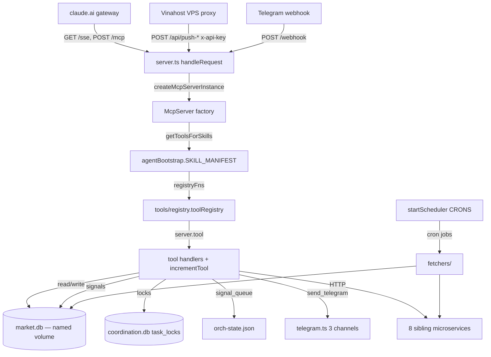

# MCP Server — Tool Interface & Infrastructure

## Purpose & business need

This zone is the **single front door** through which every Claude agent (cowork team + dev team) reaches the VN-Market-Intelligence platform. It exposes ~164 MCP tools (the registry runs through `#168`, with gaps) — `get_market_snapshot`, `get_bctc_full`, `get_ticker_intelligence`, `post_agent_signal`, `send_telegram`, `task_claim`, etc. — over an HTTP/SSE transport that the claude.ai gateway proxies. It also owns:

- the **named-volume SQLite database** (`market.db`) holding all served market data, financial reports, signals, alerts, and system state;
- the **HTTP ingest surface** that the Vinahost VPS proxy pushes geo-blocked Vietnamese data into (prices, foreign flow, news, SBV FX rates, BCTC PDFs);
- the **external data fetchers** (vnstock bridge, FRED, SSC, RSS, etc.);
- the **cross-session coordination locks** (`coordination.db` / `task_locks`) and the **signal queue** (`agent_signals` + `orch-state.json`) that let multiple Claude sessions cooperate without colliding;
- the **cron scheduler** that drives autonomous market monitoring, BCTC pulls, and health watchdogs;
- the **Telegram notifier** that fans market intelligence / work status / bug reports out to three channels.

In short: this is where market-intelligence *value* is registered as callable tools, where *raw data* enters the system, and where it is *persisted* for every other zone to read.

## Tech stack

- **Language / runtime:** TypeScript on **Bun** (`bun:sqlite`, `Bun.env`, `Bun.serve`-adjacent `node:http`). Entry is `bun run src/index.ts`.
- **MCP SDK:** `@modelcontextprotocol/sdk@1.29.0` (pinned — see Gotchas). Uses `McpServer`, `SSEServerTransport`, and `WebStandardStreamableHTTPServerTransport`.
- **DB:** SQLite via `bun:sqlite` (WAL mode). `better-sqlite3` is a dependency but the live code path uses `bun:sqlite`.
- **Validation:** `zod@^3.23` for every tool input schema.
- **Scheduler:** `node-cron@^3`.
- **Fetch / scrape:** `axios`, `cheerio`, `rss-parser`, `puppeteer-core` (Chromium for geo-blocked scrapes), `pdf-parse` + `node-tesseract-ocr` (BCTC OCR fallback).
- **Vector / ML:** `@lancedb/lancedb`, `@huggingface/transformers` (declared; LanceDB lifecycle is delegated to the `rag-service` microservice — `composition-root.ts` shutdown notes "rag-service owns LanceDB lifecycle").
- **Architecture:** DDD-style layering — `interface/` → `application/` → `domain/` → `infrastructure/`, enforced by `eslint-plugin-boundaries`.

## Entry points

- **Process main:** `apps/mcp-server/src/index.ts` — sets `RUST_LOG`/`LANCEDB_LOG_LEVEL`, loads config + logger, then calls `bootstrapMcpServer()`.
- **Bootstrap orchestrator:** `apps/mcp-server/src/composition-root.ts` → `bootstrapMcpServer(cfg, log)`. Ordered sections: env self-check → `initDatabase()` + vnstock migrations + WAL checkpoint replay → startup sentinel row → trade-profile seed → `createBunServer()` → Telegram env check → `registerWebhook()` → pdf-extractor health → `startScheduler()` → 10s-delayed background OCR sweep → SIGTERM/SIGINT graceful shutdown (writes clean-shutdown sentinel).
- **HTTP server factory:** `apps/mcp-server/src/interface/mcp/server.ts` → `createBunServer()`. Defines all HTTP routes (below) and the **per-session `McpServer` factory** `createMcpServerInstance(skills?, sessionId?)`.
- **HTTP routes** (in `server.ts handleRequest`, prefix-stripped for Cloudflare `/vn-market/*`):
  - `GET /sse` + `POST /messages?sessionId=` — legacy SSE MCP transport (via `SseSessionManager`).
  - `POST|GET /mcp` — Streamable HTTP for claude.ai connectors (one transport+server per request).
  - `GET /health`, `GET /` — liveness + endpoint info.
  - `POST /webhook` — Telegram bot command webhook (`webhookHandler.ts`).
  - **VPS ingest (API-key auth):** `POST /api/push-prices`, `/api/push-foreign-flow`, `/api/push-news`, `/api/push-sbv-rates`, `/api/push-bctc-pdf` (multipart), `/api/enrich-queue-item`; `GET /api/watchlist`, `/api/bctc-fetch-queue`, `/api/foreign-flow-status`.
  - **BCTC inspector / human-confirm:** `GET /api/bctc-inspect[...]` (page, docs, pdf, ocr, table, md, zones, page-image, page-window, flags), `POST /api/bctc-inspect/correct|confirm[/reset]`, `POST /api/push-bctc-table|md-tables|layout`, `POST /api/trigger-pek-extract`.
  - **Frontend read DTOs (FE-REROUTE / TASK17):** ~25 `GET /api/*` endpoints — `market-digest`, `analysis-brief[s]`, `news-sentiment`, `macro-regime`, `price-history`, `alerts`, `foreign-flow`, `agm-plan-actual`, `prediction-claims`, `conviction-history`, `market-summaries`, `sector-rotation`, `sector-cascade`, `kinh-dich-signals`, `global-markets`, `corporate-events`, `shareholders`, `officers`, `financials`, `fed-rates`, `reputation`, `news-buzz`, plus `quality-checklist`, `orchestration`, `fetch-status`, `vps-proxy-health`, news-fetch dashboard statics.
- **MCP tool registration SSOT:** `apps/mcp-server/src/interface/mcp/tools/registry.ts` → `toolRegistry` (flat array of ~110 `registerXxxTools(server)` functions; each registers 1–N tools).
- **Skill-gated tool resolution:** `apps/mcp-server/src/interface/mcp/bootstrap/agentBootstrap.ts` → `getToolsForSkills(skills[])`.
- **Cron registration:** `apps/mcp-server/src/scheduler/startScheduler.ts` (`startScheduler()`), schedules in `apps/mcp-server/src/scheduler/cronConfig.ts` → `CRONS`.

## Architecture & key modules

### Tool interface layer (`src/interface/mcp/`)
- **`server.ts`** (2412 lines) — HTTP server, route table, the `createMcpServerInstance` factory. Wraps every registered tool handler with `incrementTool()` telemetry (the only reliable per-call counter because the gateway dials a fresh SSE connection per call, so `sessionId` rarely fires). Holds **one shared `getDb()` handle** for all HTTP route handlers (opened once at startup).
- **`transport.ts`** → `SseSessionManager` — maps `sessionId → SSEServerTransport`; one `McpServer` per SSE connection (SDK limitation); 30s keep-alive heartbeat to survive Cloudflare proxy timeouts; evicts session on heartbeat write failure.
- **`tools/registry.ts`** — the registration SSOT. Add a tool = create `tools/<area>/<file>.ts` exporting `registerXxxTools(server)`, add one import + one array entry. `server.ts` needs no edit.
- **`tools/<area>/*.ts`** — tool implementations, grouped by domain: `market-data/`, `financial-reports/`, `macro/`, `news-analysis/`, `alerts/`, `portfolio/`, `sector/`, `briefings/`, `system/`, `kinhdich/`, `backtesting/`, `analysis/`. Each calls `server.tool(name, description, zodSchema, async handler)` and returns `{content:[{type:"text", text: JSON.stringify(...)}]}`. Example: `tools/system/coordinationTools.ts` registers `task_claim`/`task_heartbeat`/`task_release`/`task_list_held`/`task_force_release_orphan`/`get_week_period`.
- **`bootstrap/agentBootstrap.ts`** — `SKILL_MANIFEST` maps each agent skill (`news_scout`, `financial_analyst`, `market_watcher`, `alert_commander`, `digest_predict`, `dev_team`, `qa_responder`, `report_analyzer`, `unified_coordinator`) → its allowed tool names. `buildToolNameMap()` probes every registry fn against a fake server once at module load to build `toolName → registryFn`. `getToolsForSkills()` narrows the registered tool surface per session, always injecting `ALWAYS_ON_TOOLS` (7: `get_cycle_bootstrap`, `submit_feedback`, `get_recent_fixes`, `log_agent_work`, `send_telegram`, `post_agent_signal`, `get_agent_signals`).
- **`routes/*.ts`** — ~70 HTTP route handlers (dependency-injected `db` + `log`), one per REST endpoint.

### Infrastructure layer (`src/infrastructure/`)
- **`db/schema.ts`** — `getDb()` singleton (WAL, `foreign_keys=ON`, `busy_timeout=5000`, `wal_autocheckpoint=1000`), `initDatabase()` (idempotent, runs 9 domain-slice initializers + watchlist seed + BCTC backfills + ad-hoc migrations), `closeDb()`. **Inode-change detection**: `getDb()` re-`statSync`es the file and reopens if the inode changed (file deleted/recreated under a running server).
- **`db/schema-*.ts`** — 9 domain slices: `schema-market-data`, `schema-financial-reports`, `schema-news`, `schema-alerts`, `schema-portfolio`, `schema-briefings`, `schema-macro`, `schema-system`, `schema-backtesting`.
- **`db/*Store.ts`** — ~50 repository modules (raw `db.prepare().run/get/all`), one per table family. Key ones: `agentSignalStore.ts` (signal queue), `coordinationStore.ts` (task locks), `alertStore.ts`, `vnstockStore.ts`, `signalOutcomeStore.ts`, `telegramReportStore.ts`, `vpsPushLogStore.ts`.
- **`config.ts`** — loads `mcp.config.json` (`loadMcpConfig()`, cached `mcpConfig`) + env overrides into typed `AppConfig`/`McpConfig`. Holds watchlist, referenceStocks, globalIndices, fetcher URLs, alert policy thresholds, fetch-limit profiles.
- **`envCheck.ts`** — `assertEnvDbConsistency()` (hard-kills process if `APP_ENV`/`DB_PATH` mismatch — prevents a dev container writing prod data), `runEnvCheck()`, `currentDataEnv()`.
- **`fetchers/`** — ~40 external data fetchers (`vnstockBridge.ts` is the primary VN source via a Python subprocess; `fredApi.ts`/`fredEffrIorb.ts` for US macro; `ssc.ts`/`congbao.ts`/`hose.ts`/`hnx.ts` for filings; `cafef.ts`/`vnexpress.ts`/`vneconomy.ts`/`rss.ts` for news; `pdf.ts`/`pdfOcrWorker.ts`/`pdfExtractorClient.ts` for BCTC; `polymarket.ts`, `tradingEconomics*.ts`, `yahooFinance.ts`, `weatherVn.ts`, `davPharmacy.ts`, etc.). Source routers (`priceSourceRouter`, `newsSourceRouter`, `bctcSourceRouter`) pick local-vs-VPS.
- **`notifiers/telegram.ts`** — three-channel send (`sendTelegramMarket`/`sendTelegramWork`/`sendTelegramBug`), Markdown→plaintext fallback, 4096-char split, token never logged.
- **`microservices/clients.ts`** — HTTP adapters to 8 sibling services: api-gateway:4000, stock-price:5000, pdf-extractor:5001, rag-service:5002, technical-analysis:5003, macro-indicators:5004, kinh-dich:5005, alert-engine:5006 (timeout + retry).
- **`rag/ragHttpClient.ts`** — RAG search/index over HTTP to rag-service:5002 (vector + temporal decay).
- **`orchStateStore.ts`** — atomic read-modify-write for `docs/data/orch/orch-state.json` (the cross-session blackboard: `signal_queue`, `task_board`, `head`). mtime-compare-retry CAS to survive concurrent writers (dev-team / cowork-team / system-auditor).
- **`circuitBreaker.ts` / `circuitBreakerRegistry.ts`** — per-source breakers for flaky fetchers.
- **`logger.ts`**, **`journalStore.ts`**, **`telemetry/perCallCounterStore.ts`**, **`vps/sshExec.ts`** (VPS service restart).

### Scheduler (`src/scheduler/`)
- **`startScheduler.ts`** — imports ~70 job runners and registers them against `CRONS`.
- **`cronConfig.ts`** → `CRONS` — ~50 named cron expressions, all env-overridable (e.g. `intelligenceCycle '*/15 * * * *'`, `foreignFlowFetch '*/1 * * * *'`, `vpsServiceHealth '*/5 * * * *'`, `bctcReparseJob '30 9 * * *'`, `walCheckpoint '*/30 * * * *'`).
- Job folders: `market-data/`, `financial-reports/`, `news-analysis/`, `news/`, `macro/`, `alerts/`, `briefings/`, `digest/`, `portfolio/`, `audits/`, `system/`.

## Feature-by-feature breakdown

### 1. MCP tool exposure (the ~164-tool surface)
- **Business purpose:** give agents one well-described callable per intelligence capability.
- **Path:** gateway dials `GET /sse` (or `POST /mcp`) → `createMcpServerInstance(skills, sessionId)` → if `skills` present `getToolsForSkills(skills)` else full `toolRegistry` → each `fn(server)` calls `server.tool(...)` → handlers wrapped by `incrementTool()` → `_registeredTools` populated → tool calls arrive on `POST /messages` and dispatch to the matching handler → handler reads/writes `market.db` and returns JSON text.
- **Edge cases / hidden deps:** Skill-gating narrows the surface so a session only sees its allowed tools; `ALWAYS_ON_TOOLS` are always injected. `buildToolNameMap()` warns (not throws) on duplicate tool names — but the *real* `McpServer` throws "Tool X already registered" at startup, so a name collision is a hard boot failure. A `SKILL_MANIFEST` tool name with no registry entry is silently dropped from that session (logged warning) — drift between `agentBootstrap.ts` and `registry.ts` is a real hazard.

### 2. Cross-session coordination locks (`task_claim` family)
- **Business purpose:** prevent two Claude Code OS processes (separate sessions) from doing the same exclusive work — cowork 15-min slots, sprint-task board rows, dashboard rows, and the fleet-wide `commit-mutex:main` git critical section.
- **Path:** `tools/system/coordinationTools.ts` → `infrastructure/db/coordinationStore.ts` → **`coordination.db`** (a *separate* DB from market.db) → `task_locks` table. Claim protocol: `INSERT OR IGNORE` → on miss `UPDATE WHERE expires_at<now` (stale-steal) → `SELECT` current holder.
- **Edge cases / hidden deps:** `owner_session` is **server-injected** (`SERVER_SESSION_ID = pid-<pid>-ts-<startMs>`), never caller-supplied — anti-spoofing. After an mcp-server restart `SERVER_SESSION_ID` changes, so `task_heartbeat`/`task_release` now match on `owner_agent` (stable) — legacy calls without `owner_agent` go zombie after restart. `task_force_release_orphan` recovers leader-locks orphaned by a restart (only when `heartbeat_at` is older than threshold AND owner_agent matches). If `coordination.db` fails to open → **refuse-all mode** (`_coordDbUnavailable`) — all claims return `claimed:false`, never throw. The CHECK-constraint migration to add `commit-mutex` recreates the table in a transaction (SQLite can't ALTER a CHECK in place).

### 3. Signal queue / agent message bus (`post_agent_signal` / `get_agent_signals`)
- **Business purpose:** async agent-to-agent intelligence relay (news-scout → analyst → alert-commander chains, with causal-root grouping and confidence scoring).
- **Path:** `post_agent_signal` tool → `agentSignalStore.postSignal(db, input)` → `agent_signals` table (in market.db). Optional critic gate via `postSignalWithCriticGate()`. Consumers query `getSignals()`, `getOpenChainFindings()`, `getSignalsGroupedByCausalRoot()`.
- **Edge cases / hidden deps:** `agent_signals` started small and grew ~20 columns via `try{ALTER TABLE...}catch{}` (outcome, cycle_id, finding_data, causal_ref/root_id/label, signal_class, confidence_score, validated_at, news_sentiment, kinhDichConfidence). Time-window dedup: same `(stock_code, signal_type, direction)` within `dedupWindowMinutes` → returns `-1` (suppressed, no row); default 240 min for `urgent_news`, 0 otherwise. A *parallel, lighter* signal lane exists as `orch-state.json .signal_queue.rows[]` (≤120-char summaries, no raw payloads) for the dashboard/dev-team blackboard, written atomically by `orchStateStore.ts`.

### 4. VPS data ingest (push-prices / foreign-flow / news / SBV / BCTC-PDF)
- **Business purpose:** all Vietnamese sources are geo-blocked from the host; the Vinahost VPS proxy fetches them and POSTs them in. This is the *real-data* entry point.
- **Path (prices):** `POST /api/push-prices` → `routes/pushPricesHandler.ts` (API-key auth) → upsert `market_prices` + `daily_ohlcv` + intraday ticks → fire-and-forget signal/alert detection → `logVpsPush()`. **BCTC-PDF:** `POST /api/push-bctc-pdf` (multipart, ≤50 MB, PDF ≥10 KB) → `parseMultipartFields()` → write to `data/pdfs/` → upsert `bctc_vps_queue` → `setImmediate` triggers `triggerPushBctcExtraction()` (local text extract → parse → `financial_reports`), then queue status `done`/`failed`.
- **Edge cases / hidden deps:** Auth is a shared secret `VPS_PUSH_API_KEY` via `x-api-key`/`Bearer`. `GET /api/bctc-fetch-queue` computes the SSC filing target quarter from `currentMonth` (Jan–Apr → previous-year Q4 — a corrected boundary, the original off-by-one shipped Q1 in April). The push handlers deliberately **suppress error detail in the 500 response** (HOTFIX 1288c) so VPS-side noise doesn't leak. `push-bctc-pdf` extracts text *locally* and passes `pdfTextOverride` so the geo-blocked re-download is bypassed (1945d GAP-B fix).

### 5. BCTC inspector + human-confirm
- **Business purpose:** human-in-the-loop QA over machine-extracted Vietnamese financial statements (`báo cáo tài chính`).
- **Path:** `GET /api/bctc-inspect` (HTML) + sub-routes serve PDF bytes, OCR pages, structured `bctc_table_rows`, markdown tables, zone geometry, page images. `POST .../correct|confirm[/reset]` writes to `bctc_human_corrections`. `POST /api/trigger-pek-extract` looks up `pdf_path` from `financial_reports` and calls `pdf-extractor:5001/pek-extract`.
- **Edge cases:** `trigger-pek-extract` returns 404 when `pdf_path IS NULL` (geo-restricted, e.g. VCB Q1/Q4), 503 verbatim when pdf-extractor is in its VN-market-hours guard, 502 on extractor error. A startup `backfillBctcPdfPaths()` links NULL-path rows to on-disk PDFs.

### 6. Telegram fan-out (`send_telegram`)
- **Business purpose:** deliver market intelligence to the user (MARKET, Vietnamese), dev/analysis status (WORK), and bug reports (BUG).
- **Path:** `send_telegram` tool / scheduler jobs → `notifiers/telegram.ts` → Bot API. `POST /webhook` ingests bot commands.
- **Edge cases:** channel resolved from `TELEGRAM_INFO_MARKET_GROUP_ID` / `TELEGRAM_INFO_WORK_CHANNEL_ID` / `TELEGRAM_REPORT_BUG_CHANNEL_ID`; sends silently skipped if token/chat unset; Markdown parse failure auto-retries as plaintext; messages >4096 chars split; `sendTelegramBug` returns the message_id (so it can be deleted).

### 7. Cron-driven autonomous monitoring
- **Business purpose:** run the platform with no human in the loop — refresh prices/macro, pull BCTC, watchdog VPS health, checkpoint WAL, compute accuracy/calibration.
- **Path:** `startScheduler()` registers ~70 jobs against `CRONS`. Most market jobs are gated to `2-8 * * 1-5` (VN trading window in UTC) and weekdays.
- **Edge cases:** Most cron *windows* are widened to survive a server restart during the target minute (e.g. `franceSummary '*/30 6-8'`). `walCheckpoint`/`integrityCheck` protect against WAL-replay corruption (composition-root replays leftover WAL at boot). Startup also writes a `cron_job_runs` sentinel so `restartCadenceAlertJob` can detect a crash-loop; SIGTERM writes a *clean-shutdown* sentinel so a graceful deploy isn't counted as a crash.

## Data stores

- **`market.db`** — the main SQLite DB. In Docker it lives in the **named volume `market_data` mounted at `/app/data`** (`docker-compose.yml`, `DB_PATH=/app/data/market.db`). The host `./data/market.db` is a 0-row decoy (see Gotchas). Dev override: `market.dev.db`. Tables by slice:
  - **market-data:** `watchlist`, `market_prices`, `market_prices_history`, `daily_ohlcv` (+4 migrated foreign-flow cols), `ohlcv_backfill_queue`.
  - **financial-reports:** `financial_reports`, `bctc_table_rows`, `bctc_balance_checks`, `bctc_md_tables`, `bctc_layout_units`, `bctc_page_zones`, `bctc_eval_results`, `pdf_extracted_text`, `bctc_vps_queue`, `bctc_refined_units`, `bctc_human_corrections`, `vnstock_*` (financials, balance_sheet, cash_flow, trading_stats, events, officers, shareholders, fetch_log).
  - **news:** `agent_signals` (signal queue), `rag_analyses`, `mention_velocity`, `reputation_scores`, `market_messages`, `cascade_rule_hits`, `trade_exposures`, `insider_transactions`, `signal_rejections`, `signal_outcomes`, `deep_fetch_queue`/`deep_fetch_stats`.
  - **alerts:** `alerts`, `custom_alert_rules`, `alert_mutes`, `price_alerts`, `broker_sanctions`.
  - **portfolio:** `positions`, `portfolio_pnl_snapshots`, `portfolio_targets`.
  - **briefings:** `briefing_log`, `market_summaries`.
  - **macro:** `macro_indicators`, `imf_indicators`, `commodity_prices(_history)`, `sbv_rates(_history)`, `prediction_markets`, `prediction_signals`, `tracked_indicators`, `kinhdich_readings`, `hexagram_transitions`, `fred_series_daily`, `bond_maturity`, `pharma_events`.
  - **system:** `cron_job_runs`, `agent_feedback`, `agent_work_log`, `evidence_fragments`/`evidence_scores`/`evidence_likelihood_ratios`, `prediction_claims`, `conviction_history`, `calibration_snapshots`, `system_logs`, `system_changelog`, `audit_state`, `ask_queue`, `user_requests`, `telegram_reports`, `vps_push_log`, `scheduler_locks`, `improve_check_log`, `signal_quality_audit`, `vps_service_health`, `bctc_signal_debounce`, `sla_breach_audit`.
- **`coordination.db`** — *separate* SQLite DB (`COORDINATION_DB_PATH=/app/data/coordination.db`). Single table `task_locks(task_id PK, task_kind CHECK(...), owner_session, owner_agent, claimed_at, expires_at, heartbeat_at, ttl_seconds, payload)`.
- **`docs/data/orch/orch-state.json`** — file-based cross-session blackboard (`signal_queue`, `task_board`, `head`); atomic temp→rename via `orchStateStore.ts`. **READ-ONLY for this analysis.**
- **`data/pdfs/`** — on-disk BCTC PDFs (host bind-mounted into the volume).
- **LanceDB** — vector store, owned by the `rag-service` microservice (not opened in-process).

## External integrations

- **claude.ai gateway** — proxies the MCP surface; per `CLAUDE.md` the `vn-market` server is intentionally NOT in `.mcp.json`, reachable only via `mcp__claude_ai_gateway__call_tool(server="vn-market", tool=...)`. The gateway opens a *fresh SSE connection per call*, which is why per-call telemetry is done by wrapping handlers, not by sessionId.
- **Vinahost VPS proxy** — fetches all VN geo-blocked sources and POSTs to `/api/push-*` (auth `VPS_PUSH_API_KEY`). The mcp-server can also SSH-restart VPS services (`infrastructure/vps/sshExec.ts`, `restart_vps_service` tool).
- **8 sibling microservices** (`microservices/clients.ts`): api-gateway:4000, stock-price:5000, pdf-extractor:5001, rag-service:5002, technical-analysis:5003, macro-indicators:5004, kinh-dich:5005, alert-engine:5006.
- **Telegram Bot API** — 3 channels (MARKET / WORK / BUG) + webhook via Cloudflare tunnel (`zenmidi.com/vn-market/webhook`).
- **Data sources:** vnstock (VCI backend, Python subprocess), FRED, SSC/`congbothongtin.ssc.gov.vn`, HOSE/HNX, CafeF/VnExpress/VnEconomy RSS, Polymarket, TradingEconomics, Yahoo Finance, SBV/VCB FX.

## Cross-zone interactions

- **Cowork + dev agents → this zone:** via `call_tool` over the gateway (every tool call). This zone is the universal read/write API for all agents.
- **This zone ↔ sibling microservices:** outbound HTTP (`microservices/clients.ts`, `ragHttpClient.ts`, `pdfExtractorClient.ts`). pdf-extractor calls back into this zone (`POST /api/push-bctc-table|md-tables|layout`).
- **This zone ↔ VPS:** inbound HTTP push (`/api/push-*`), outbound SSH (restart) + queue-pull (`/api/bctc-fetch-queue`).
- **Shared DB:** `market.db` (named volume) is read by sibling services that mount the same `market_data` volume (e.g. pdf-extractor `MARKET_DB_PATH=/app/data/market.db`) — a cross-service coupling beyond the HTTP surface.
- **Signal queue:** `agent_signals` (DB) + `orch-state.json .signal_queue` (file) are the two cross-session message buses. Coordination locks (`coordination.db`) serialize the dev/cowork/auditor writers.

## Gotchas — "must know before changing"

1. **Pinned SDK + Bun-JIT corruption.** `@modelcontextprotocol/sdk@1.29.0` is pinned. The `/mcp` route deliberately uses `WebStandardStreamableHTTPServerTransport` (not `StreamableHTTPServerTransport`) because the latter bridges through `@hono/node-server` whose 13 Symbol-keyed prototype properties trigger a Bun 1.3.13 JIT bug after ~80 min of heavy use → `TypeError "Cannot convert a symbol to a string"` (FIX-MCP-500-SYMBOL-TO-STRING). A restart *clears* the symptom but does not fix it.
2. **Live DB is the named volume, not host `./data`.** The host `apps/mcp-server/data/market.db` and `infrastructure/db/vn-market.db` are stale decoys. The real DB is in the `market_data` Docker volume. Query the live DB via a sqlite sidecar, never the host file.
3. **`coordination.db` is a separate DB.** Lock state is NOT in market.db. `owner_session` is always server-injected; never trust a caller-supplied session. After a server restart, locks must be matched on `owner_agent` or they zombie.
4. **Tool-name uniqueness is a hard boot gate.** Two registry fns registering the same tool name → `McpServer` throws at startup. `agentBootstrap.buildToolNameMap()` only *warns*. Keep `SKILL_MANIFEST` (agentBootstrap) and `toolRegistry` (registry.ts) in lockstep — a manifest tool with no registry entry is silently absent for that skill.
5. **Per-session McpServer instances.** One `McpServer` per SSE connection (SDK limitation). The 30s heartbeat is load-bearing for Cloudflare; without it sessions drop. `toolCount` is computed from a throwaway probe server.
6. **Schema evolves by `try{ALTER TABLE}catch{}`.** `agent_signals` and others gained ~20 columns this way. `initDatabase()` is idempotent (CREATE/INDEX IF NOT EXISTS) and also runs ad-hoc data migrations (delete corrupt VCB rows, purge test-contamination rows, backfill BCTC queue) on **every** boot — be careful adding destructive statements here.
7. **VPS push handlers suppress error bodies (HOTFIX 1288c)** and require `VPS_PUSH_API_KEY`. The SSC target-quarter math in `/api/bctc-fetch-queue` is boundary-sensitive (Jan–Apr → prev-year Q4); changing it risks fetching the wrong period.
8. **`assertEnvDbConsistency()` will kill the process** at boot on `APP_ENV`/`DB_PATH` mismatch — intentional, so a misconfigured dev container can't write prod data.
9. **No fake data (standing goal).** Every served metric must be real fetched data; this zone is where ingest/fetch correctness is enforced. A non-empty/non-zero value is the floor, not the bar — plausibility still has to be checked downstream.
10. **DDD boundary enforcement.** `eslint-plugin-boundaries` forbids `interface/` importing `domain/`/`infrastructure/` in `agentBootstrap.ts`, and `infrastructure/db` importing `domain`. Tool handlers go interface → application → domain → infrastructure.
11. **The tool count drifts across 3 SSOTs.** Registry comments label tools up to `#168`; the actual count is "whatever `toolRegistry` resolves to at boot" (logged by `createBunServer`). Project-stats / tool-registry / system-map can disagree — reconcile via the live probe count, not the comments.

## Internal flow (Mermaid)

