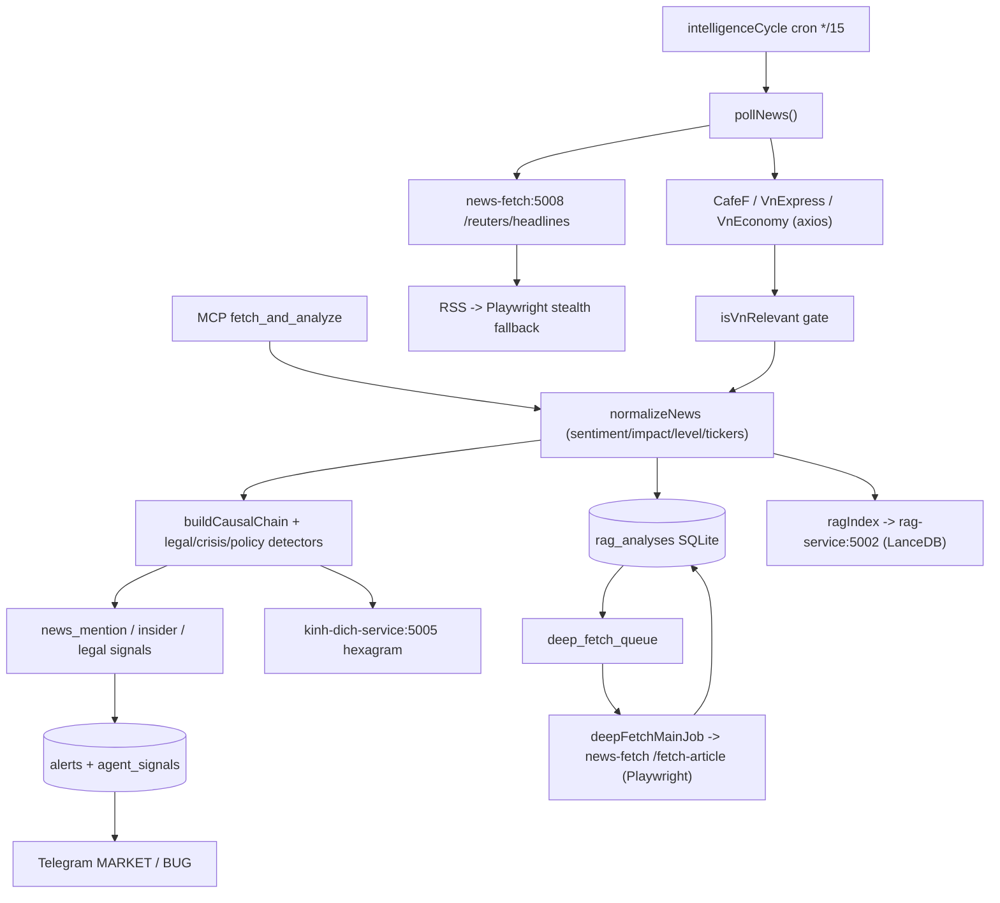

# News Fetch — News & Sentiment Pipeline

> Zone id: `news-pipeline` · Primary paths: `apps/news-fetch` (+ the news-analysis pipeline that lives in `apps/mcp-server`)

## Purpose & business need

This zone is the **market-intelligence ingestion + reasoning layer**: it pulls live news from Vietnamese and international sources, turns each raw headline into a typed, scored `AnalysisEntry` (sentiment, impact, affected sectors/stocks), and traces causal "cascade" chains from a macro/global event down to specific tickers on the user's watchlist. The downstream value is:

- **Early signal generation** — `news_mention`, `insider_trading`, legal-risk, and crisis signals that feed the alert/Telegram fan-out and the inter-agent signal bus.
- **Causal explanation** — `run_impact_chain` answers "if oil spikes / a canal closes / Vietnam is upgraded by FTSE, which of my stocks move and why?" with confidence scores at each hop.
- **Retrievable memory** — every normalized article is written to SQLite `rag_analyses` and vector-indexed (via the rag-service) so `search_similar_context` can surface historical precedents.

Two physically separate codebases make up the zone:

1. **`apps/news-fetch`** — a small standalone microservice (the deployed container is the **TypeScript/Bun + Playwright** build) whose only job is hard-to-scrape international headlines (**Reuters / Bloomberg**) plus a **Playwright deep-fetch** article-body extractor. A parallel **Go port** exists in the same directory (`cmd/`, `internal/`) for VN-RSS sources but is **not wired into `docker-compose.yml`**.
2. **`apps/mcp-server` news-analysis subsystem** — the heavy domain logic: VN RSS fetchers (CafeF, VnExpress, VnEconomy), the `normalizeNews` classifier, the `cascadeEngine`, legal/crisis/policy detectors, `pollNews` orchestration, the 12 news-analysis MCP tools, and all SQLite/RAG persistence.

## Tech stack

| Layer | Tech |
|---|---|
| `apps/news-fetch` runtime | **Bun** + **Hono** (`hono` ^4) HTTP router; **Playwright** ^1.44 (Chromium stealth); TypeScript ^5.4, strict, ESM (`tsconfig.json`). Deployed via `mcr.microsoft.com/playwright:v1.60.0-jammy` base (`apps/news-fetch/Dockerfile`). |
| `apps/news-fetch` Go port | Go 1.22, `go-chi/chi v5`, `modernc.org/sqlite` (pure-Go, `CGO_ENABLED=0`) — `apps/news-fetch/go.mod`. Not in compose. |
| `apps/news-fetch` DDD fence | `eslint-plugin-boundaries` enforces primitive→module→domain→infrastructure→interface import direction (`apps/news-fetch/eslint.config.mjs`, `package.json` `lint:fence`). |
| mcp-server news-analysis | Bun + **@modelcontextprotocol/sdk** (`McpServer.tool(...)`), **zod** schemas, `bun:sqlite`, **axios** (RSS fetch), DDD layering (domain/application/infrastructure/interface). |
| RSS parsing | `parseRssFeed` in `apps/mcp-server/src/infrastructure/fetchers/rss.ts` (cheerio XML-mode upstream). |

## Entry points

### `apps/news-fetch` microservice (deployed, port 5008)
- `apps/news-fetch/src/index.ts` — Bun server, `idleTimeout: 0` (so Playwright 25–30 s requests don't 502).
- `apps/news-fetch/composition-root.ts` — DI wiring (G3: zero domain ops here). Builds `composeNewsIngest(rss, stealthFallback)` for each source and `createRouter(...)`.
- HTTP routes (`apps/news-fetch/src/interface/handlers.ts`):
  - `GET /health`
  - `POST|GET /reuters/headlines` `{ maxItems }` → `ReutersRssScraper` primary → `ReutersStealthFallback`.
  - `POST|GET /bloomberg/headlines` → `BloombergRssScraper` → `BloombergStealth`.
  - `POST /fetch-article` `{ url }` → `handleFetchArticle` (Playwright body extractor, Contract B; `apps/news-fetch/src/routes/fetchArticle.ts`).
- Go port routes (`apps/news-fetch/cmd/server/main.go`, not deployed): `/health`, `/vneconomy/fetch`, `/vnexpress/fetch`, `/newsapi/fetch`, `/vps/fetch`, `/fetch/all`.

### mcp-server MCP tools (registered in `apps/mcp-server/src/interface/mcp/tools/registry.ts`)
12 tools across `apps/mcp-server/src/interface/mcp/tools/news-analysis/`:
- `fetch_and_analyze`, `run_impact_chain`, `search_similar_context` (`analysis.ts`)
- `get_sentiment_trend` (`sentimentTrendTools.ts`)
- `compare_stocks` (`compareTools.ts`)
- `get_cascade_metrics` (`cascadeMetricsTools.ts`), `get_cascade_outcomes` (`cascadeOutcomeTools.ts`)
- `post_agent_signal`, `get_agent_signals`, `record_signal_outcome`, `get_signal_effectiveness`, `get_open_chain_findings` (`agentSignalTools.ts`)
- `getAccuracyContextTool.ts` (`get_accuracy_context`) and `sourceHealthTools.ts` (`registerSourceHealthTools` is a **no-op** — the health table is consumed by `get_system_status`, not exposed as its own tool).

### Cron / scheduler registrations (`apps/mcp-server/src/scheduler/startScheduler.ts`, schedules in `cronConfig.ts`)
- **`intelligenceCycle`** (`*/15 * * * *`) → `runIntelligenceCycle` — the master news poll driver (step A = `pollNews`, step E = Telegram alerts).
- `newsHeadlinesRefresh` → `newsHeadlinesRefreshJob`.
- `deepFetchVps` → `runDeepFetchVpsJob`; `deepFetchMain` (every 5 min) → `runDeepFetchMainJob` (calls news-fetch `POST /fetch-article`).
- `reputationCompute` → `runReputationComputeJob`; `patternWatch`, `dataAuditDaily/Weekly`, `brokerSanctionsSweep`, `evidenceAccumulator`, `sscCheck`.
- `vpsProxyWatchdog` (`*/10 2-8 * * 1-5`) → `runVpsProxyWatchdog` (Reuters/VPS staleness).

### HTTP (dashboard) on mcp-server port 3000 (`apps/mcp-server/src/interface/mcp/server.ts`)
- `GET /api/news-fetch/live` → `handleNewsFetchLive` (live `rag_analyses` inspection, no auth).
- `GET /dashboards/news-fetch/*` → `handleNewsFetchDashboard` (static pilot dashboard).

## Architecture & key modules

### `apps/news-fetch` (DDD, strict import fence)
- `src/domain/models.ts` — `NewsSource` enum, `Article`, `FetchResult` (`method: 'rss'|'playwright-stealth'|'module'`, `confidence: 'HIGH'|'LOW'`, `error` key on failure).
- `src/domain/repositories.ts` — `ReutersNewsPort`, `BloombergNewsPort` interfaces.
- `src/module/news_ingest/index.ts` — `composeNewsIngest(primary, fallback)`: RSS primary → stealth fallback on error/empty, then `processArticleBatch` (normalize + dedup). `ports.ts` defines `NewsIngestPort` / `NewsFetcherPort`.
- `src/primitive/*` — pure leaf functions, each with its own test: `headline-normalizer`, `source-dedup-key` (`computeArticleKey`), `published-at-parser`, `article-relevance-filter`.
- `src/infrastructure/scrapers/` — `reuters-rss.ts`, `reuters-stealth.ts`, `bloomberg-rss.ts`, `bloomberg-stealth.ts`, `playwright-browser-factory.ts` (single launch per request).
- `src/routes/fetchArticle.ts` + `fetchArticleConfig.ts` — Playwright body extractor with **SSRF allowlist** loaded from `mcp.config.json` `deepFetch.playwrightAllowedDomains`.
- `src/sandbox/runner.ts` + `dashboard/` — scenario-driven self-test harness that emits `results.json` consumed by the pilot dashboard.

### mcp-server news-analysis (the brain)
- **Fetchers** (`src/infrastructure/fetchers/`): `cafef.ts` (`https://cafef.vn/thi-truong-chung-khoan.rss`, browser UA to dodge 503), `vnexpress.ts`, `vneconomy.ts` (2 serial feeds), `newsapi.ts` (+ `newsapiRateLimit.ts` daily cap), `rss.ts` (`parseRssFeed`/`RssItem`), `newsSourceRouter.ts` (VPS→cache→domestic-RSS fallback gated by a circuit breaker), `polymarket.ts` (prediction-market source).
- **Normalizer** (`src/domain/services/newsNormalizer.ts`): pure `normalizeNews(item)` — NFC-normalizes + `decodeHtmlEntities`, runs `detectDomains`, `extractStockTickers`, `classifyLevel`, `detectSentiment`, `computeImpactScore`, `computeConfidence`. Hardcoded `GLOBAL_KEYWORDS`, `COUNTRY_KEYWORDS`, `DOMAIN_KEYWORD_MAP` (per `DomainType`), `BULLISH_KEYWORDS`/`BEARISH_KEYWORDS`, `KNOWN_VN_STOCKS`, and false-positive guards (`CURRENCY_CONTEXT_MAP` for VND, `GEOGRAPHIC_CONTEXT_MAP` for HCM).
- **Sentiment** (`src/domain/services/sentimentClassifier.ts`): `classifySentiment(text): SentimentResult { direction, confidence, keywords }` (richer than the normalizer's keyword count; handles negation per `1321-sentiment-negation-loss`).
- **Cascade engine** (`src/domain/services/cascadeEngine.ts`, ~3500 lines, pure/no-I/O): `buildCausalChain(entry, watchlist, ragResults, macroContext, macroStats, broadcastMinImpact)` returns a `CausalChain` with `entries` and `watchlistImpacts`. Hardcoded rule tables: `SECTOR_RULES` (`SectorRule` with `keywords/domain/direction/confidence/excludeKeywords/requireAnyKeyword/affected_actions`), `MacroRule`s, `LEGAL_RISK_RULES`, `POLICY_RULES`, `INSIDER_DUMP_RULES`, `MSCI_INCLUSION/WATCHLIST/EXCLUSION_RULES`, `AGRICULTURE_WEATHER_RULES`. **First-matching rule per domain wins** — rule ordering is load-bearing (VN policy-intervention rules placed first to override bearish triggers).
- **Specialized detectors** (`src/domain/services/`): `legalRiskDetector.ts` (16 regex patterns / 7 `LegalRiskType`s → severity), `crisisPatternDetector.ts` (`CRISIS_PATTERNS`, `CRISIS_COOLDOWN_MINUTES = 30`), `policyImpactMapper.ts`, `climateImpactMapper.ts`, `predictionCascadeMapper.ts`/`predictionSignalDetector.ts`, `leadershipSignal.ts`, `imfSentimentClassifier.ts`/`imfDataClassifier.ts`, `vnRelevanceFilter.ts` (`isVnRelevant` — non-VN articles dropped unless they carry a VN signal; `VN_SOURCE_IDS` always pass), `signalDetector.ts`/`signalValidator.ts`/`signalClassWeighter.ts`.
- **Application orchestration** (`src/application/usecases/`): `pollNews.ts` (full cycle), `runImpactChain.ts` + `runPredictionImpactChain.ts` (wrap cascade with live macro fetch), `getCrisisEarlyWarning.ts`. `cascadeExecutor.ts` and `services/signalQualityAudit.ts` round out application logic.
- **Persistence** (`src/infrastructure/db/`): `schema-news.ts` (all news tables), `alertStore.ts`, `mentionVelocityStore.ts`, `deepFetchQueueStore.ts`, `cascadeHitStore.ts`/`cascadeSignalStore.ts`, `agentSignalStore.ts`, `signalOutcomeStore.ts`, `tradeStore.ts`.
- **RAG bridge** (`src/infrastructure/rag/ragHttpClient.ts`): `ragIndex` / `ragSearch` HTTP calls to **rag-service:5002** (the single LanceDB writer; the old direct-LanceDB path is deprecated per G5b).

## Feature-by-feature breakdown

### 1. `fetch_and_analyze` (MCP tool — `analysis.ts`)
- **Business purpose:** one-shot "go fetch the news and tell me what matters" — bulk ingest + score + persist + index.
- **Path:** `initDatabase()` → parallel fetch from CafeF/VnExpress/VnEconomy (local axios) + Reuters (HTTP to `news-fetch:5008/reuters/headlines`) → each source wrapped in `withSourceTimeout` (cafef/vnexpress 10 s, vneconomy 12 s, reuters 15 s) with `Promise.allSettled` so a dead upstream contributes `[]` → `normalizeNews` per item → `INSERT OR IGNORE INTO rag_analyses` → best-effort parallel `ragIndex` (allSettled, 8 s AbortSignal per call) → formatted text.
- **Edge cases / hidden deps:** Reuters is delegated to the microservice (geo-blocked direct); RAG insert failures degrade silently (SQLite rows already committed); empty result returns a `source_tier: 2` JSON note, never throws.

### 2. `pollNews` cycle (`pollNews.ts`, driven by `intelligenceCycle` cron)
- **Business purpose:** the autonomous heartbeat that produces alerts/signals every 15 min.
- **Path:** fetch all sources (CafeF/VnExpress/VnEconomy + TE-Chromium + NewsAPI fallback, all injectable via `SourceFetchers`) → `isVnRelevant` gate → `normalizeNews` → dedup by `source_url` (UNIQUE index) **and** title fingerprint (`titleFingerprint`/`isTitleDuplicate`) → `tryInsertEntry` → per new entry `buildCausalChain` (with batch-prefetched macro context from Yahoo + SBV, skipped when `CI=true`) → gated `news_mention` signal creation (article age ≤ `maxAgeMinutes`, non-neutral sentiment, direct ticker mention via `tickerWholeWordMatch` OR trusted-source+strong-cascade) → insider/family-buying elevation (`detectInsiderFamilyBuying` → `insider_trading MEDIUM`) → trade-relationship impacts (`analyzeTradeImpact`, `detectAndLearnTradeRelationship`) → per-stock cap (`MAX_SIGNALS_PER_STOCK_PER_CYCLE = 3`) → `mention_velocity` hourly buckets (`recordMention`) → `deduplicateSignalsByStockAndType` → `generateAlerts` → `storeAlerts`.
- **Side-effects:** writes `rag_analyses`, `mention_velocity`, `alerts`; "all sources dark" → one `sendTelegramBug` per 24 h (`ALL_DARK_ALERT_COOLDOWN_MS`), suppressed within the `VPS_NEWS_STALE_MS = 2h` window (off-hours `[]` is expected, Tasks 1228/1843/1855a).
- **Edge cases:** Reuters/TE fallback only activates after `REUTERS_STALE_MS = 90 min`; per-source failure increments `errors` but never aborts the cycle.

### 3. `run_impact_chain` (MCP tool)
- **Business purpose:** explain causality from an event text down to watchlist tickers.
- **Path:** load `watchlist` from SQLite → `runImpactChain({ newsText, watchlist, ... })` (live commodity/SBV/RAG fetchers, overridable via `_test*` params) → format chain entries + `watchlistImpacts` → **per-impact** append a Kinh Dịch hexagram block via `appendStockHexagramHttp` (HTTP to **kinh-dich-service:5005**; service-down → omit block, data-short → honest VN fallback line).

### 4. `search_similar_context` (MCP tool)
- **Business purpose:** retrieve historical precedents for an event.
- **Path:** `ragSearch({ query, limit: k*3, level?, action_code?, hybrid: true })` against rag-service → map to `SearchResult` → `applyRecencyWeighting(results, recency_days)` (`final_score = cosine_similarity * recency_weight`, `recency_weight = max(0.1, 1 - age/recency*0.9)`) → trim to `k`.

### 5. Deep-fetch (article body) — DFR pipeline
- **Business purpose:** enrich a headline with full body text + a "deep" vector for better RAG recall.
- **Path:** mcp-server enqueues into `deep_fetch_queue` (status machine `pending→vps-fetching→vps-failed→done|expired`) → `deepFetchVpsJob` tries the VPS plain-HTTP path → rows that fail become `vps-failed` → `deepFetchMainJob` (every 5 min, capped at `deepFetch.maxPlaywrightPerCycle = 5`) calls **`POST news-fetch:5008/fetch-article`** (Playwright) → on success writes `rag_analyses.body_text` and re-indexes LanceDB with `depth_tier="deep"`, `id = rag_id + "_deep"`; on failure `markExpired` (Playwright is heavy — no retry); 4 h stale expiry.
- **Hidden deps:** the news-fetch container mounts `mcp.config.json` read-only purely so `/fetch-article` can load the SSRF allowlist; a domain not in `deepFetch.playwrightAllowedDomains` → HTTP 400.

### 6. Reuters/Bloomberg headline ingest (`apps/news-fetch`)
- **Business purpose:** international macro headlines that direct RSS/geo-block makes hard to fetch from the VN host.
- **Path:** `composeNewsIngest` tries the RSS scraper; on error or 0 articles falls back to the Playwright **stealth** scraper (`playwright-stealth` to evade DataDome/PerimeterX); `processArticleBatch` normalizes headlines and dedups by `computeArticleKey`. Each scraper returns a `FetchResult` whose `error` key (`"datadome-block"`, `"http-error"`, …) and `confidence` (HIGH for RSS, LOW for heuristic) flow through.

### 7. Sentiment trend / cascade metrics / agent signals (tools)
- `get_sentiment_trend` aggregates `rag_analyses.sentiment` over time. `get_cascade_metrics` / `get_cascade_outcomes` read `cascade_rule_hits` (win-rate, 3d/7d price-impact backtest). `post_agent_signal`/`get_agent_signals`/`record_signal_outcome`/`get_signal_effectiveness`/`get_open_chain_findings` operate the `agent_signals` + `signal_outcomes` inter-agent bus, with `signal_rejections` audit on validation failure.

## Data stores

All in the shared **named volume `market_data`** mounted as `/app/data/market.db` (SQLite). The news-fetch container mounts it **read-only** (`:ro`); the writer is mcp-server. Schema authored in `apps/mcp-server/src/infrastructure/db/schema-news.ts`:

| Table | Key columns / role |
|---|---|
| `rag_analyses` | `id` PK, `created_at`, `level`, `source_url` (UNIQUE partial index = dedup), `source_title/type`, `published_at`, `sentiment`, `impact_score`, `impact_direction`, `confidence`, `time_horizon`, `summary`, `reasoning`, JSON `affected_countries/domains/actions/parent_ids/tags`, `data_env`, `body_text` (deep-fetch). Vectors live in LanceDB. |
| `agent_signals` | inter-agent bus; `from/to_agent`, `signal_type`, `stock_code`, `payload`, `status`, `expires_at`, plus chain/causal/critic/`alert_id` columns. |
| `mention_velocity` | PK `(code, hour)`; `mention_count/negative_count/source_count` — feeds crisis spike detection. |
| `reputation_scores` | PK `(code, date)`; `score/trend/risk_level`. |
| `market_messages` | MARKET-channel log for quality review; `verdict`, impact-tracking (`price_at_message`, `price_3d_after`). |
| `cascade_rule_hits` | every fired cascade rule + outcome backtest (`price_impact_3d/7d`, `outcome_correct`). |
| `trade_exposures` | UNIQUE `(code, market)`; `revenue_pct` for country→stock trade impact. |
| `insider_transactions` | SSC insider disclosures (`type buy/sell/other`, volumes, dates). |
| `deep_fetch_queue` | UNIQUE `source_url`; status machine + `attempts`; `deep_fetch_stats` = per-domain daily cap. |
| `signal_outcomes` | T+24h/T+48h price verification per directional signal (feedback loop). |
| `signal_rejections` | audit of rejected `post_agent_signal` calls. |

`apps/news-fetch/dashboard/results.json` + `data.js` are sandbox-test artifacts (not runtime data).

## External integrations

- **CafeF / VnExpress / VnEconomy RSS** — direct HTTPS from mcp-server (browser UA required; CafeF 503s bot UAs).
- **Reuters / Bloomberg** — scraped by `apps/news-fetch` (RSS + Playwright stealth). Reuters reached by mcp-server over the Docker network at `http://news-fetch:5008` (`NEWS_FETCH_URL` env).
- **NewsAPI** — fallback international source (`NEWSAPI_KEY`, daily rate limit).
- **VPS proxy (Vinahost)** — push pipeline for geo-blocked VN sources (vietstock/vietnambiz/etc.); freshness governed by `vpsProxyWatchdogJob`, `REUTERS_STALE_MS`, `newsSourceRouter` circuit breaker.
- **rag-service:5002** — single LanceDB writer; `ragIndex`/`ragSearch` over HTTP.
- **kinh-dich-service:5005** — per-stock hexagram blocks appended to impact-chain output.
- **Yahoo Finance + SBV** — live macro context (Brent, gold, USD/VND, VIX, DXY, rates) prefetched once per `pollNews` batch.
- **Telegram** — `sendTelegramMarket` (MARKET channel, Vietnamese summary of HIGH/CRITICAL), `sendTelegramBug` (BUG channel, "all sources dark"). Channel routing per `system-map.json`.
- **Polymarket / prediction markets** — `polymarket.ts` source + `predictionCascadeMapper`.

## Cross-zone interactions

- **mcp-server core ↔ this zone (in-process):** the news-analysis tools and `pollNews`/`intelligenceCycle` are part of the mcp-server process; they share `bun:sqlite` `getDb()` and the scheduler.
- **mcp-server → news-fetch microservice (HTTP):** `fetch_and_analyze` calls `/reuters/headlines`; `deepFetchMainJob` calls `/fetch-article`. (Bloomberg endpoint exists but isn't wired into `fetch_and_analyze`.)
- **this zone → rag-service (HTTP):** all vector index/search.
- **this zone → kinh-dich-service (HTTP):** hexagram enrichment.
- **this zone → alert-engine / Telegram fan-out:** via `alerts` table + `sendTelegram*`.
- **this zone → inter-agent bus (shared DB):** `agent_signals` produced here are consumed by cowork agents (news-scout, alert-commander, etc.); `record_signal_outcome` closes the loop.
- **technical-analysis / stock-price zones:** consumed indirectly — `pollNews` pulls live prices (Yahoo/SBV) for macro context and `signal_outcomes` reads price history for T+24/48h verification.

## Gotchas — "must know before changing"

1. **Two implementations, one deployed.** The shipped `news-fetch` container is the **TS/Bun + Playwright** build (`apps/news-fetch/Dockerfile` → `bun run src/index.ts`). The **Go port** (`cmd/`, `internal/`) handles *different* sources (vneconomy/vnexpress/newsapi/vps) and is **not in `docker-compose.yml`** — editing Go code changes nothing in production.
2. **The "news pipeline" is mostly in mcp-server, not `apps/news-fetch`.** CafeF/VnExpress/VnEconomy fetch, all sentiment/cascade/legal/crisis logic, and 12 MCP tools live under `apps/mcp-server/src/.../news-analysis/` and `domain/services/`. `apps/news-fetch` is only Reuters/Bloomberg + Playwright deep-fetch.
3. **Cascade rule ordering is load-bearing.** `SECTOR_RULES` is first-match-wins per domain; VN policy-intervention rules are intentionally placed **first** so a government-support article overrides co-occurring bearish keywords ("war", "tariff"). Reordering silently flips verdicts (see `1268-govt-support-cascade`, `FIX-1298`).
4. **Keyword tables and `KNOWN_VN_STOCKS` are hardcoded** in `newsNormalizer.ts`. New tickers/sectors require editing these maps. False-positive guards (`CURRENCY_CONTEXT_MAP` for VND vs VNDirect, `GEOGRAPHIC_CONTEXT_MAP` for HCM vs TP.HCM) are subtle — `extractStockTickers` Pattern 1 (parenthetical) is intentionally **not** guarded.
5. **NFC + entity decoding is mandatory.** RSS/VPS feeds arrive in NFD with HTML entities; `normalizeNews` calls `.normalize("NFC")` + `decodeHtmlEntities` first — skip it and Vietnamese keyword matching silently fails (Task 1213).
6. **Dedup is double-layered.** `source_url` UNIQUE partial index **plus** `titleFingerprint` catch the same story re-syndicated under different URLs. RAG inserts use `INSERT OR IGNORE`.
7. **Off-hours empty fetches are normal, not an outage.** `pollNews` suppresses "all sources dark" alerts within `VPS_NEWS_STALE_MS` (2 h) and rate-limits to one Telegram bug per 24 h. Don't "fix" empty off-hours batches.
8. **Timeouts are tuned, not arbitrary.** Per-source budgets in `fetch_and_analyze` (10/12/15 s) + `Promise.allSettled`, the news-fetch server's `idleTimeout: 0`, the Playwright `PAGE_TIMEOUT_MS = 30_000`, and rag-service's 8 s AbortSignal all exist to keep the MCP 60 s tool budget. Tightening Reuters from 30 s → 15 s was deliberate (local Docker call).
9. **`/fetch-article` SSRF allowlist is config-driven.** Empty/missing `deepFetch.playwrightAllowedDomains` in `mcp.config.json` blocks **all** domains (fail-closed). The container needs the read-only `mcp.config.json` mount.
10. **`registerSourceHealthTools` is a no-op** — source health is surfaced through `get_system_status`, and `globalSourceTracker` carries shared state seeded with disabled Reuters/Trading-Economics RSS. `pollNews` imports it across the DDD fence under an `eslint-disable` legacy exception.
11. **The Go store writes only the columns it owns** (`id`, `created_at`, `level`, `source_url/title/type`, `published_at`) into `rag_analyses`; analysis columns stay NULL until mcp-server's `fetch_and_analyze` runs — the two services share the table schema contract.
12. **Dashboard HTML is generated.** `apps/mcp-server/src/interface/news-fetch-dashboard/index.html` is a synced copy of `apps/news-fetch/dashboard/index.html` (re-run `apps/mcp-server/sync-news-fetch-dashboard.sh`); the difference is the relative `/api/news-fetch/live` endpoint for same-origin serving on port 3000.

## Internal flow (Mermaid)

