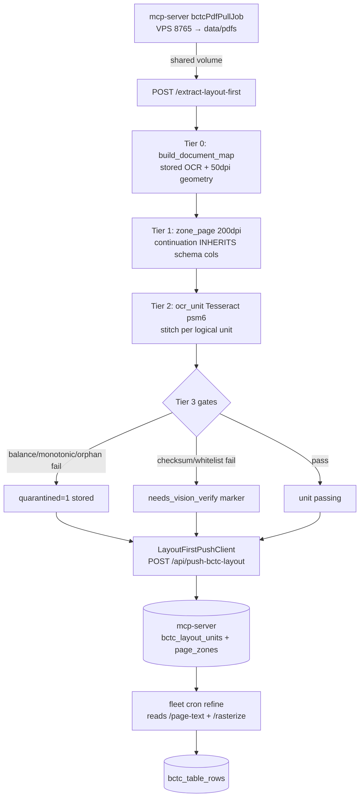

# PDF Extractor — BCTC / OCR Pipeline

> Zone id: `pdf-bctc` · Primary path: `apps/pdf-extractor/` · Language: **Python 3.12 (FastAPI)** · 204 files

## Purpose & business need

This zone turns **Vietnamese financial statements (Báo cáo tài chính / "BCTC")** — published as PDF, frequently as scanned image-only PDFs — into machine-readable structured table rows that the rest of the platform can reason about (ratios, balance-sheet conviction, RSI/valuation context, signal generation). It is the **structured-data on-ramp** for the fundamental side of the market-intelligence product.

A Vietnamese B01-DN balance sheet is a three-block, multi-column, multi-page layout (label / Mã số code / current-period / prior-period). Naive table extraction scrambles it. This zone's value is a **layout-first, geometry-driven** extraction pipeline that respects that structure, plus a set of **machine-checkable accounting-identity gates** (VAS Circular 200/2014 identities) so that bad extractions are quarantined rather than silently fed downstream as fake numbers (a STANDING project goal: *no fake/placeholder data on any served metric*).

The service is the **on-host extraction engine** (`pdf-extractor:5001`). It does NOT discover or download PDFs — that is the VPS-proxied PULL pipeline orchestrated by `mcp-server` scheduler jobs. The end-to-end flow spans two zones:

```
discover (VPS:8765 proxy)  →  fetch/pull (mcp-server bctcPdfPullJob → data/pdfs)  →
OCR + layout extraction (THIS ZONE, pdf-extractor:5001)  →  push to mcp-server (/api/push-bctc-layout)  →
agentic refine (mcp-server fleet cron reads /page-text + /rasterize)  →  bctc_table_rows
```

> Health-recheck context (the "34h-dead pipeline"): the *death* is almost always upstream of this service — discovery/pull staleness or the refine fan-out not running — not the FastAPI extractor itself. The extractor is a stateless request/response engine; freshness must be judged by last-success age of the **pull + refine** jobs in `mcp-server`, not by `pdf-extractor` `/health` (which is liveness, not data freshness). See **Gotchas**.

## Tech stack

- **Language / framework:** Python 3.12, **FastAPI** + **uvicorn** (`main.py`, port 5001).
- **Architecture:** strict DDD layering — `domain/` (pure, zero infra imports) → `application/` (use cases, port-injected) → `infrastructure/` (adapters: HTTP, SQLite, OCR) → `interface/` (FastAPI handlers). Composition root is `create_app()` in `main.py`.
- **PDF / raster:** `pdfplumber`, `PyMuPDF` (`fitz`), `pdf2image` (poppler `pdftoppm`).
- **OCR:** **Tesseract 5** `vie+eng` `--psm 6` (via `pytesseract`); **PaddleOCR** PP-StructureV2 (CPU, `lang="vi"`); **PDF-Extract-Kit (PEK)** `DocLayout-YOLO` for layout detection (`doclayout_yolo.YOLOv10`, `omegaconf`).
- **Concurrency / host safety:** `ProcessPoolExecutor(max_workers=1)` for Tesseract isolation; `threading.Semaphore(1)` for PEK; CPU-only invariant (no CUDA/Metal/`paddlepaddle_gpu`).
- **Persistence:** Python stdlib `sqlite3` (read-only URI for the shared `market.db`); local files (PNG rasters, extraction JSON, `.dclg.xml`).
- **Image:** `ubuntu:24.04` (`apt` Tesseract + poppler), torch/torchvision CPU wheels (`Dockerfile`). Requirements split: `requirements.txt` (lean), `requirements-pek.txt` (PEK CPU stack).

## Entry points

All HTTP routes are registered in `interface/handlers.py::register_routes`; the app is built by `main.py::create_app`.

| Route | Method | Handler / use case | Purpose |
|---|---|---|---|
| `/health` | GET | `health()` → `HealthResponse(ocr_source_ok=...)` | Liveness + FU-1 startup probe result for the SQLite OCR source. |
| `/extract` | POST | `extract_pdf()` → `ExtractPDFUseCase` (url) or `local_extract_usecase` (pdf_path) | Original whole-doc extract; `pdf_path` mode reads the shared `./data/pdfs` volume (no HTTP). |
| `/extract-tables` | POST | `ExtractTablesUseCase` | TEXT-path structured balance-sheet rows + balance-identity cross-check; pushes to mcp-server. |
| `/extract-md-tables` | POST (202) | `ExtractMdTablesUseCase` (BackgroundTask) | Generic bbox markdown tables, ALL pages; fire-and-forget. |
| `/extract-layout-first` | POST (202) | `ExtractLayoutFirstUseCase` (BackgroundTask) | **Primary** Tier 0-3 layout-first pipeline, one doc per call. |
| `/pek-extract` | POST (202) | `PekEngineAdapter` + `LayoutFirstPushClient` (BackgroundTask) | PDF-Extract-Kit DocLayout-YOLO + PaddleOCR path. **503 during VN market hours**. |
| `/rasterize` | POST | `infrastructure.page_rasterizer.rasterize_page` | On-demand page→PNG; supports mcp-server `get_bctc_page_image`. |
| `/page-text` | GET | `ocr_text_source.get_page_text` | Stored per-page OCR text; supports mcp-server `get_bctc_page_text`. |
| `/inspect`, `/inspect/pdfs`, `/inspect/pdf/{id}`, `/inspect/extraction/{id}` | GET | `InspectionStore` | **DEPRECATED** PDF viewer (reads junk `pdf_documents`); real viewer moved to mcp-server `/api/bctc-inspect`. |

**There is no internal scheduler/cron in this zone.** All cadence comes from `mcp-server` scheduler jobs that call these endpoints. The `CMD` is `uvicorn main:app --host 0.0.0.0 --port 5001`.

## Architecture & key modules

Composition root `main.py::create_app` wires every layer and injects concrete adapters into use cases. Key files and their roles:

**Domain (pure, no I/O):**
- `domain/services.py` — `ExtractPDFService.process_pdf()`: the original pipeline (find → mark processing → fetch → extract tables+text+OCR → quality gate → store → mark success). Quality gate: reject when `ocr_conf < 0.5` AND no tables (`_OCR_CONFIDENCE_THRESHOLD`).
- `domain/models.py` — `PDFDocument` (entity, lifecycle pending→processing→success|failed), `ExtractedTable`, `ExtractedContent` (carries `ocr_confidence` + `confidence_financial`; `composite_confidence = min(...)`).
- `domain/primitives/layout_invariants/primitive.py` — **the Tier-3 gates** (pure functions): `check_balance_identity`, `check_codes_monotonic`, `check_no_orphan_rows` (AC-0 generic, geometry-only), plus B01-DN-specific `check_bs_accounting_identities` (VAS identities I1–I4: 280==440, 440==300+400, 100==Σ1xx, 200==Σ2xx).
- `domain/primitives/bctc_code_whitelist/primitive.py` — `check_code_whitelist` (every Mã số must be in the B01-DN/HN fixed code set).
- `domain/primitives/market_hours/primitive.py` — `is_vn_market_open_utc()` (HOSE Mon–Fri 02:00–08:59 UTC) → gates `/pek-extract`.
- Other primitives (`decimal_normalizer`, `vn_number_normalize`, `reconcile_figures`, `select_period_column`, `validate_financial_figures`, `confidence_scorer`, `low_confidence_gate`, `ratio_computer`, `field_extractor`, `select_balance_sheet_section`) — composed via `domain/modules/financial_reports/module.py::FinancialReportsModule` using Protocol ports in `ports.py`. BT-1 ordering: `vn_number_normalize` runs BEFORE `decimal_normalizer` to fix the VNM/DHG decimal-shift bug.
- `domain/eval_detectors.py` — `eval_stage1_rasterize`, `eval_stage2_layout_detect`, `eval_stage3_ocr` (observability detectors, NOT pipeline gates).

**Application (orchestration, port-injected, imports only domain + stdlib):**
- `application/extract_layout_first_usecase.py` — `ExtractLayoutFirstUseCase.execute()`: the Tier 0→1→2→3 orchestrator (detailed below). Loads thresholds from `config/bctc-eval-thresholds.json`.
- `application/extract_tables_usecase.py` — `ExtractTablesUseCase` (TEXT path + OCR fallback + Telegram alert on balance fail).
- `application/extract_md_tables_usecase.py` — `ExtractMdTablesUseCase` (generic md tables, MAX_PAGES=20 guard, skips cover pages 1–3 on overflow).
- `application/usecases.py` — `ExtractPDFUseCase` (wraps `ExtractPDFService`). `application/doclang_serialize_usecase.py` — additive `.dclg.xml` output.

**Infrastructure (adapters):**
- `infrastructure/pek_engine_adapter.py` — `PekEngineAdapter` + `_PekLayoutModel` + `_load_pek_models()` (lazy singleton, CPU-only, hard timeout, semaphore). The most constraint-heavy file in the zone.
- `infrastructure/generic_md_table_extractor.py` — **4111 lines**, the heavy geometry engine. Exposes `build_document_map`, `zone_page`, `ocr_unit` (injected into `ExtractLayoutFirstUseCase` as callables), plus `ocr_text_to_markdown` and dozens of private column-anchor/row-clustering helpers (`_cluster_number_rows_adaptive`, `_build_ordinal_grid`, `_detect_column_anchors_from_tokens`, …).
- `infrastructure/ocr_adapter.py` — `PdfOcrAdapter`: `locate_balance_sheet_pages()` (pdfplumber native-text marker scan, fallback pages [4,5,6,7]) + `ocr_pages()` (Tesseract `vie+eng --psm 6`, sequential, single-page convert for host safety).
- `infrastructure/ocr_backends.py` — pluggable cell/line TEXT step: `TesseractVieBackend` (default), `PaddleOcrBackend`, `AutoFallbackOcrBackend`; `select_ocr_backend()` reads `OCR_TEXT_BACKEND`.
- `infrastructure/ocr_text_source.py` — `SqliteOcrTextSource` (read-only `market.db` query of `pdf_extracted_text`) + `MistralOcrSource` stub; selected by `ocr_text_source_factory.select_ocr_text_source`.
- `infrastructure/layout_first_push_client.py` — `LayoutFirstPushClient.push_layout()` → `POST /api/push-bctc-layout` (stdlib urllib, wrapped in `asyncio.to_thread` to keep the event loop free).
- `infrastructure/ocr_text_fetch_client.py` — `OcrTextFetchClient` (fetches stored OCR pages from mcp-server for Tier 0). `infrastructure/eval_push_client.py` — pushes eval stages.
- `infrastructure/repositories.py` — `SQLitePDFDocumentRepository` (table `pdf_documents`), `HTTPPDFStorageRepository`, `LocalPDFStorageRepository`.
- `infrastructure/page_rasterizer.py` — `rasterize_page()` (PyMuPDF PNG). `infrastructure/inspection_store.py` — DEPRECATED viewer store. `infrastructure/extraction_engine.py` — `PdfplumberExtractionEngine`. `infrastructure/lifespan.py`, `infrastructure/startup.py`, `infrastructure/config.py`.

**Interface:** `interface/handlers.py` (routes), `interface/serializers.py`, `interface/viewer.html` (deprecated).

## Feature-by-feature breakdown

### 1. Layout-first Tier 0-3 extraction (primary path) — `POST /extract-layout-first`
**Business purpose:** correctly extract multi-page B01-DN balance sheets where continuation pages lack column headers (the named *FPT Q1 page-5 missing-header scramble* fix).
**Technical path:** `extract_layout_first()` handler → `_run_extract_layout_first` BackgroundTask → `ExtractLayoutFirstUseCase.execute()`:
- **Tier 0 (document map):** `_ocr_pages_client.fetch_ocr_pages(report_id)` pulls already-stored OCR text from mcp-server (CHEAP — no new Tesseract), then `build_document_map(pages, pdf_path)` groups pages into logical units by geometric fingerprint at 50 DPI.
- **Tier 1 (zoning):** per page, rasterize 200 DPI (`_rasterize_page_200dpi`), `zone_page(...)` detects header/footer bands + column gutters. **Continuation pages INHERIT the schema-page's `column_gutters` + `row_pitch`** — the core fix.
- **Tier 2 (OCR-into-grid + stitch):** `ocr_unit(...)`, one `image_to_data --psm 6` per page (200 DPI), rows ordered by (page, Y), one markdown table per logical unit.
- **Tier 3 (invariant gate):** five gates run in order (Gate A B01-DN identities, Gate B code whitelist, Gates 1–3 balance/monotonic/orphan). Gates 1–3 fail → `quarantined=True` (stored, not dropped). Gates A/B fail → emit `needs_vision_verify` + `vision_verify_markers` (escalation-only; the extractor does NOT call vision itself).
- **Eval (observability):** after stages 1/2/3, `eval_stage*` detector results are pushed to mcp-server `/api/bctc-eval/push-stage`; failures NEVER abort extraction.
- **Push:** `LayoutFirstPushClient.push_layout()` → `POST /api/push-bctc-layout` with `{document_map, units, page_zones, pass_rate_report}`.
**Edge cases:** rasterize failure → `_make_blank_page_zones`; `pdf2image` missing → early return zeros; OCR per-unit error → unit stored quarantined with `_ocr_error`. AC-LFE-9: strictly sequential, never invokes batch sweep.

### 2. PEK extraction — `POST /pek-extract`
**Business purpose:** an alternative DocLayout-YOLO-driven layout path producing the same `/api/push-bctc-layout` payload.
**Technical path:** handler checks `is_vn_market_open_utc()` → **HTTP 503 immediately during market hours, no model load** (RSS stays ~80MB); then `_run_pek_extract` BackgroundTask → `PekEngineAdapter.extract_layout_and_tables()`. Lazy-loads `_load_pek_models()` (DocLayout-YOLO + PaddleOCR), runs under `Semaphore(1)` (contention → `SemaphoreContendedError` → 429) and a hard `ThreadPoolExecutor` timeout (`PEK_EXTRACTION_TIMEOUT_SECONDS`, default 30 min). Per-page heartbeat logs distinguish slow-but-progressing from hung. Result pushed via `LayoutFirstPushClient`.
**Edge cases / hidden deps:** **NEVER import from `pdf_extract_kit.tasks.*`** (eager `__init__` pulls `FormulaRecognitionTask → unimernet` → crash) — `_PekLayoutModel` replaces `LayoutDetectionTask` using `doclayout_yolo.YOLOv10` directly. Layout-load failure RAISES (fail-loud); table-load failure degrades. The push return is an **echo, not a committed DB count** (`project_mcp_server_write_wedge`) — handler logs warn ops to verify with an in-container `market.db COUNT`.

### 3. TEXT-path structured tables — `POST /extract-tables`
**Business purpose:** fast, exact structured balance-sheet rows for clean text-layer PDFs, with an accounting-identity cross-check.
**Technical path:** `ExtractTablesUseCase.execute()` → `TextTableExtractor` builds rows; `PdfOcrAdapter` runs Tesseract only on located BS pages when text-layer is thin (`ocr_executor` ProcessPool isolates CPU); on balance-identity fail, `TelegramAlertAdapter` posts to the WORK channel (BT-5). Pushes via `TablePushClient`. Accepts pre-supplied `pages` OCR text to avoid re-OCR.

### 4. Page text + rasterize seams (support the agentic refine loop)
- `GET /page-text` → `SqliteOcrTextSource.get_page_text(filename, page_number)` reads `pdf_extracted_text` in `market.db` (read-only URI). **Returns `source_reachable:false` (NOT `text:""`) on DB error** — distinguishes "page genuinely empty" from "OCR pipeline broken", preventing the refine agent from fabricating.
- `POST /rasterize` → `rasterize_page()` renders missing pages to PNG (idempotent), DPI from `BCTC_RASTER_DPI` (150 in compose). Supports mcp-server `getBctcPageImageTool` for vision escalation.

### 5. Generic md-tables + DocLang serialize
`/extract-md-tables` runs generic bbox tables on all pages (income statement, cash flow, notes, segment reports), MAX_PAGES=20 guard. DocLang serializer writes additive `.dclg.xml` (Phase 1, no geometry).

## Data stores

- **`pdf_extractor.db`** (`DB_PATH=/app/data/pdf_extractor.db`, named volume `market_data`) — table **`pdf_documents`** `(id PK, url, source_type, status, extracted_at, pdf_path)`. Drives the original `/extract` lifecycle. Marked a "junk table" for the deprecated `/inspect` viewer.
- **`market.db`** (`MARKET_DB_PATH=/app/data/market.db`, shared) — **READ-ONLY** here. Table **`pdf_extracted_text`** `(filename, page_number, text_content, …)` is the source for `/page-text` and Tier-0 OCR text. The authoritative output tables (`bctc_table_rows`, `bctc_layout_units`, `bctc_page_zones`, `bctc_balance_checks`, `bctc_md_tables`, `financial_reports`, `bctc_vps_queue`) live in `mcp-server` and are written there, not here.
- **Filesystem:** extraction JSON (`STORAGE_DIR=/app/data/extractions`), page PNG rasters (volume `bctc-page-images:/data/bctc-page-images`), `.dclg.xml` (`DOCLANG_OUTPUT_DIR`), shared PDF input (`./data/pdfs:/app/data/pdfs:ro`).
- **Model weights:** named volume `pek_model_cache:/app/PDF-Extract-Kit/models` (DocLayout-YOLO, PaddleOCR; downloaded at runtime, NOT baked into the image).
- **Config:** `config/bctc-eval-thresholds.json` (baked to `/app/config/`, primary path; project-root copy is fallback).

## External integrations

- **mcp-server** (`MCP_SERVER_URL=http://mcp-server:3000`) — push results (`/api/push-bctc-layout`, eval `/api/bctc-eval/push-stage`), fetch stored OCR pages (`OcrTextFetchClient`). Internal Docker network only; stdlib urllib, no aiohttp/requests/cloud SDK (AC-LFE-8).
- **VPS proxy `125.212.251.27:8765`** — NOT called by this service. It is the upstream discovery/fetch proxy (`SSC_IBOARD_BASE_URL`, `BCTC_DISCOVER_URL`, `bctc-files/`) consumed by `mcp-server` scheduler jobs; PDFs land in the shared `./data/pdfs` volume that this service reads.
- **Telegram** — `TelegramAlertAdapter` (WORK channel) for balance-identity failures from the TEXT path (creds from env).
- **Self-hosted OCR only** — Tesseract, PaddleOCR, DocLayout-YOLO all run on-host; **zero outbound HTTP during extraction**, no cloud OCR. (Mistral OCR source is a stub.)

## Cross-zone interactions

- **`mcp-server` → this zone (HTTP, `pdf-extractor:5001`):**
  - `infrastructure/fetchers/pdfExtractorClient.ts` (`extractViaMicroservice`, `getPageText`, `rasterizePages`, `checkPdfExtractorHealth`).
  - Tools: `getBctcPageTextTool` → `/page-text`; `getBctcPageImageTool` → `/rasterize`; `getBctcPendingRefineTool`.
  - Jobs: `bctcPdfPullJob` (pulls VPS PDFs → `data/pdfs` → triggers extraction via shared volume `file://` path, 3-tier fallback because raw VPS URLs 401), `bctcBatchTableBackfillJob`, `bctcReparseJob`, `bctcRefineJob` (agentic fan-out reads `/page-text` + `/rasterize`).
- **this zone → `mcp-server` (HTTP push):** `pushBctcLayoutHandler.ts` receives `/api/push-bctc-layout` → writes `bctc_layout_units` + `bctc_page_zones`.
- **Shared DB (read-only):** `market.db` `pdf_extracted_text` is written by mcp-server's pull/OCR jobs and read here via `SqliteOcrTextSource`.
- **Shared volume:** `./data/pdfs` (mcp-server RW, pdf-extractor RO) is how downloaded PDFs reach the extractor without an HTTP round-trip (avoids VPS 401).
- **Consumers of the structured output:** fundamental/balance-sheet analysis agents (e.g. `balance-sheet-first-read`, `four-factor-synthesis`, financial-analyst) read the resulting `bctc_table_rows` through mcp-server tools.

## Gotchas — must know before changing

1. **"Pipeline dead 34h" is rarely this service.** `/health` is liveness only (FU-1 probe checks DB reachability, not data age). Death = upstream pull/refine staleness in `mcp-server` jobs. Gate on **last-success age of the pull + refine jobs**, not on extractor liveness (`feedback_passive_health_masks_dead_data`).
2. **Push echo ≠ DB commit.** `push_layout` returns mcp-server's *input echo*; the handler logs explicitly that `units_stored`/`pages_stored` are NOT confirmed DB rows. Always verify persistence with an in-container `market.db COUNT` (`project_mcp_server_write_wedge`).
3. **NEVER import `pdf_extract_kit.tasks.*`** (any subpath). Its `__init__` eagerly imports `FormulaRecognitionTask → unimernet` → `ModuleNotFoundError`. Use `_PekLayoutModel` (doclayout_yolo directly). Any new import in `_load_pek_models()` MUST be added to the **Dockerfile smoke gate** (it imports the real module, not a proxy).
4. **`--psm 6` is load-bearing.** Removing `config="--psm 6"` reverts Tesseract to psm 3 (auto column segmentation), which scrambles BCTC three-block layouts into interleaved columns (drift #4: orphan rows, off-by-one labels, dup codes despite `balance_pass=true`). Same value must match `spike/` evals and all OCR backends.
5. **CPU-only invariant.** `paddlepaddle_gpu` must never enter `sys.modules` (asserted in `_load_pek_models`). PaddleOCR `use_gpu=False`, `lang="vi"` (was `"en"` — root cause of empty Vietnamese OCR). Host-safety caps: `ProcessPoolExecutor(max_workers=1)`, `Semaphore(1)`, single-page convert; the 16GB Mac kernel-panics under parallel Tesseract.
6. **Market-hours guard on `/pek-extract`** returns 503 before any model load (RSS protection during HOSE trading). Don't move the guard after the adapter call.
7. **`/page-text` must return `source_reachable:false` on DB error**, never `text:""` — empty string means "page genuinely has no text" and the refine agent will fabricate if the broken-pipeline case is masked (FU-1 RISK-1).
8. **`market.db` is opened read-only** (`file:...?mode=ro`) here by design — pdf-extractor must never write the shared DB. The real DB is the **named volume**, not host `./data/market.db` (which can be a stale 0-row decoy — `feedback_live_db_is_named_volume_not_host_data`).
9. **Gates A/B are escalation-only.** A failing checksum/whitelist emits `needs_vision_verify`; it does NOT trigger blanket vision. The consumer-side contract (gate-first, vision-on-failure-only) lives in `docs/agents/dev-pdf-extractor/flow/main.md §GATE-VISION` / skill `bctc-gate-vision`.
10. **`/inspect` viewer is DEPRECATED** (reads junk `pdf_documents`); the real inspection surface is mcp-server `GET /api/bctc-inspect`. Don't extend it.
11. **PEK source tree must stay pristine** (`AC-PEK-0a`: `git diff` on `PDF-Extract-Kit/` empty). Fixes live in `pek_engine_adapter.py`. PEK is on `PYTHONPATH`, NOT pip-installed (its `pyproject.toml` is invalid TOML on 3.12).
12. **DDD fences are enforced:** `domain/` and `application/` import zero infrastructure; heavy infra functions (`build_document_map`, `zone_page`, `ocr_unit`) are injected as callables at the composition root. Don't add an `infrastructure` import inside `application/`.
13. **The dev pilot has a blocking DoD gate (G12):** `python sandbox_runner.py --tier=primitive|module --scenario=all` must be all-GREEN before any task is DONE.

## Internal flow (Mermaid)


