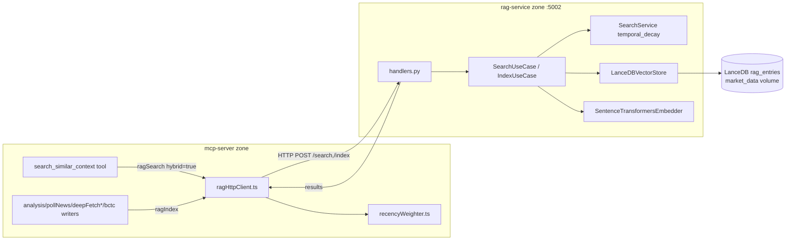

# RAG Service — Embeddings & Semantic Search

> Zone id: `rag-embeddings` · Primary path: `apps/rag-service` · Language: Python 3.11 (FastAPI / DDD) · Port: **5002**

## Purpose & business need

The RAG service is the platform's **semantic long-term memory**. Every piece of market intelligence the system produces — analyzed news articles, BCTC (Báo cáo tài chính / financial statement) extractions, macro notes, filings — is embedded into a 384-dim vector and stored in LanceDB. When an agent later needs *"what did we previously conclude about events like this?"*, it queries this service to retrieve the most semantically-similar **and recent** past analyses.

The market-intelligence value:

- **Historical precedent lookup** — the MCP tool `search_similar_context` (registered in `apps/mcp-server/src/interface/mcp/tools/news-analysis/analysis.ts`) lets the news-analysis pipeline, chef synthesis, and bctc-analyst find prior analyses for an event/ticker, so reports cite precedent instead of treating each event as novel.
- **Recency-aware ranking** — raw cosine similarity is reweighted by **temporal decay** (`domain/services.py:apply_temporal_decay`), so a 6-month-old analysis never out-ranks a fresh one of equal relevance. This matters in a fast-moving market where stale context is misleading.
- **Ticker / sector / doc-type targeting** — Phase-1 metadata (FR-1/FR-2/FR-3) lets callers pre-filter by `ticker`, `sector`, `doc_type` (news|filing|macro|analysis), `depth_tier` (shallow|deep), so the bctc-analyst can issue *ticker-exact filing* queries and get high-recall hits.

It is an **internal-only microservice** — port 5002 is never exposed externally; all access is via HTTP from the `mcp-server`.

## Tech stack

- **Language:** Python 3.11 (`pyproject.toml` `requires-python = ">=3.11"`; Docker base actually installs system Python via Ubuntu 22.04 apt).
- **Web framework:** FastAPI + Uvicorn (`fastapi>=0.110.0`, `uvicorn[standard]>=0.29.0`).
- **Vector store:** **LanceDB** (`lancedb>=0.6.0`) — embedded, file-backed, no server process.
- **Embeddings:** `sentence-transformers>=2.7.0` on **CPU-only torch** (`torch==2.5.1+cpu`, `transformers==4.40.2` pinned — see `requirements.txt` sprint-1956c note). Model: `sentence-transformers/paraphrase-multilingual-MiniLM-L12-v2` (384 dims, multilingual incl. Vietnamese).
- **Validation:** Pydantic v2 (`pydantic>=2.6.4`).
- **Architecture enforcement:** `import-linter` (grimp backend) + `mypy --strict` (`pyproject.toml` + `.importlinter`).
- **Container:** `Dockerfile` — Ubuntu 22.04, **model pre-baked at build time** into `/opt/model-cache`, `HF_HUB_OFFLINE=1` + `TRANSFORMERS_OFFLINE=1` at runtime.

## Entry points

| Kind | Symbol / Path | Notes |
|------|---------------|-------|
| ASGI app / composition root | `apps/rag-service/main.py` → `create_app()` (line 19); module-level `app = create_app()` (line 62) | Wiring-only, no business logic. `__main__` runs `uvicorn.run("main:app", port=cfg.port)` |
| App construction helpers | `apps/rag-service/app_factory.py` → `build_lifespan()`, `add_cors_middleware()`, `build_real_adapters()` | Lifespan factory + real-vs-fake adapter selection (P3-A injection seam) |
| HTTP route registration | `apps/rag-service/interface/handlers.py` → `register_routes()` (line 24) | Attaches all 5 routes to an `APIRouter` |
| HTTP routes | `GET /health`, `GET /embed/health`, `POST /search`, `POST /index`, `POST /admin/rebuild-fts` | See Feature breakdown below |
| Sandbox runner | `apps/rag-service/sandbox/__main__.py` (`python -m sandbox --service=rag-service --tier=...`) | Scenario→trace test harness (primitive/module/service tiers); zero model/DB |
| Dashboard checker | `apps/rag-service/dashboard/dash-check.py` | Static CI inspector of the Scenario Trust Dashboard HTML |

There is **no cron/scheduler inside this service**. The only scheduled interaction is external: the mcp-server is documented to POST `/admin/rebuild-fts` at ~02:00 UTC daily (`interface/handlers.py:rebuild_fts` docstring), but no live caller of that endpoint exists in the repo today — it is on-demand/admin only.

## Architecture & key modules

Strict **DDD 4-layer hexagonal architecture**, fenced by import-linter (`.importlinter` + `pyproject.toml [tool.importlinter]`):

- **Fence-C** — layered: `interface → application → domain` (domain is innermost, never imports outward).
- **Fence-A** — the 5 primitives are mutually independent (no primitive imports another primitive).
- **Fence-B** — `domain.module.retrieval` cannot import `infrastructure`.

```
interface/      ← HTTP (FastAPI handlers, Pydantic schemas)
application/    ← use cases + DTOs (orchestration only)
domain/         ← models, services, ports, primitives, retrieval module (pure, no I/O)
infrastructure/ ← LanceDB, SQLite, SentenceTransformers adapters (only outer layer touches libs)
```

### File-by-file roles

**Domain (pure, no I/O):**
- `domain/models.py` — value objects/entities: `EmbeddingVector` (validates `len==dims`), `AnalysisEntry` (the indexed entity + 8 Phase-1 metadata fields), `SearchResult` (carries `distance` + `recency_score` + metadata).
- `domain/services.py` — `compute_recency_score()`, `apply_temporal_decay()` (distance→similarity→decay→sort), `filter_by_max_distance()`, and `SearchService.rank()` (filter then decay). Constants `DEFAULT_HALF_LIFE_DAYS=7.0`, `DEFAULT_MAX_DISTANCE=0.8`.
- `domain/repositories.py` — abstract ports: `VectorStorePort` (insert/search/hybrid_search/count), `AnalysisRepositoryPort` (save/find_by_id/find_all), `EmbedderPort` (embed/embed_batch).
- `domain/errors.py` — `RAGError` hierarchy (`SearchError`, `IndexError`, `EmbeddingError`, …).
- `domain/primitive/*` — 5 independent, stdlib-only pure functions (the algorithmic core):
  - `similarity_scorer/similarity_scorer.py::score(distance)` → `1/(1+distance)`, raises on negative distance.
  - `temporal_decay_scorer/temporal_decay_scorer.py::score(similarity, created_at_iso, half_life_days, now=, now_iso=)` → `similarity * 0.5^(age_hours/half_life_hours)`. Future dates → age 0; invalid timestamp → `age=inf` → score 0. `now`/`now_iso` is a **determinism gate** for scenario injection.
  - `relevance_threshold_gate/relevance_threshold_gate.py::gate(results, max_distance)` → inclusive `distance <= max_distance` filter, order-preserving.
  - `top_k_selector/top_k_selector.py::select_top_k(results, k)` (alias `select`) → `results[:k]`, clamps `k<=0`→`[]`.
  - `context_window_packer/context_window_packer.py::pack(title, content, source, max_chars=512)` → assembles embedding-ready text, truncates content to `max_chars`.
  - `mock_adder/mock_adder.py` — scaffold/demo primitive only (not used in the live pipeline).
- `domain/module/retrieval/module.py::RetrievalModule` + module-level `retrieve()` — the **canonical 7-step pipeline barrel** that composes all 5 primitives via Protocol ports (`domain/module/retrieval/ports.py`: `EmbedderModulePort`, `VectorSearchPort`, both `@runtime_checkable Protocol`). *Note:* this module is the clean reference composition and the sandbox `module` tier; the **live HTTP path does NOT route through `RetrievalModule`** — it uses `SearchUseCase` + `SearchService` (see Gotchas).

**Application (orchestration):**
- `application/usecases.py` — `SearchUseCase.execute()` (embed query → vector/hybrid search → `SearchService.rank()` → trim → DTOs) and `IndexUseCase.execute()` (build embedding text via `context_window_packer.pack`, embed, build `AnalysisEntry`, insert).
- `application/dtos.py` — `SearchRequest`, `SearchResponse`, `SearchResultDTO`, `IndexRequest`, `IndexResponse`.

**Interface (HTTP):**
- `interface/handlers.py` — `register_routes()` with all 5 endpoints; maps `ValueError → HTTP 400`, generic `Exception → HTTP 500`.
- `interface/serializers.py` — Pydantic `SearchRequestSchema`, `IndexRequestSchema`, `HealthResponse`; field bounds (`limit 1..50`, `max_distance 0..2`, `confidence 0..1`, `impact_score 0..10`).

**Infrastructure (only layer that imports libs):**
- `infrastructure/config.py` — `Config.from_env()` (all env reads centralized here).
- `infrastructure/embedder.py` — `SentenceTransformersEmbedder` (lazy-load singleton, asyncio.Lock-guarded).
- `infrastructure/repositories.py` — `LanceDBVectorStore` (vector + hybrid search, compaction, FTS index, filter clause building) and `SQLiteAnalysisRepository` (lightweight metadata index).

## Feature-by-feature breakdown

### 1. Indexing intelligence (`POST /index`)
**Business purpose:** persist each new analysis as a searchable vector so it becomes retrievable precedent.
**Path:** `handlers.index()` → `IndexRequestSchema.to_dto()` → `IndexUseCase.execute()` → builds ordered text (`action_code, title, level, tags, content`) → `context_window_packer.pack(max_chars=2000)` → `SentenceTransformersEmbedder.embed()` (384-dim) → `AnalysisEntry` → `LanceDBVectorStore.insert()` → LanceDB `rag_entries` table row.
**Side-effects:** writes to the LanceDB named volume; every `_COMPACT_EVERY=100` inserts triggers `compact()` (`infrastructure/repositories.py:176`).
**Callers (cross-zone, writers):** `ragIndex()` in `apps/mcp-server/src/infrastructure/rag/ragHttpClient.ts`, fanned out from `analysis.ts`, `pollNews.ts`, `deepFetchVpsJob.ts`, `deepFetchMainJob.ts`, `fetchParseAndStoreBctc.ts`. The SQLite row is committed by mcp-server *before* `ragIndex` is called (with `Promise.allSettled` + 8s timeout) so an OOM rag-service restart cannot stall the pipeline.
**Edge cases:** `title`/`summary` default to `content[:100]`/`content[:500]` if empty. All Phase-1 metadata has safe defaults so legacy callers work unchanged.

### 2. Semantic search with temporal decay (`POST /search`)
**Business purpose:** return the top-k most relevant + recent past analyses.
**Path:** `handlers.search()` → `SearchUseCase.execute()` → `embedder.embed(query)` → branch on `hybrid` flag → `LanceDBVectorStore.search()` *or* `.hybrid_search()` (over-fetch `limit*4`) → `SearchService.rank()` = `filter_by_max_distance(0.8)` then `apply_temporal_decay(half_life=7d)` (distance→`1/(1+d)`→`0.5^(age/half_life)`→sort desc) → trim to `limit` → `SearchResultDTO[]`.
**Filters:** `level`, `action_code`, `ticker`, `sector`, `source_domain`, `depth_tier`, `doc_type` — built + validated + SQL-sanitized in `_build_filter_clauses()`.
**Edge cases:** invalid `depth_tier`/`doc_type`/`ticker`/`level`/`action_code` → `ValueError` → **HTTP 400**. Results deduped by `(title, summary)` in `_dedup_and_trim()`.
**Caller:** `ragSearch()` in `ragHttpClient.ts`, invoked by MCP tool `search_similar_context` (which passes `hybrid: true`).

### 3. Hybrid BM25 + vector search (DFR-P3)
**Business purpose:** ticker-exact filing queries (bctc-analyst, chef) need keyword recall that pure vector search misses.
**Path:** `LanceDBVectorStore.hybrid_search()` (`infrastructure/repositories.py:382`) → lazy-build FTS indexes on first call (`_build_fts_index()` — **two separate `create_index(config=FTS())` calls for `title` and `summary`**, AC-P3R-7) → `table.query().nearest_to(vec).column("vector").nearest_to_text(text).rerank(RRFReranker()).limit(limit*4)` → dedup/trim.
**Edge cases:** first hybrid request at ~14k rows takes ~30s (index build); guarded by per-process `_fts_index_built` flag — never rebuilt within a container lifetime. Uses the `.nearest_to().nearest_to_text()` pattern (NOT `tbl.search('text', query_type='hybrid')`, which requires an embedding-function registration this service deliberately does not have — it passes raw vectors).

### 4. Temporal-decay re-ranking (the core ranking IP)
**Business purpose:** down-rank stale context. `recency_score = (1/(1+distance)) * 0.5^(age_hours / (half_life_days*24))`.
**Path:** `domain/primitive/temporal_decay_scorer/temporal_decay_scorer.py::score()`, invoked from `domain/services.py::apply_temporal_decay()`. Default half-life 7 days (a 7-day-old item with equal similarity is worth half a fresh one).
**Edge cases:** future `created_at` → no penalty (age 0); unparseable timestamp → score 0; `half_life<=0` → decay 0.

### 5. Disk compaction (write-amplification guard)
**Business purpose:** LanceDB is append-only and bloats; compaction prevents disk-full incidents on the shared `market_data` volume.
**Path:** `LanceDBVectorStore.compact()` → `table.optimize(cleanup_older_than=timedelta(days=2))`. Auto-runs every 100 inserts; non-fatal on failure (logs + resets `_insert_count`). Latest version always preserved; stored `created_at` unchanged so decay logic is unaffected.

### 6. Health & capability probes
- `GET /health` → `HealthResponse{status:"ok", service:"rag-service"}` — Docker `HEALTHCHECK` + mcp-server `ragHealthCheck()`.
- `GET /embed/health` (GFD-7/GFD-13) — **purely passive cold/warm probe**: reports `state:"cold"` (model not loaded, **200 — normal**) or `state:"warm"` (200, runs a 1-token smoke encode), plus `index_size` (LanceDB `count()`). Returns **503 only** on genuine failure (embedder unwired, prior model-load error, LanceDB unreachable). **Never** triggers a model load.

### 7. Admin: FTS rebuild (`POST /admin/rebuild-fts`)
**Business purpose:** allow a daily cron / on-demand rebuild of FTS indexes without a redeploy.
**Path:** `handlers.rebuild_fts()` → `LanceDBVectorStore._build_fts_index()` (idempotent, `replace=True`). Returns 503 if `vector_store` not wired.

## Data stores

- **LanceDB table `rag_entries`** (`TABLE_NAME` in `infrastructure/repositories.py:21`) — the **canonical** store. 16-column seed schema (`_get_table()` line 130):
  - Core: `id`, `level`, `title`, `summary`, `vector` (`[float]*384`), `tags` (JSON string), `action_code`, `created_at` (ISO).
  - Phase-1 metadata (FR-1, added via idempotent `add_columns()` migration `_PHASE1_ADD_COLUMNS`): `ticker`, `sector`, `source_domain`, `depth_tier` (default `'shallow'`), `doc_type` (default `'news'`), `published_at`, `confidence` (DOUBLE), `impact_score` (DOUBLE).
  - FTS indexes on `title` + `summary` (built lazily).
- **SQLite `rag_service.db` table `rag_entries`** (`SQLiteAnalysisRepository`) — a **lightweight metadata index** (7 columns, no vector); described as "administrative queries" only. *Note:* it is implemented but **not wired into `create_app()`** — the live `IndexUseCase` writes only to LanceDB. (It is a parallel/legacy admin store, not on the hot path.)
- **Named volume `market_data`** (`docker-compose.yml` `rag-service.volumes: market_data:/app/data`) — holds `/app/data/lancedb` + `/app/data/rag_service.db`. **Shared with other services** (the project's "live DB = named volume, not host ./data" rule applies here).
- **Model cache `/opt/model-cache`** — baked into the image layer at build (intentionally **outside** the `/app/data` volume mount so it is never shadowed); `EMBEDDING_CACHE_DIR=/opt/model-cache` at runtime.

## External integrations

- **mcp-server (the only external client)** — reaches this service over HTTP at `RAG_SERVICE_URL` (`http://rag-service:5002` in-cluster, `http://localhost:5002` default). Client: `apps/mcp-server/src/infrastructure/rag/ragHttpClient.ts` (`ragSearch`, `ragIndex`, `ragHealthCheck`, 8s `AbortSignal.timeout`).
- **sentence-transformers / HuggingFace** — only at *build time* (model bake). Runtime is fully offline (`HF_HUB_OFFLINE=1`).
- **No direct integrations** with Telegram, VPS proxy, gateway, or external data sources — the service is a pure storage/retrieval backend. All news/BCTC ingestion happens upstream in mcp-server and arrives as `/index` calls.

## Cross-zone interactions



- **Inbound (callers of rag-service):** `mcp-server` only, via HTTP. Search reaches it through the MCP tool `search_similar_context` (`analysis.ts`, passes `hybrid:true`); indexing reaches it through `ragIndex` fanned out from news analysis, deep-fetch jobs, BCTC parse, and `pollNews`.
- **Outbound:** none (no calls to siblings; it is a leaf service).
- **Mechanism:** HTTP/JSON over the Docker network. Shared DB only via the `market_data` named volume (LanceDB files), but rag-service is the **single LanceDB writer** (R-1 resolved — `composition-root.ts:236`, `analysis.ts:34`); mcp-server no longer touches LanceDB directly.

## Gotchas — must know before changing

1. **Double recency weighting (two decay layers).** rag-service applies **exponential** decay (`temporal_decay_scorer`, `0.5^(age/half_life)`, half-life 7d) inside `/search`. Then mcp-server applies a **second, linear** decay in `apps/mcp-server/src/domain/services/recencyWeighter.ts::applyRecencyWeighting()` (`weight = max(0.1, 1 - (age/recency_days)*0.9)`, default 90d) using `similarity = 1 - distance` (NOT `1/(1+distance)`). The two layers use different similarity formulas and different windows. Re-tuning decay on one side without the other will produce surprising rankings.
2. **The live HTTP path bypasses `RetrievalModule`.** `domain/module/retrieval/module.py` is a clean reference composition + sandbox target, but `create_app()` wires `SearchUseCase` → `SearchService`, not `RetrievalModule`. Editing the retrieval module does **not** change production behavior. Two parallel pipelines exist.
3. **FDA-9 absent-distance trap (fixed, keep it fixed).** In `_dedup_and_trim()` (`infrastructure/repositories.py:280-296`), distance resolution must **not** use truthiness `or`: `0.0 or X` would discard a legitimate identical-vector match. Absent signal → fail-safe `1.0` (→ similarity 0.5), never a fabricated perfect match. Mirror in `module.py:102` uses `result.get("distance", 1.0)`.
4. **Lazy model load — cold ≠ broken.** `SentenceTransformersEmbedder` (GFD-13) does NOT load at startup; `initialize()` is a no-op. Model loads on first `embed()` via asyncio.Lock-guarded `_ensure_model_loaded()`. Container starts ~150 MiB, spikes to ~600-700 MiB on first embed. `/embed/health` cold state returns **200**, not 503 — do not "fix" that to 503.
5. **Memory cap 768m + offline model.** `docker-compose.yml` caps rag-service at `memory: 768m` (reservation 256m). The 400MB model is baked into `/opt/model-cache` and runtime is `HF_HUB_OFFLINE=1`/`TRANSFORMERS_OFFLINE=1` — if the model is missing from the cache, startup fails fast (no Hub fallback). OOM-restart hangs are why mcp-server uses an 8s fetch timeout.
6. **First hybrid request is ~30s.** `_build_fts_index()` runs lazily on the first `hybrid_search`; per-process `_fts_index_built` guards repeats. Use `POST /admin/rebuild-fts` to pre-warm. Two **separate** index calls (title, then summary) are required — not a multi-field list (AC-P3R-7).
7. **SQL filter clauses are string-interpolated.** `_build_filter_clauses()` builds `WHERE` SQL by f-string interpolation, defended by enum/regex validation + `_sanitize()` (single-quote doubling). `sector`/`source_domain` are free-text (sanitize only, no enum). Any new filter MUST validate or sanitize — this is the SQL-injection surface (mirrors the project's "never shell/SQL-interpolate payload" lesson).
8. **`vector` dimension is hardcoded 384** (`_DIMS` in `embedder.py`, seed schema, `EmbeddingVector.__post_init__` validation). Changing the embedding model to a different dimensionality requires a full table rebuild — existing 384-dim rows are incompatible.
9. **Compaction retention = 2 days, every 100 inserts** (`_COMPACT_RETENTION`, `_COMPACT_EVERY`). `optimize(cleanup_older_than=2d)` prunes old version manifests; the latest is always kept. Lowering retention below the daily cycle could prune a version still being read.
10. **SQLite repo is dead-on-arrival on the hot path.** `SQLiteAnalysisRepository` exists and is tested but is **not** constructed in `build_real_adapters()`. Do not assume `/index` populates SQLite — it writes LanceDB only. The 7-column SQLite schema also lacks the 8 Phase-1 metadata columns.
11. **`action_code` vs `ticker` overlap.** Both exist as separate filters and both validate against `^[A-Z0-9]{1,10}$`. The MCP tool `search_similar_context` maps its `actionCode` arg to `action_code` (not `ticker`). They are distinct columns — confirm which one a caller populates.
12. **Architecture fences are enforced in CI** (`.importlinter` / `pyproject.toml`). Adding an `infrastructure` import to `domain.module.retrieval`, a cross-primitive import, or an outward domain import will fail `lint-imports`. Run from `apps/rag-service/`.
