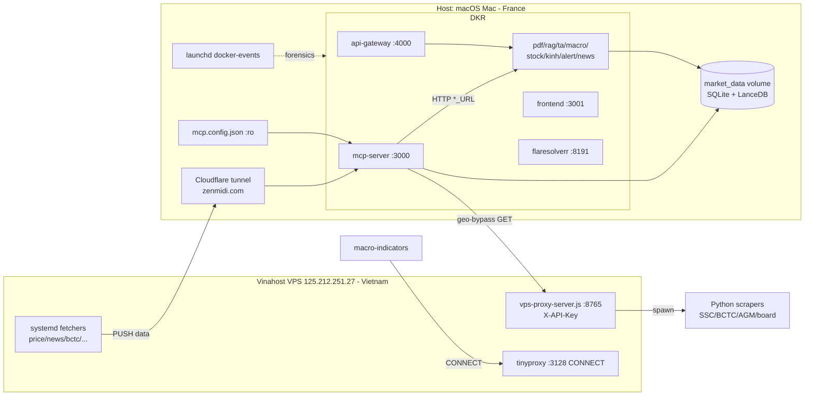

# Shared Packages & Deployment Infrastructure

> Zone id: `shared-and-infra` — the "plumbing" layer of the VN-Market-Intelligence-MCP monorepo.
> Covers the cross-service shared libraries (`packages/*`), the Docker/compose deployment topology,
> nginx + SSL + Cloudflare-tunnel edge, the Vinahost VPS geo-block proxy, launchd watchdogs, and
> host-side helper scripts.

## Purpose & business need

The platform is a Vietnamese stock-market intelligence system. Almost every authoritative VN data
source (SSC company-disclosure portal, HOSE/HNX BCTC financial-statement PDFs, the government
procurement portal `muasamcong.mpi.gov.vn`, SBV/Vietcombank FX, NSO/Customs macro) is **geo-blocked
or NXDOMAIN outside Vietnam** — and the operator runs from France (`docs/.../user_location.md`). This
zone is what makes the rest of the system physically able to fetch real VN data and serve it to the
operator:

- **Shared packages** (`packages/primitives`, `packages/shared-config`, `packages/shared-db`,
  `packages/shared-types`) are the intended single-source-of-truth contracts/config across the
  microservice fleet. They are currently **Phase-0 stubs** (see Gotchas).
- **Deployment infra** (`docker-compose.yml`, `nginx.conf`, `ssl/`, `launchd/`) wires the 11-service
  Docker fleet, the public edge (`zenmidi.com` via Cloudflare tunnel), and the macOS-host watchdogs
  that keep the gateway alive.
- **VPS proxy** (`vps-scripts/`) is a Vietnam-resident Vinahost VPS (`125.212.251.27`) that runs an
  HTTP proxy + a fleet of systemd fetchers, bypassing the geo-block so the in-France containers can
  reach VN-only sources. **Without this zone the whole "real fetched data, no fake data" standing
  goal is impossible.**

## Tech stack

| Concern | Tech |
| --- | --- |
| Shared packages | TypeScript, run natively under **Bun** (`tsconfig.json` `noEmit:true`, `types:["bun-types"]`); ESM (`"type":"module"`) |
| Workspace mgmt | **pnpm 9** workspaces (`pnpm-workspace.yaml` globs `apps/*`, `packages/*`); Bun also used per-package (`bun.lock`) |
| Orchestration | **Docker Compose v3.9** (`docker-compose.yml`), Docker named volumes |
| Edge / reverse proxy | **nginx** (`nginx.conf`) + self-signed **TLS** (`ssl/cert.pem`, `ssl/key.pem`, CN=`zenmidi.com`) + **Cloudflare tunnel** |
| VPS proxy server | **Node.js** core `http`/`https` (no framework) — `vps-scripts/vps-proxy-server.js` |
| VPS fetchers | **bash** loops + **Python** scrapers (Playwright/requests), wired as **systemd** `.service`/`.timer` units |
| Host watchdogs | macOS **launchd** plists (`launchd/*.plist`), `socat`, `newsyslog` rotation |
| Helper scripts | bash, TypeScript (Bun), Python; orchestration filters in **jq** |

## Entry points

- **Shared-package exported APIs** (all `index.ts`, `exports` map in each `package.json`):
  - `@vn-market/shared-config` → `loadMcpConfig(baseDir?)`, `getMcpConfig()` (lazy singleton), `resetMcpConfigCache()`, interface `McpConfig` — `packages/shared-config/index.ts`.
  - `@vn-market/shared-db` → const `SHARED_DB_VERSION`, const `DB_SCHEMA_MODULES`, type `DbSchemaModule` — `packages/shared-db/index.ts`.
  - `@vn-market/shared-types` → interfaces `Alert`, `Signal`, `ExtractPDFRequest/Response`, `ComputeTARequest/Response`, `SearchRequest`, `SearchResult`, `ServiceHealth` — `packages/shared-types/index.ts`.
- **Deployment entry**: `docker compose up -d` reads `docker-compose.yml` (prod) merged optionally with `docker-compose.dev.yml` (dev). `npm`/`pnpm` root scripts in `package.json`: `test`, `test:all`, `build`, `check`.
- **VPS proxy HTTP server**: `http.createServer` → `server.listen(PORT, "0.0.0.0")` (default `8765`) in `vps-scripts/vps-proxy-server.js`; routes dispatched by `handleRequest(req,res)`.
- **VPS systemd units** (installed by `scripts/deploy-vinahost.sh`): `vn-vps-proxy.service`, `vn-price-fetch.service`, `vn-news-fetch.service`, `vn-bctc-fetch.service`, `vn-sbv-fetch.service`, `vn-foreign-flow.service`, `vn-tradingeconomics-fetch.service`, `vn-agm-plan.service`, `vn-board-details.service`, plus `.timer` units `vn-ohlcv-backfill.timer`, `vn-bctc-enrich.timer`.
- **Host launchd agents**: `com.vn-market.docker-events` (Docker daemon event logging), `com.vn-market.socat-bridge` (TCP 4000→3000 bridge, now superseded — see Gotchas).
- **git pre-push hook**: `scripts/git-hooks/pre-push` (installed via `scripts/git-hooks/install.sh`).

## Architecture & key modules

### Shared packages (`packages/`)

| File | Role |
| --- | --- |
| `packages/shared-config/index.ts` | Loader for `mcp.config.json` (the one config file shared by all services). `loadMcpConfig()` reads `<cwd>/mcp.config.json` via `node:fs`, throws if missing/invalid; `getMcpConfig()` caches in module-level `_cached`. Interface `McpConfig` types `server`/`logging`/`data`/`embedding` plus open `[key:string]:unknown`. |
| `packages/shared-db/index.ts` | Schema-module registry only. `DB_SCHEMA_MODULES` enumerates the 8 SQLite schema slices that live in `apps/mcp-server/src/infrastructure/db/schema-*.ts` (`schema-alerts`, `schema-briefings`, `schema-financial-reports`, `schema-macro`, `schema-market-data`, `schema-news`, `schema-portfolio`, `schema-system`). No runtime DB code — a **stub** for future service extraction. |
| `packages/shared-types/index.ts` | Inter-service DTO contracts intended as SSOT across TS/Python(JSON-schema)/Go(OpenAPI). Defines `Alert`, `Signal`, PDF-extract, TA, RAG-search, and `ServiceHealth` shapes. **Stub** — not yet imported by services. |
| `packages/primitives/technical-analysis/` | Empty placeholder — only a `bun.lock` + `node_modules`; **no source files**. Reserved for a future shared TA primitive. |

### Deployment topology (`docker-compose.yml`)

The compose file declares **11 services** + **3 named volumes**. `mcp-server` is the TypeScript/Bun
core; every other service is a domain microservice it fans out to via in-network DNS
(`http://<service>:<port>`). See the service/port/volume table below.

| File | Role |
| --- | --- |
| `docker-compose.yml` | Prod fleet definition — services, ports, named volumes, env, healthchecks, CPU/mem limits, labels. |
| `docker-compose.dev.yml` | Dev override (ENV-ISOLATION EI-P2). Overrides **only** `mcp-server`: `container_name vn-market-mcp-dev`, port `3099:3000`, `APP_ENV=dev`, `DB_PATH=/app/data/market.dev.db`, `LANCEDB_PATH=/app/data/lancedb.dev`. Merge-only: `docker compose -f docker-compose.yml -f docker-compose.dev.yml up -d`. |
| `mcp.config.json` | **Central runtime config** (loaded by `@vn-market/shared-config`). Mounted read-only into `mcp-server` and `news-fetch`. Holds watchlist, reference stocks per sector, alert thresholds, fetcher URLs/rate-limits, RAG decay, circuit-breaker, deepFetch caps, etc. |
| `.env` / `.env.example` | Secrets + cron schedules + VPS connection vars. `.env` is `env_file` for `mcp-server`, `macro-indicators`, `alert-engine`. |
| `nginx.conf` | Edge reverse proxy (HTTP:80 + HTTPS:443). Upstreams `mcp_backend`(mcp-server:3000), `api_gateway`(api-gateway:4000). Path map below. |
| `ssl/cert.pem`, `ssl/key.pem` | Self-signed TLS for nginx 443. CN=`zenmidi.com`, O=`VN Market Intelligence`, valid 2026-05-05 → 2027-05-05. |

### Edge: nginx + Cloudflare tunnel

`nginx.conf` defines identical route maps on `:80` and `:443`. Path → upstream:

| Path prefix | Upstream | Notes |
| --- | --- | --- |
| `/` | `api_gateway` (4000) | default route |
| `/mcp/` | `mcp_backend` (3000) | strips `/mcp/` prefix |
| `/vn-market/` | `mcp_backend` (3000) | the Cloudflare-tunnel public prefix; matches `CLOUDFLARE_PATH_PREFIX=/vn-market` env on mcp-server |
| `/gateway/` | `api_gateway` (4000) | |
| `/webhook` | `mcp_backend` (3000) | Telegram webhook (`proxy_read_timeout 60`) |
| `/health` | static `200 "nginx healthy"` | |

Cloudflare passes `CF-Connecting-IP`/`CF-IPCountry` headers (origin validation). `proxy_buffering off` +
`proxy_read_timeout 86400` keep MCP/SSE streams alive. Public hostname is `zenmidi.com`; the Telegram
webhook is `zenmidi.com/vn-market/webhook` (memory: telegram_webhook_cloudflare_routing). **Note:** nginx
is NOT a compose service — it is a host/standalone concern (see Gotchas); production currently routes
the Cloudflare tunnel directly to `mcp-server:3000`.

### VPS geo-block proxy (`vps-scripts/`)

`vps-proxy-server.js` is a single-file Node HTTP server on Vinahost (Vietnam IP `125.212.251.27:8765`)
that bypasses VN geo-blocks. `handleRequest()` dispatches on URL prefix:

| Endpoint (`/proxy/...`) | Upstream / action | Backing code |
| --- | --- | --- |
| `/proxy/ssc-iboard/...` | `https://iboard-query.ssc.vn` (`IBOARD_UPSTREAM`) | inline `fetchUpstream()` |
| `/proxy/ssc-insider` | SSC insider-transaction `ketquagiaodich.jspx` | inline |
| `/proxy/muasamcong[?path=]` | `https://muasamcong.mpi.gov.vn` procurement portal | inline |
| `/proxy/bctc-discover/:ticker` | runs `discover-bctc-urls-browser.py` (Playwright) | `runDiscoverScript()` |
| `/proxy/article-body?url=` | runs `article-body-fetcher.py`; domain-whitelist `cafef.vn`/`vneconomy.vn`/`vnexpress.net` | `runArticleBodyScript()` |
| `/proxy/agm-plan?ticker=|batch=` (≤30) | runs `vietstock-agm-plan.py` (planned revenue/profit targets) | `runAgmPlanScript()` |
| `/proxy/board-details?ticker=|batch=` (≤33) | runs `vietstock-board-details.py` (officer appointment years) | `runBoardDetailsScript()` |
| `/bctc-files/:code/:filename` | static-serve cached BCTC PDFs from `BCTC_CACHE_DIR` (`/root/bctc-cache`) | inline static handler |

**Auth**: every endpoint requires header `X-API-Key` matching `VPS_API_KEY`/`VPS_PUSH_API_KEY`
(`API_KEY` const). If the key is unset the server logs a warning and accepts all requests (insecure).
401 returned on mismatch (`jsonResponse(res,401,...)`). `vps-lib.sh` provides the shared bash logging
(`log_info/log_step/log_push/log_done`) and the `LOG_ROTATE_BYTES=10MB` rotation cap sourced by all
fetcher scripts.

### Host watchdogs (`launchd/`)

| Plist | Role |
| --- | --- |
| `com.vn-market.docker-events.plist` | Runs `docker events --format {{json .}}`, `RunAtLoad`, `KeepAlive` on crash, logs to `/usr/local/var/log/docker-events.log`. Forensic event capture (Docker's in-memory buffer expires <13h). Rotated by `docker-events-newsyslog.conf` (30 archives, 50 MB, daily, bzip2). |
| `com.vn-market.socat-bridge.plist` | `socat TCP-LISTEN:4000,fork → TCP:127.0.0.1:3000`. Band-aid bridge so host :4000 forwards to mcp-server. **Superseded** (api-gateway now owns :4000 via compose — `docs/OPERATOR-ALERT-SOCAT-FIX.md`). |

### Host helper scripts (`scripts/`)

239 files; **194 are `.jq`** router/PO orchestration-board mutation filters (belong to the
orchestration zone, not infra). The genuine infra helpers:

- `scripts/deploy-vinahost.sh` — installs all 9 VPS systemd services + Python CLI scrapers to Vinahost over SSH (requires `VINAHOST_IP`, `VINAHOST_PASSWORD`, `VPS_PUSH_API_KEY` in `.env`).
- `scripts/maybe-deploy-vps.sh` — conditional VPS redeploy gate: triggers only if `git diff HEAD~1` touches `^vps-scripts/` or `deploy-vinahost.sh`; `--dry-run` supported.
- `scripts/verify-deploy-sha.sh` — deploy gate: asserts a running container's `vn.market.git_sha` image label == HEAD; exportable `compare_shas()` (unit-tested, no Docker). Skips `flaresolverr` (pulled image, no label).
- `scripts/preflight-disk.sh` — fails `docker compose up` if Docker disk free < 15 GB (RCA 1958 cold-start hang).
- `scripts/git-hooks/pre-push` + `install.sh` — pre-push runs `pnpm --filter vn-market check` (tsc from `apps/mcp-server`, not root — fixes phantom-OK bug 1873f); installed as a symlink. Bypass only via `PRE_PUSH_SKIP_TSC=1`.
- `scripts/fb-jargon-gate.sh` — deterministic Vietnamese-jargon pre-publish gate for FB posts.
- `scripts/migrations/*.ts` — Bun one-shot DB migrations/repairs (e.g. `repair-ohlcv-scale-corruption.ts`, `create-signals-db.ts`, `reparse-bctc-reports.ts`).
- `scripts/gen-*.ts` — SSOT generators (`gen-project-stats.ts`, `gen-tool-registry.ts`, `gen-que-descriptions.ts`).

## Service / port / volume table (`docker-compose.yml`)

| Service | Build context / lang | Host:Container ports | Volumes | Key env | Mem/CPU limit |
| --- | --- | --- | --- | --- | --- |
| `mcp-server` | `apps/mcp-server/Dockerfile` (TS/Bun) | `3000:3000`, `4004:3000` | `market_data`, `./data/pdfs`, `mcp.config.json:ro`, `./reports`, `./docs/agent-memory`, `./docs/data`, `./docs/signals`, ssh key→`/run/secrets/vps_ssh_key`, `bctc-page-images` | `DB_PATH=/app/data/market.db`, `COORDINATION_DB_PATH=.../coordination.db`, all `*_URL` siblings, `SSC_IBOARD_BASE_URL`/`BCTC_DISCOVER_URL`/`MUASAMCONG_VPS_PROXY_URL`→VPS:8765, `VPS_HOST=125.212.251.27`, `CLOUDFLARE_PATH_PREFIX=/vn-market`, REFINE_* | 2g / 2.0 |
| `pdf-extractor` | `apps/pdf-extractor` (Python/PEK) | `5001:5001` | `market_data`, `./data/pdfs:ro`, `pek_model_cache`, `bctc-page-images` | `DB_PATH=.../pdf_extractor.db`, `MCP_SERVER_URL`, PEK model-cache dirs, `BCTC_RASTER_DPI=150` | 2.5g / 2.0 (raised for Tesseract — ARCH-A20) |
| `rag-service` | `apps/rag-service` (Python) | `5002:5002` | `market_data` | `LANCEDB_PATH=/app/data/lancedb`, `DB_PATH=.../rag_service.db`, `EMBEDDING_CACHE_DIR=/opt/model-cache` | 768m / 1.0 |
| `technical-analysis` | `apps/technical-analysis` (Go) | `5003:5003` | `market_data` | `DB_PATH=.../market.db`, `DB_READONLY=true` | 512m / 0.75 |
| `macro-indicators` | `apps/macro-indicators` (Python) | `5004:5004` | `market_data` | `DB_READONLY=true`, `COMMODITY_LIVE_MODE=true`, **`VPS_HTTP_HOST=125.212.251.27`/`VPS_HTTP_PORT=3128`** (tinyproxy CONNECT proxy for NSO/SBV/Customs) | 1.5g / 0.5 |
| `stock-price` | `apps/stock-price` (Python) | `5010:5000` | `market_data` | `DB_PATH=.../market.db`, `STOCK_PRICE_DB_PATH`, `VPS_HOST` | 512m / 0.75 |
| `api-gateway` | `apps/api-gateway` (Go) | `4000:4000` | `system-map.json:ro`→`/etc/system-map/` | all `*_URL` siblings, `SYSTEM_MAP_PATH`, `NOT_DEPLOYED_SERVICES=` | 512m / 0.75 |
| `kinh-dich-service` | `apps/kinh-dich-service` | `5005:5005` | `market_data` | `DB_READONLY=true`, `PRICE_HISTORY_URL=http://api-gateway:4000` | 512m / 0.75 |
| `alert-engine` | `apps/alert-engine` | `5006:5006` | `market_data` | `ALERT_ENGINE_DB_PATH=.../alert_engine.db` | 512m / 0.75 |
| `news-fetch` | `apps/news-fetch` | `5008:5008` | `market_data:ro`, `mcp.config.json:ro` | `DB_READONLY=true`, `MCP_CONFIG_PATH` | 1g / 0.75 |
| `frontend` | `apps/frontend` (Remix) | `3001:3001` | — | `API_GATEWAY_URL`, `MCP_SERVER_BASE_URL`; `depends_on: api-gateway` | 512m / 0.75 |
| `flaresolverr` | `ghcr.io/flaresolverr/flaresolverr:latest` (pulled) | `8191:8191` | — | `shm_size:1g`, Cloudflare-challenge solver | 512m / 0.5 |

**Named volumes** (all `driver: local`): `market_data` (shared SQLite + LanceDB, the system's SSOT
data plane), `pek_model_cache` (PDF-Extract-Kit / HuggingFace / PaddleOCR / YOLO weights),
`bctc-page-images` (rasterized BCTC page PNGs, mounted at `/data/bctc-page-images`).

## Feature-by-feature breakdown

### 1. Centralized config loading (`@vn-market/shared-config`)
- **Business purpose**: one config file (`mcp.config.json`) drives watchlist, alert thresholds, fetcher rate-limits, RAG decay across the whole fleet — never hardcode.
- **Path**: service calls `getMcpConfig()` → `loadMcpConfig(process.cwd())` → `readFileSync("mcp.config.json")` → `JSON.parse` → cached in `_cached`. Mounted read-only into `mcp-server` & `news-fetch` (`./mcp.config.json:/app/mcp.config.json:ro`).
- **Edge cases**: throws if file missing/invalid (fail-loud); `resetMcpConfigCache()` exists for tests. Singleton means a config edit needs a container restart to take effect.

### 2. Geo-block bypass via VPS proxy
- **Business purpose**: containers run in France; SSC iboard (`iboard-query.ssc.vn`) is NXDOMAIN outside VN, BCTC PDFs/muasamcong/insider are geo-blocked. The Vinahost VPS sits inside Vietnam and proxies these.
- **Path**: `mcp-server` env `SSC_IBOARD_BASE_URL=http://125.212.251.27:8765/proxy/ssc-iboard` (and `BCTC_DISCOVER_URL`, `MUASAMCONG_VPS_PROXY_URL`) → HTTP GET to `vps-proxy-server.js` with `X-API-Key` → `handleRequest()` either `fetchUpstream()` (iboard/insider/muasamcong) or spawns a Python scraper (`runDiscoverScript`/`runAgmPlanScript`/`runBoardDetailsScript`/`runArticleBodyScript`) → JSON back to container → SQLite write into `market_data`.
- **Two distinct proxy channels**: (a) the **app HTTP proxy on :8765** (`vps-proxy-server.js`, X-API-Key auth) for SSC/BCTC/AGM/board/article; (b) a separate **tinyproxy HTTP-CONNECT proxy on :3128** (`VPS_HTTP_HOST`/`VPS_HTTP_PORT` on `macro-indicators`) for NSO/SBV/Customs macro fetches (installed 2026-06-15, VPS-AVAIL-02-FIX). Do not conflate them.
- **Side-effects/deps**: VPS also runs **push fetchers** (`vn-price-fetch`, `vn-news-fetch`, `vn-foreign-flow`, etc.) that periodically `PUSH` data INTO the MCP server at `zenmidi.com` — i.e. data flows both pull (container→VPS) and push (VPS→container). `flaresolverr` (compose) solves Cloudflare JS-challenges for sources the VPS can't.

### 3. Public edge & Telegram webhook (nginx + Cloudflare + SSL)
- **Business purpose**: expose the MCP server + Telegram webhook to the public internet behind `zenmidi.com` without opening the home/host firewall.
- **Path**: Cloudflare tunnel → (nginx `:443` TLS, when used) → `/vn-market/*`→mcp-server:3000, `/gateway/*`→api-gateway:4000, `/webhook`→mcp-server:3000. SSE/MCP streams kept open via `proxy_buffering off` + 86400s read timeout.
- **Edge cases**: self-signed cert (CN zenmidi.com) — Cloudflare must be in non-strict origin mode. Webhook uses a shorter 60s timeout. `CF-Connecting-IP`/`CF-IPCountry` forwarded for origin validation.

### 4. Host resilience watchdogs (launchd)
- **Business purpose**: the operator's 16 GB Mac is the production host; if Docker/the gateway dies the whole fleet goes dark. launchd auto-restarts critical processes.
- **Path**: `com.vn-market.docker-events` persists daemon events for forensics (RunAtLoad/KeepAlive, newsyslog 30-day rotation); `com.vn-market.socat-bridge` historically bridged host:4000→3000 (now superseded by api-gateway owning :4000).
- **Edge cases**: socat plist documented but **not installed** in `~/Library/LaunchAgents` (per OPERATOR-ALERT-SOCAT-FIX). Host memory panics if too many heavy workflows run at once (memory: host_memory_panic) — Docker is capped at 8 GB.

### 5. Deploy gates & SHA verification
- **Business purpose**: prevent silent "code changed but container not rebuilt" drift (a recurring false-green class in memory).
- **Path**: after a dev code change → ops rebuilds container → `verify-deploy-sha.sh <service>` reads the running image's `vn.market.git_sha` label, compares to HEAD via `compare_shas()`; `maybe-deploy-vps.sh` redeploys VPS only when `vps-scripts/` changed; `preflight-disk.sh` blocks `up` under disk pressure; `pre-push` git hook runs `pnpm --filter vn-market check` to stop tracked-imports-untracked-file breakage.

## Data stores

- **`market_data` (named volume)** — the SSOT data plane, mounted by 9 services. Contains the SQLite DBs and LanceDB. Per-service DB files (compose env): `market.db` (OHLCV/candles/market data — the most-read DB), `coordination.db` (`COORDINATION_DB_PATH`, task/lock coordination), `pdf_extractor.db`, `rag_service.db` (+ `lancedb/` for RAG embeddings, 384-dim `Xenova/paraphrase-multilingual-MiniLM-L12-v2`), `stock_price.db`, `alert_engine.db`. Read-only mounts (`DB_READONLY=true`) on technical-analysis, macro-indicators, kinh-dich, news-fetch.
- **Schema slices** registered in `packages/shared-db/index.ts` `DB_SCHEMA_MODULES`: alerts, briefings, financial-reports, macro, market-data, news, portfolio, system — source at `apps/mcp-server/src/infrastructure/db/schema-*.ts`.
- **`pek_model_cache` (named volume)** — PDF-Extract-Kit weights (HuggingFace/ModelScope/YOLO/PaddleOCR), avoids re-downloading multi-GB model weights on rebuild.
- **`bctc-page-images` (named volume)** — rasterized BCTC financial-statement page PNGs (`BCTC_RASTER_DPI=150`).
- **Host bind-mounts**: `./reports` (generated analysis reports), `./docs/data` (orch-state, system-map, dashboards), `./docs/agent-memory`, `./docs/signals`, `./data/pdfs`.
- **VPS-side**: `BCTC_CACHE_DIR=/root/bctc-cache` (cached BCTC PDFs served at `/bctc-files/`); `bctc_vps_queue.source_url` rows point at `http://<VPS_IP>:8765/bctc-files/...`.
- **Note (decoy)**: host `./market.db` and host `./data/*.db` are mostly stale/0-row decoys — the **live** data is inside the `market_data` named volume (memory: live_db_is_named_volume_not_host_data).

## External integrations

- **Vinahost VPS** (`125.212.251.27`, root SSH) — geo-block bypass; two proxy ports (`:8765` app proxy, `:3128` tinyproxy CONNECT). SSH key mounted at `/run/secrets/vps_ssh_key` from `~/.ssh/id_rsa`. Used by the `restart_vps_service` MCP tool (`sshExec.ts`).
- **Cloudflare tunnel** → `zenmidi.com` public hostname; routes `/vn-market/*` to mcp-server, `/webhook` to Telegram handler.
- **Telegram** — webhook `zenmidi.com/vn-market/webhook`; bot config in `mcp.config.json.telegram` (token/channel IDs blank in repo, supplied via `.env`); 3 channels (MARKET/WORK/BUG).
- **VN data sources** (via VPS): SSC iboard, SSC insider, muasamcong procurement, HOSE/HNX BCTC PDFs, Vietstock AGM-plan & board-details, cafef/vnexpress/vneconomy article bodies. Direct (non-geo-blocked) sources in `mcp.config.json.fetchers`: VNDirect finfo API, HNX snapshot API, Yahoo Finance (Brent/gold/USDVND), Vietcombank FX XML, Trading Economics, Polymarket CLOB/Gamma.
- **claude.ai MCP gateway** — the `vn-market` server is reached only through the gateway `call_tool` wrapper, not registered in `.mcp.json` (which is intentionally empty `{"mcpServers":{}}`) to keep the tool surface small (CLAUDE.md).
- **flaresolverr** (compose service `:8191`) — Cloudflare JS-challenge solver for protected sources.

## Cross-zone interactions

- **mcp-server → sibling microservices**: in-Docker-network HTTP via `*_URL` env (`PDF_EXTRACTOR_URL`, `RAG_SERVICE_URL`, `TA_SERVICE_URL`, `MACRO_INDICATORS_URL`, `KINH_DICH_URL`, `ALERT_ENGINE_URL`, `STOCK_PRICE_URL`, `GATEWAY_URL`). All resolve via Docker DNS service names.
- **api-gateway → fleet**: Go routing layer (`:4000`) fans out to every service `*_URL`; reads `system-map.json` (`/etc/system-map/system-map.json:ro`) for service topology; `NOT_DEPLOYED_SERVICES` env lets it return graceful 503 for intentionally-undeployed services.
- **Shared DB plane**: all services share the `market_data` volume → cross-service coupling on `market.db` (writers: mcp-server, stock-price, alert-engine; readers: TA, macro, kinh-dich, news-fetch). Two tools reading the SAME `market.db` can still see different row counts mid-write (memory: same_db_tools_diverge_rowcount) — a known trap.
- **VPS push fetchers → mcp-server**: systemd loops on the VPS POST data to `zenmidi.com` (ingest endpoints), and mcp-server pulls from the VPS `:8765` proxy. Bidirectional.
- **Shared packages → services**: `@vn-market/shared-config` is the only one with live consumers (config load). `shared-db`/`shared-types`/`primitives` are Phase-0 stubs with **no current importers** (confirmed: `grep @vn-market/shared` across `apps/` returns no source imports).
- **frontend (Remix :3001) → api-gateway/mcp-server** for dashboard data.

## Gotchas — must know before changing

1. **`packages/shared-db`, `shared-types`, and `primitives/technical-analysis` are stubs.** `shared-db` is a module-name registry (no runtime code); `shared-types` DTOs are not imported by any service; `primitives/technical-analysis` has **only a `bun.lock`** (no `.ts`). Do not assume changing these affects runtime — they are placeholders for future Phase-1–3 service extraction. The real schema lives in `apps/mcp-server/src/infrastructure/db/schema-*.ts`.
2. **`@vn-market/shared-config` is a lazy singleton.** A change to `mcp.config.json` requires a container restart — `getMcpConfig()` caches the first read in `_cached`. The file is mounted `:ro`, so it cannot be hot-edited from inside the container.
3. **nginx is NOT a compose service.** `nginx.conf` + `ssl/` exist but no `nginx` entry is in `docker-compose.yml`. Production routes the Cloudflare tunnel **directly to `mcp-server:3000`** (per OPERATOR-ALERT-SOCAT-FIX). Adding nginx to the fleet is a topology change, not a config tweak.
4. **socat bridge is superseded/obsolete.** `com.vn-market.socat-bridge.plist` is in-repo but NOT installed; api-gateway owns `:4000` via compose. Don't "fix" the socat bridge — it's dead by design (`docs/OPERATOR-ALERT-SOCAT-FIX.md`). A false "VPS /api 502 → socat" diagnosis is a known recurring trap.
5. **Two different VPS proxies on two ports.** `:8765` = the app HTTP proxy (`vps-proxy-server.js`, `X-API-Key` auth, SSC/BCTC/AGM/board/article). `:3128` = tinyproxy HTTP-CONNECT (NSO/SBV/Customs macro). Mixing up the port or auth model breaks fetches.
6. **VPS proxy is an open proxy if `VPS_API_KEY` is unset.** `vps-proxy-server.js` logs a warning but accepts ALL requests. Article-body is domain-whitelisted (`cafef.vn`/`vneconomy.vn`/`vnexpress.net`) to avoid being a general open proxy; keep that whitelist.
7. **Self-signed TLS (CN=zenmidi.com).** `ssl/cert.pem` is self-signed and expires **2027-05-05**; Cloudflare origin must run in flexible/full(non-strict) mode. Renewal is a manual step.
8. **CPU cgroup quotas are load-bearing.** `pdf-extractor` `cpus:2.0` is a deliberate fix (ARCH-A20): a 1-core CFS quota was consumed entirely by the Tesseract `ProcessPoolExecutor` child, starving uvicorn → `/health` timeout. Lowering it re-breaks healthchecks. Host has only 6 Docker-VM CPUs and an 8 GB Docker cap — over-provisioning starves the gateway (memory: overparallel_fanout_host_starvation).
9. **pre-push hook runs tsc from `apps/mcp-server`, not root.** Running `tsc` at repo root compiles 0 files and exits 0 (phantom OK, bug 1873f) because root `tsconfig.json` `include:["src/**/*"]` has no root `src/`. A red tsc hook strands ALL pushes for the fleet (memory: red_prepush_strands_fleet) — run `pnpm check` before relying on push.
10. **Live data is in the `market_data` named volume, not host files.** Host `./market.db` (0 bytes) and most host `./data/*.db` are stale decoys. Query the live DB via a `keinos/sqlite3` sidecar against the volume.
11. **`docker-compose.yml.backup`, `.bak`, `.patch` exist** alongside the live `docker-compose.yml` — edit only `docker-compose.yml`. The `.backup`/`.bak` are not consumed by compose.
12. **Dev and prod must never run simultaneously** (`docker-compose.dev.yml` header): 16 GB Mac / 8 GB Docker cap. Dev override is merge-only and overrides only `mcp-server` (port 3099, `market.dev.db`); the env-isolation assertion lives in `apps/mcp-server/src/infrastructure/envCheck.ts`.
13. **`scripts/` is 80% jq orchestration filters**, not infra. The 194 `.jq` files are router/PO board-mutation filters (a different zone). Only the `.sh`/`.ts`/`.py` helpers listed above are infra.

## Internal flow (Mermaid)

