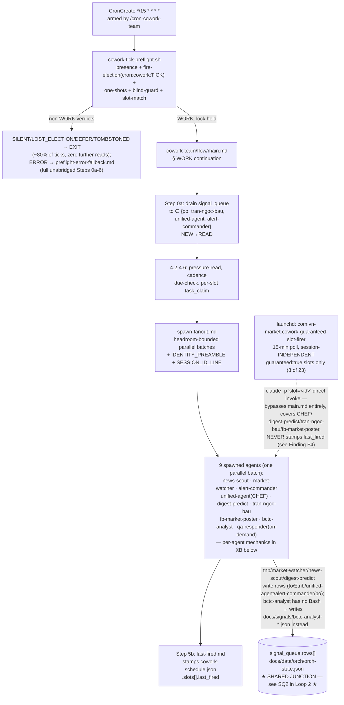
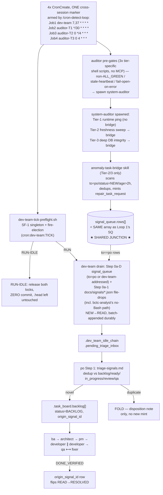

# Cowork-Team + Detect-Loop Orchestration Fabric — Flow Review

**Author:** agents-architect · **Date:** 2026-08-22 · **Trigger:** user_request (ad-hoc, observe-and-report)
**Scope:** (1) cowork-team master dispatcher loop, (2) anomaly-detection → dev-team-planning loop, their intersection, and a live correctness check. No wiring was changed — this is observation only.

---

## A) Diagram — both loops + the shared junction

Two independently-rendered diagrams (not one combined graph) — a single combined diagram put LOOP1/LOOP2 side-by-side and fanned one node into 10 parallel edges, which is what made the original render far wider than a normal screen. Each diagram below is a single narrow chain (max 2 nodes at any rank — verified by tracing dagre's rank assignment, not eyeballed). `SQ` (Loop 1) and `SQ2` (Loop 2) are the **same physical node** — `docs/data/orch/orch-state.json` `.signal_queue.rows[]` — split across the two blocks only because mermaid can't share a node across separate diagrams; that split is the one piece of topology worth re-stating in prose: Loop 1 *writes* to it, Loop 2 *reads from* it (`to==po` rows only) and also *writes* back to it (the anomaly-task-bridge's `repair_task_request`).

### Loop 1 — cowork-team dispatch (session-scoped, every 15 min)

### Loop 2 — anomaly-detection → dev-team planning (4 session-scoped crons)

---

## B) What each agent actually does on its turn

**cowork-team dispatcher (`main.md`).** Step 0 runs `cowork-tick-preflight.sh` *before any LLM read* — the script itself does presence registration, the fire-time election (`task_claim` on `cron:cowork:<TICK>`), claims due one-shot scheduled tasks, checks gateway-blind, and matches due slots against `cowork-schedule.json`. On `SILENT`/`LOST_ELECTION`/`DEFER`/`TOMBSTONED` the tick ends immediately (~80% of ticks never open `main.md` at all — this is the WU-2 token-economy design). On `WORK` (election won), the LLM continues at "§ WORK continuation": drains `.signal_queue.rows[]` for the 4 cowork-addressed recipients, treats the script's already-matched slots as `MATCHES` (re-running only the collision guard, never re-claiming), reads pressure-state/cadence, and fans out to `spawn-fanout.md`. Every spawned agent gets an `IDENTITY_PREAMBLE` (anti off-flow-latch guard — a prior incident had a spawn silently fall back to running the *router's* CLAUDE.md protocol instead of its own flow) and a `SESSION_ID_LINE` (the dispatcher's own resolved session id, injected as a literal string because some leaf agents have no Bash to resolve `$CLAUDE_CODE_SESSION_ID` themselves). Fan-out is headroom-bounded (batches of `MAX_PARALLEL`, computed from host load/memory), guaranteed slots always fill batch 1.

**news-scout / alert-commander / qa-responder / bctc-analyst (dispatchers).** Each is a thin (~20-180L) dispatcher: a mandatory `SELF-IDENTITY GUARD` (explicitly telling the spawned leaf worker that the router's "never execute, always delegate" rule does *not* apply to it — it must run the flow, not describe it), then a single hand-off to its own `cycle.md`. bctc-analyst additionally carries a deterministic post-pass Escalation Gate (ESC-1..ESC-5 — balance-sheet imbalance, OCF/NPAT divergence, related-party concentration, low refine-confidence); any TRUE fire, gated by a 24h `task_claim` idempotency guard, writes a signal *file* (not `signal_queue` — this agent has no Bash and cannot run `orch-apply.sh`) addressed `to: "dev-team"`, `type: "esc-deep-dive-request"`.

**market-watcher (dispatcher).** The one dispatcher with real routing logic: it reads `slot=<id>` from the spawn prompt *first* and routes on slot identity, never re-deriving from wall-clock (a 2026-07-21 incident had a late-firing EOD slot drift outside its window and silently fall through to the wrong sub-flow). Only a slot-less manual/ad-hoc invocation falls back to the UTC clock-window table.

**digest-predict / tran-ngoc-bau / fb-market-poster (published-marker-gated).** Each runs a two-phase publish gate: Phase-1 is a cheap read-only `task_list_held(kind="cowork-slot")` probe against a `published:<slot>:<period>` key (daily cadence → calendar-day key; weekly cadence → ISO-week `periodKey` — mixing the two silently no-ops 5/6 fires of a daily job, a real fixed incident, `FIX-CADENCE-TNB-AUDIT-WEEKLY-MARKER-BLOCKS-DAILY-CRON`). Phase-2 (the actual `task_claim`) happens deep inside the sub-flow, immediately before the one irreversible action (`send_telegram(channel="market")` or the post write) — deliberately moved there in a 2026-08-14 pass after 4 agents were found claiming the marker too early and self-blocking their own retries.

**unified-agent (CHEF).** Pure UTC-clock dispatcher, 4 fixed windows (morning/intraday/EOD/evening); any other time is an immediate `EXIT`. All synthesis work lives in `chef.md`'s 8 recipe steps, not the dispatcher.

**fb-market-poster.** VN-day-of-week mode router (DAILY Mon–Fri / WEEKLY_RECAP Sat / WEEKLY_PREDICTION Sun) plus a hard-coded PRIVACY GUARD (bans first-person portfolio/position language on the public FB page) enforced by a pre-write gate inside each mode's own sub-flow.

**anomaly-task-bridge (invoked inline by system-auditor Tier-2/Tier-3 only, never Tier-1).** Reads the *same* `.signal_queue.rows[]` — specifically rows `to=="po"`, `status=="NEW"`, `type ∈ {microservice_degraded, data_stale, db_integrity_breach, system_issue}`, aged **older than 2h** (i.e. rows the system already emitted that nobody triaged in time). Dedups against `task_list_held` + the open task_board lanes, then mints a *new* `repair_task_request` row back into the same array, addressed `to: "po"`. This is a self-referential escalation loop: it both reads and writes the identical structure dev-team's own drain services.

**dev-team dispatcher.** `dev-team-tick-preflight.sh` resolves SF-1 (per-session singleton) and the fire-election (`cron:dev-team:<tick>`) *before* any LLM read. On `RUN` it jumps straight past `main.md`'s own re-derivation of those locks. On `RUN-IDLE` (signal_queue NEW rows + signals.db freshness + `active_sprints` all empty/fresh) it releases both locks and commits **nothing** — `.head` is left untouched on this path, which matters for reading `.head.updated_at` as a liveness signal (see Finding F2). `drain-signals.md` §0a-D is the mirror image of cowork-team's own Step 0a: it claims each `to=="po"`-or-dev-team-addressed `NEW` row (`task_kind="dashboard-row"`), batches them, and durably appends the *whole batch* to `.dev_team_idle_chain.pending_triage_inbox` in one CAS-guarded `orch-apply.sh` write, flipping the source rows `NEW→READ` in that *same* write (closes an append-succeeded/flip-failed race a two-write design would leave open). `docs/signals/*.json` file-drops (§0a-1, the bctc-analyst path and any agent's fallback) feed the *same* durable inbox through a separate fingerprint-dedup file-plane drain.

**po Step 1 (`triage-signals.md`).** The sole authoritative handler for every routed type, including `repair_task_request`. Dedup scans the 5 *non-terminal lanes* (`backlog[]`+`ready[]`+`in_progress[]`+`review[]`+`qa[]`) — explicitly never a status-token enum, which was measured live to miss 62.4% of open rows. If novel, mints a canonical `.task_board.backlog[]` row with `status: "BACKLOG"` and an `origin_signal_id` back-reference; that back-reference is what flips the originating signal row `READ→RESOLVED` once the resulting FIX task reaches `DONE_VERIFIED`, closing the loop.

---

## C) Correctness review

Legend: **CONFIRMED** = independently verified this cycle against live state or source files. **SUSPECTED** = plausible from doc-reading alone, not independently verified.

**F1 — CONFIRMED: the hypothesis holds, with one precision the docs don't state up front.**
`docs/data/orch/orch-state.json` `.signal_queue.rows[]` is genuinely the shared junction — verified by reading `drain-signals.md`'s routing table and `anomaly-task-bridge/SKILL.md` side by side: both read/write the identical array. But the overlap is *scoped*, not total: rows addressed `to ∈ {tran-ngoc-bau, unified-agent, alert-commander}` are consumed entirely inside Loop 1 by cowork-team's own Step 0a and never touched by dev-team. Only `to=="po"` rows (including every `repair_task_request` the anomaly-task-bridge mints) actually cross into Loop 2. The user's hypothesis is correct; "the whole queue is shared" would have been an overstatement.

**F2 — CONFIRMED (live read, 2026-08-22T16:16 UTC): the queue currently has an un-drained backlog, and the loops were both silent for a multi-day window.**
At read time, `.signal_queue.rows[]` held 3 `status:"NEW"` rows dated 2026-08-14T19:57Z (`to: agents-architect` — see F5), 2026-08-15T20:44Z (`to: po`), and 2026-08-18T08:51Z (`to: dev-team`), plus 4 more `status:"OPEN"` rows `to:"ops"` dated 2026-08-14, none drained. `.head.updated_at` = 2026-08-15T09:25:10Z (7 days stale at read time). `docs/data/dev-team-idle-widen-state.json.updated_at` = 2026-08-18T11:56:31Z. None of the 23 rows in `docs/data/cowork-schedule.json` show a `last_fired` after 2026-08-15T09:04:34Z. system-auditor's own notebook (cycle c104, committed today) states verbatim: *"Fleet Status: Host was dark 4 days (last commit 2026-08-18), now 2026-08-22 — normal routine tick."* All four independent data points corroborate the same already-catalogued pattern (memory: `project_host_suspension_causes_multiday_cron_silence_backlog_flush`) — the host was suspended, both session-scoped loops went silent for the outage window, and the rows above are the currently-unflushed backlog from that gap. This is real, presently-open state, not a hypothetical.

**F3 — CONFIRMED (live `task_list_held`): both loops' cross-session registration markers are freshly held right now, but I could not independently verify the underlying `CronList` entries.**
`cron-registration:cowork-team` and `cron-registration:detect-loop` were both re-claimed ~9 minutes before this check (~16:07 UTC today) — almost certainly this session's or a sibling's session-start re-arm. That confirms the *registration layer* is fresh as of now. It does **not** prove the actual OS-level `CronCreate` entries exist and match canonical cadence/prompt text — `CronCreate`/`CronList`/`CronDelete` are Claude-Code-CLI-native, session-scoped tools with no MCP-server route, and this Task-spawned review agent has no access path to them (the same limitation the codebase's own preflight scripts document — that's *why* the re-arm logic has to be LLM-narrated from the cron prompt text itself, never script-verified). Registration-marker freshness: CONFIRMED. Actual `CronList` presence/correctness: SUSPECTED only.

**F4 — CONFIRMED (read `scripts/agents-flow/cowork-guaranteed-slot-firer.sh` + its live log): the guaranteed-slot launchd backstop is real, independent, and was actively bridging the outage — but it silently desyncs the schedule's own bookkeeping.**
The `com.vn-market.cowork-guaranteed-slot-firer` launchd job (15-min `StartInterval`, session-independent) covers only `guaranteed:true` slots (8 of 23) by invoking `claude -p 'slot=<id>'` directly, bypassing `cowork-team/flow/main.md` entirely. Its own log shows a successful fire today, 2026-08-22T13:29–13:35Z (`fb-weekend`, exit_code=0, "weekend recap posted... publish marker held for today") — genuinely bridging part of the outage window from F2. But `cowork-guaranteed-slot-firer.sh` never writes `last_fired` (grepped, zero references) — that write belongs solely to the primary dispatcher's `spawn-fanout.md`→`last-fired.md` step, which this backstop path never runs. Confirmed directly against the live file: `fb-weekend.last_fired` still reads `2026-08-08T13:24:06Z` despite the slot demonstrably firing and publishing today. `cowork-schedule.json.slots[].last_fired` is therefore **not trustworthy as a "is this pipeline alive" signal** for guaranteed slots during any window where the launchd backstop, not the primary dispatcher, is doing the work. Low severity (duplicate-publish is independently protected by the published-marker gate in B above, so no double-post occurred) but a genuine observability gap — recommend a follow-up dev task to have the firer script (or the spawned flow itself) stamp `last_fired` too.

**F5 — CONFIRMED (direct read): a signal addressed to this very agent (`agents-architect`) has sat unread for 8 days, and its content is directly relevant to this review's own subject matter.**
Row `po-20260814T195709` (`from: po`, `to: agents-architect`, `status: NEW`, ts 2026-08-14T19:57:09Z): *"Step 2.4 cowork probe: 28h marker TTL > 24h cadence blocks all 5 daily slots every day — 2 live blocks today."* This appears to be the origin of the already-catalogued memory item `feedback_step24_cowork_collision_probe_ttl_exceeds_cadence_daily_false_positive` — so the *substance* may already be informally tracked, but the formal `signal_queue` row itself was never marked `READ`/`RESOLVED`. That is itself a minor process gap (informal memory-note resolution without closing the formal signal) worth a note, separate from this brief's main subject. Not actioned here — recommend a follow-up architecture/PO cycle to formally close or re-open it.

**F6 — CONFIRMED (direct read of both files): a stale doc contradiction in `anomaly-task-bridge/SKILL.md`, not a live functional bug.**
`.claude/skills/anomaly-task-bridge/SKILL.md` §ATB-4b still documents the `.task_board.backlog[]` shape with `status: "TODO"`, citing PO's `triage-signals.md` as "the exact template" — but `triage-signals.md`'s real template mints `status: "BACKLOG"`, and explicitly says why: `orchStateSchema.ts`'s `LANE_ALLOWED_STATUSES.backlog` only permits `{BACKLOG, BLOCKED}`; `TODO` is rejected by the validator (see the adjacent fix note `FIX-PO-TRIAGE-SIGNALS-CIRED-TEMPLATE-STATUS-TODO-REJECTED-BY-VALIDATOR`). PO's actual behavior follows the corrected template, so this is not live-broken — but the stale ATB-4b line could mislead a future reader into "fixing" PO back to a rejected value. Recommend a one-line doc fix, not urgent.

**F7 — SUSPECTED, not resolved: the exact recipient set for dev-team's drain scope is undocumented.**
`drain-signals.md` defines its scope as "rows where `to` matches `po` or any dev-team-addressed agent," but — unlike cowork-team's own Step 0a, which cites a concrete `jq`-derived set from `system-map.json` — no file I found gives an enumerated set for "dev-team-addressed agent." The 4 `to:"ops"` rows sitting since 2026-08-14 (F2) may or may not be in scope; `ops` is a real dev-team-lane agent per `dev-team/flow/main.md`'s own Team Boundary table, so plausibly yes, but I could not locate the authoritative predicate to confirm either way. Flagging as an open question, not asserting a defect.

**F8 — No structural dead-end found in the cowork→dev-team direction.**
Every cowork agent that needs dev-team action has a documented, working path to it — either `signal_queue.rows[]` (for agents with Bash/MCP write access) or the `docs/signals/*.json` file-drop convention (mandatory for the one gateway-less agent, bctc-analyst) — and both terminate at the same durable inbox and PO triage. I did not find a signal type emitted anywhere in the fleet that is absent from both `drain-signals.md`'s routing table and `triage-signals.md`'s live-inbox table.

**Bottom line.** The *documented mechanics* of both loops check out — Loop 1 and Loop 2 are genuinely mirror-image drains on the same shared array, scoped by recipient so they never fight over the same row, and the anomaly-task-bridge → `repair_task_request` → PO → `.task_board.backlog[]` chain does close, with a real back-reference (`origin_signal_id`) that closes the loop again on `DONE_VERIFIED`. The live *state* at review time shows the multi-day host-suspension backlog (F2) that the fleet is still catching up from, a real (if low-severity) bookkeeping gap in the guaranteed-slot launchd backstop (F4), and two small doc-staleness items (F5 discovery aside, F6) — none of which are wiring defects. No fixes were applied; F4, F5, F6, F7 are recommended as follow-up tasks for a future agent-father/developer/PO cycle, not touched here.
