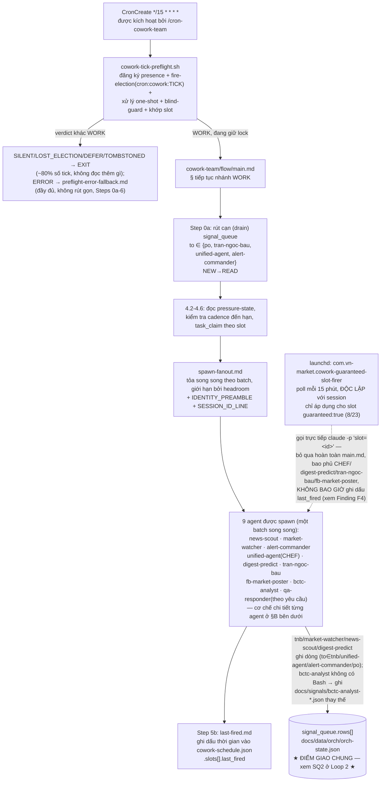
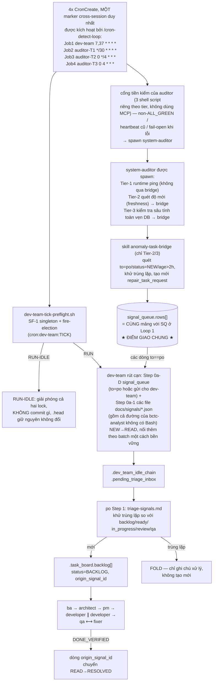

# Hạ Tầng Điều Phối Cowork-Team + Detect-Loop — Rà Soát Luồng Vận Hành

> *Đây là bản dịch tiếng Việt của bản gốc tiếng Anh tại `docs/architecture-briefs/2026-08-22-cowork-detect-loop-flow-review.md` — bản gốc mới là nguồn tham chiếu chính thức (source of truth); bản dịch này chỉ phục vụ đọc tham khảo.*

**Tác giả:** agents-architect · **Ngày:** 2026-08-22 · **Kích hoạt:** user_request (đột xuất, chỉ quan sát và báo cáo)
**Phạm vi:** (1) vòng lặp điều phối chính của cowork-team, (2) vòng lặp anomaly-detection → dev-team-planning, điểm giao nhau giữa hai vòng lặp, và một lượt kiểm tra tính đúng đắn trên trạng thái sống (live). Không có thay đổi nào đối với hệ thống dây nối (wiring) — đây chỉ là quan sát.

---

## A) Sơ đồ — cả hai vòng lặp + điểm giao chung

Hai sơ đồ được render độc lập (không phải một graph gộp chung) — bản gộp chung ban đầu đặt LOOP1/LOOP2 cạnh nhau (side-by-side) và tỏa một node ra 10 cạnh song song, đó chính là lý do bản gốc render rộng hơn nhiều so với một màn hình thông thường. Mỗi sơ đồ dưới đây là một chuỗi hẹp đơn (tối đa 2 node ở bất kỳ rank nào — đã xác minh bằng cách truy vết cách gán rank của dagre, không phải ước lượng bằng mắt). `SQ` (Loop 1) và `SQ2` (Loop 2) là **cùng một node vật lý** — `docs/data/orch/orch-state.json` `.signal_queue.rows[]` — bị tách thành hai khối chỉ vì mermaid không thể chia sẻ một node giữa các sơ đồ riêng biệt; sự tách này là điểm cấu trúc (topology) duy nhất đáng nhắc lại bằng văn xuôi: Loop 1 *ghi (writes)* vào đó, Loop 2 *đọc (reads)* từ đó (chỉ các dòng `to==po`) và cũng *ghi ngược lại* vào đó (`repair_task_request` của anomaly-task-bridge).

### Loop 1 — Điều phối cowork-team (giới hạn theo session, mỗi 15 phút)

### Loop 2 — anomaly-detection → lập kế hoạch dev-team (4 cron giới hạn theo session)

---

## B) Từng agent thực sự làm gì trong lượt của mình

**Dispatcher cowork-team (`main.md`).** Step 0 chạy `cowork-tick-preflight.sh` *trước khi đọc bất kỳ nội dung nào bằng LLM* — bản thân script này thực hiện đăng ký presence, bầu chọn thời điểm bắn (fire-time election, `task_claim` trên `cron:cowork:<TICK>`), claim các one-shot scheduled task đến hạn, kiểm tra gateway-blind, và khớp các slot đến hạn với `cowork-schedule.json`. Với `SILENT`/`LOST_ELECTION`/`DEFER`/`TOMBSTONED`, tick kết thúc ngay lập tức (~80% số tick không bao giờ mở `main.md` — đây là thiết kế tiết kiệm token WU-2). Với `WORK` (thắng bầu chọn), LLM tiếp tục tại "§ tiếp tục nhánh WORK": rút cạn `.signal_queue.rows[]` cho 4 người nhận thuộc cowork, coi các slot đã được script khớp sẵn là `MATCHES` (chỉ chạy lại collision guard, không claim lại), đọc pressure-state/cadence, rồi tỏa (fan out) sang `spawn-fanout.md`. Mỗi agent được spawn đều nhận một `IDENTITY_PREAMBLE` (cơ chế chống việc agent lạc sang chạy nhầm flow khác — một sự cố trước đây có một lượt spawn âm thầm quay về chạy protocol CLAUDE.md của *router* thay vì flow của chính nó) và một `SESSION_ID_LINE` (session id của chính dispatcher đã resolve, được chèn vào dưới dạng chuỗi literal vì một số agent lá không có Bash để tự resolve `$CLAUDE_CODE_SESSION_ID`). Việc tỏa (fan-out) bị giới hạn bởi headroom (theo batch `MAX_PARALLEL`, tính từ tải/bộ nhớ của host), các slot guaranteed luôn được xếp vào batch đầu tiên.

**news-scout / alert-commander / qa-responder / bctc-analyst (các dispatcher).** Mỗi agent là một dispatcher mỏng (~20-180 dòng): có một `SELF-IDENTITY GUARD` bắt buộc (nói rõ với leaf worker được spawn rằng quy tắc "không bao giờ tự thực thi, luôn delegate" của router *không* áp dụng cho nó — nó phải thực sự chạy flow, không chỉ mô tả), sau đó bàn giao (hand-off) duy nhất một lần sang `cycle.md` của chính nó. Riêng bctc-analyst còn mang một Escalation Gate xác định (deterministic) chạy sau các pass (ESC-1..ESC-5 — mất cân đối bảng cân đối kế toán, phân kỳ OCF/NPAT, tập trung bên liên quan, độ tin cậy refine thấp); bất kỳ điều kiện nào bật TRUE, được chặn bởi một `task_claim` idempotency guard 24 giờ, sẽ ghi ra một *file* tín hiệu (không phải `signal_queue` — agent này không có Bash và không thể chạy `orch-apply.sh`) gửi tới `to: "dev-team"`, `type: "esc-deep-dive-request"`.

**market-watcher (dispatcher).** Đây là dispatcher duy nhất có logic định tuyến (routing) thực sự: nó đọc `slot=<id>` từ prompt spawn *trước tiên* và định tuyến theo identity của slot, không bao giờ suy ra lại từ đồng hồ hệ thống (wall-clock) — một sự cố ngày 2026-07-21 từng có một slot EOD bắn trễ, trôi ra ngoài khung giờ của nó và âm thầm rơi (fall through) sang nhầm sub-flow. Chỉ khi được gọi thủ công/ad-hoc mà không có slot mới quay lại dùng bảng khung giờ UTC.

**digest-predict / tran-ngoc-bau / fb-market-poster (được chặn bởi published-marker).** Mỗi agent chạy một cổng xuất bản (publish gate) 2 pha: Pha 1 là một lượt dò (probe) rẻ, chỉ đọc, `task_list_held(kind="cowork-slot")` trên một khóa `published:<slot>:<period>` (cadence hàng ngày → khóa theo ngày lịch; cadence hàng tuần → `periodKey` theo tuần ISO — lẫn lộn hai loại này sẽ âm thầm khiến 5/6 lần bắn của một job hàng ngày thành no-op, một sự cố có thật đã được sửa, `FIX-CADENCE-TNB-AUDIT-WEEKLY-MARKER-BLOCKS-DAILY-CRON`). Pha 2 (`task_claim` thực sự) xảy ra sâu bên trong sub-flow, ngay trước hành động không thể đảo ngược duy nhất (`send_telegram(channel="market")` hoặc ghi bài đăng) — được cố tình chuyển tới đó trong một đợt sửa ngày 2026-08-14 sau khi phát hiện 4 agent claim marker quá sớm và tự chặn (self-block) chính các lần retry của mình.

**unified-agent (CHEF).** Là một dispatcher thuần theo đồng hồ UTC, 4 khung giờ cố định (morning/intraday/EOD/evening); bất kỳ thời điểm nào khác đều `EXIT` ngay. Toàn bộ công việc tổng hợp (synthesis) nằm trong 8 bước "công thức" (recipe steps) của `chef.md`, không nằm trong dispatcher.

**fb-market-poster.** Là một router chế độ (mode) theo ngày-trong-tuần giờ VN (DAILY Thứ 2–6 / WEEKLY_RECAP Thứ 7 / WEEKLY_PREDICTION Chủ nhật), kèm một PRIVACY GUARD được hard-code (cấm ngôn ngữ danh mục/vị thế ở ngôi thứ nhất trên trang FB công khai), được thực thi bởi một cổng kiểm tra trước khi ghi (pre-write gate) bên trong sub-flow riêng của từng chế độ.

**anomaly-task-bridge (được system-auditor gọi inline, chỉ ở Tier-2/Tier-3, không bao giờ ở Tier-1).** Đọc *cùng* `.signal_queue.rows[]` — cụ thể là các dòng `to=="po"`, `status=="NEW"`, `type ∈ {microservice_degraded, data_stale, db_integrity_breach, system_issue}`, đã tồn tại **quá 2 giờ** (tức các dòng hệ thống đã phát ra mà chưa ai triage kịp). Khử trùng lặp (dedup) dựa trên `task_list_held` + các lane đang mở của task_board, sau đó tạo mới một dòng `repair_task_request` ghi ngược lại vào chính mảng đó, gửi tới `to: "po"`. Đây là một vòng leo thang (escalation) tự tham chiếu: nó vừa đọc vừa ghi lên đúng cấu trúc mà chính drain của dev-team phục vụ.

**Dispatcher dev-team.** `dev-team-tick-preflight.sh` resolve SF-1 (singleton theo từng session) và fire-election (`cron:dev-team:<tick>`) *trước khi* LLM đọc bất cứ gì. Với `RUN`, nó nhảy thẳng qua bước `main.md` tự resolve lại các lock đó. Với `RUN-IDLE` (signal_queue không có dòng NEW + signals.db còn mới + `active_sprints` đều trống/mới), nó giải phóng cả hai lock và **không commit gì cả** — `.head` được giữ nguyên không đổi trên nhánh này, điều này quan trọng khi đọc `.head.updated_at` như một tín hiệu "còn sống" (xem Finding F2). `drain-signals.md` §0a-D là hình ảnh phản chiếu của chính Step 0a bên cowork-team: nó claim từng dòng `NEW` có `to=="po"` hoặc gửi cho dev-team (`task_kind="dashboard-row"`), gom thành batch, rồi nối thêm (append) *cả batch* một cách bền vững vào `.dev_team_idle_chain.pending_triage_inbox` trong một lượt ghi `orch-apply.sh` được bảo vệ CAS, đồng thời chuyển các dòng nguồn `NEW→READ` trong *cùng* lượt ghi đó (đóng lại một race append-thành-công/flip-thất-bại mà thiết kế 2 lượt ghi sẽ để hở). Các file `docs/signals/*.json` (§0a-1, đường của bctc-analyst và fallback của mọi agent khác) cũng đổ vào *cùng* inbox bền vững đó, qua một đường drain riêng ở mặt phẳng file, khử trùng lặp bằng fingerprint.

**po Step 1 (`triage-signals.md`).** Đây là handler có thẩm quyền duy nhất cho mọi loại tín hiệu được định tuyến tới, kể cả `repair_task_request`. Việc dedup quét 5 *lane chưa kết thúc (non-terminal)* (`backlog[]`+`ready[]`+`in_progress[]`+`review[]`+`qa[]`) — rõ ràng không bao giờ dùng một enum trạng thái (status-token), vì cách đó đã được đo thực tế là bỏ sót 62.4% số dòng đang mở. Nếu là dòng mới, nó tạo một dòng `.task_board.backlog[]` chuẩn với `status: "BACKLOG"` và một tham chiếu ngược `origin_signal_id`; chính tham chiếu ngược đó sẽ chuyển dòng tín hiệu gốc `READ→RESOLVED` khi task FIX tương ứng đạt `DONE_VERIFIED`, khép lại vòng lặp.

---

## C) Rà soát tính đúng đắn

Chú giải: **CONFIRMED** (đã xác nhận) = đã được kiểm chứng độc lập trong lượt này, đối chiếu với trạng thái sống (live) hoặc file nguồn. **SUSPECTED** (nghi ngờ/chưa xác nhận) = hợp lý dựa trên việc đọc tài liệu, nhưng chưa được kiểm chứng độc lập.

**F1 — CONFIRMED: giả thuyết đúng, nhưng có một điểm chính xác hơn mà tài liệu không nói rõ ngay từ đầu.**
`docs/data/orch/orch-state.json` `.signal_queue.rows[]` thực sự là điểm giao chung — đã kiểm chứng bằng cách đọc song song bảng định tuyến của `drain-signals.md` và `anomaly-task-bridge/SKILL.md`: cả hai đều đọc/ghi trên cùng một mảng. Nhưng phần chồng lấn này *có phạm vi giới hạn*, không phải toàn bộ: các dòng gửi tới `to ∈ {tran-ngoc-bau, unified-agent, alert-commander}` được tiêu thụ hoàn toàn bên trong Loop 1 bởi chính Step 0a của cowork-team và không bao giờ được dev-team đụng tới. Chỉ các dòng `to=="po"` (kể cả mọi `repair_task_request` do anomaly-task-bridge tạo ra) mới thực sự vượt sang Loop 2. Giả thuyết của người dùng là đúng; nói "cả hàng đợi đều được chia sẻ" sẽ là nói quá.

**F2 — CONFIRMED (đọc trạng thái sống lúc 2026-08-22T16:16 UTC): hàng đợi hiện đang tồn đọng chưa được rút cạn, và cả hai vòng lặp đều im lặng trong một khoảng nhiều ngày.**
Tại thời điểm đọc, `.signal_queue.rows[]` có 3 dòng `status:"NEW"` với ts 2026-08-14T19:57Z (`to: agents-architect` — xem F5), 2026-08-15T20:44Z (`to: po`), và 2026-08-18T08:51Z (`to: dev-team`), cộng thêm 4 dòng `status:"OPEN"` gửi `to:"ops"` với ts 2026-08-14, tất cả đều chưa được rút cạn. `.head.updated_at` = 2026-08-15T09:25:10Z (đã cũ 7 ngày tại thời điểm đọc). `docs/data/dev-team-idle-widen-state.json.updated_at` = 2026-08-18T11:56:31Z. Không có dòng nào trong 23 dòng của `docs/data/cowork-schedule.json` có `last_fired` sau 2026-08-15T09:04:34Z. Chính notebook của system-auditor (chu kỳ c104, đã commit hôm nay) ghi nguyên văn: *"Fleet Status: Host was dark 4 days (last commit 2026-08-18), now 2026-08-22 — normal routine tick."* (Tình trạng hạ tầng: máy chủ ngừng hoạt động 4 ngày, lần commit cuối 2026-08-18, giờ là 2026-08-22 — một tick bình thường). Cả bốn điểm dữ liệu độc lập này đều củng cố cho cùng một mẫu hình đã được ghi nhận từ trước (memory: `project_host_suspension_causes_multiday_cron_silence_backlog_flush`) — máy chủ đã bị treo/ngủ (suspend), cả hai vòng lặp giới hạn theo session đều im lặng trong suốt cửa sổ gián đoạn đó, và các dòng nêu trên chính là phần tồn đọng chưa được xả (unflushed) từ khoảng gián đoạn đó. Đây là trạng thái thật, đang mở tại thời điểm hiện tại, không phải một giả định.

**F3 — CONFIRMED (qua `task_list_held` trạng thái sống): marker đăng ký cross-session của cả hai vòng lặp hiện đang được giữ mới, nhưng tôi không thể tự kiểm chứng độc lập các mục `CronList` bên dưới.**
`cron-registration:cowork-team` và `cron-registration:detect-loop` đều mới được claim lại (re-claimed) ~9 phút trước lượt kiểm tra này (~16:07 UTC hôm nay) — gần như chắc chắn là do chính session này hoặc một session anh em (sibling) re-arm lúc khởi động session. Điều này xác nhận *lớp đăng ký (registration layer)* đang mới ngay tại thời điểm hiện tại. Nhưng điều đó **không** chứng minh rằng các mục `CronCreate` thực tế ở cấp hệ điều hành có tồn tại và khớp đúng cadence/nội dung prompt chuẩn — `CronCreate`/`CronList`/`CronDelete` là các tool thuộc riêng Claude-Code-CLI, giới hạn theo session, không có đường kết nối qua MCP-server, và agent rà soát được Task-spawn này không có đường truy cập tới chúng (đúng giới hạn mà chính các preflight script trong codebase đã ghi lại — đó cũng là *lý do* logic re-arm phải được LLM tự thuật lại (narrated) từ nội dung prompt của cron, chứ không bao giờ được script xác minh). Độ mới của marker đăng ký: CONFIRMED. Sự tồn tại/tính đúng đắn thực tế của `CronList`: chỉ SUSPECTED.

**F4 — CONFIRMED (đọc `scripts/agents-flow/cowork-guaranteed-slot-firer.sh` + log trạng thái sống của nó): cơ chế dự phòng (backstop) launchd cho guaranteed-slot là có thật, độc lập, và đã thực sự bắc cầu qua đợt gián đoạn — nhưng nó âm thầm làm lệch (desync) sổ sách của chính cowork-schedule.**
Job launchd `com.vn-market.cowork-guaranteed-slot-firer` (`StartInterval` 15 phút, độc lập với session) chỉ bao phủ các slot `guaranteed:true` (8/23) bằng cách gọi trực tiếp `claude -p 'slot=<id>'`, bỏ qua hoàn toàn `cowork-team/flow/main.md`. Log của chính nó cho thấy một lượt bắn thành công hôm nay, 2026-08-22T13:29–13:35Z (`fb-weekend`, exit_code=0, "đã đăng recap cuối tuần... publish marker đã được giữ cho hôm nay") — thực sự đã bắc cầu qua một phần cửa sổ gián đoạn ở F2. Nhưng `cowork-guaranteed-slot-firer.sh` không bao giờ ghi `last_fired` (đã grep, không có tham chiếu nào) — việc ghi đó thuộc riêng về bước `spawn-fanout.md`→`last-fired.md` của dispatcher chính, mà đường backstop này không bao giờ chạy qua. Đã xác nhận trực tiếp trên file trạng thái sống: `fb-weekend.last_fired` vẫn đọc là `2026-08-08T13:24:06Z` dù slot đó rõ ràng đã bắn và đăng bài hôm nay. Vì vậy `cowork-schedule.json.slots[].last_fired` **không đáng tin cậy như một tín hiệu "pipeline này còn sống"** cho các slot guaranteed trong bất kỳ khoảng thời gian nào mà backstop launchd, chứ không phải dispatcher chính, là bên đang làm việc. Mức độ nghiêm trọng thấp (việc đăng trùng đã được bảo vệ độc lập bởi published-marker gate ở mục B phía trên, nên không có việc đăng trùng nào xảy ra) nhưng là một lỗ hổng quan sát (observability gap) có thật — khuyến nghị một task dev follow-up để script firer (hoặc chính flow được spawn) cũng ghi dấu `last_fired`.

**F5 — CONFIRMED (đọc trực tiếp): một tín hiệu gửi đích danh cho chính agent này (`agents-architect`) đã nằm chưa đọc suốt 8 ngày, và nội dung của nó liên quan trực tiếp tới chủ đề của chính bài rà soát này.**
Dòng `po-20260814T195709` (`from: po`, `to: agents-architect`, `status: NEW`, ts 2026-08-14T19:57:09Z): *"Step 2.4 cowork probe: 28h marker TTL > 24h cadence blocks all 5 daily slots every day — 2 live blocks today."* (Step 2.4 cowork probe: TTL marker 28 giờ > cadence 24 giờ khiến cả 5 slot hàng ngày bị chặn mỗi ngày — 2 lần chặn đang xảy ra hôm nay). Đây có vẻ là nguồn gốc của mục memory đã được ghi nhận từ trước `feedback_step24_cowork_collision_probe_ttl_exceeds_cadence_daily_false_positive` — nên *bản chất vấn đề* có thể đã được theo dõi một cách không chính thức, nhưng bản thân dòng `signal_queue` chính thức thì chưa bao giờ được đánh dấu `READ`/`RESOLVED`. Bản thân đó là một lỗ hổng quy trình nhỏ (xử lý qua ghi chú memory không chính thức mà không đóng tín hiệu chính thức) đáng ghi chú lại, tách biệt khỏi chủ đề chính của brief này. Không xử lý ở đây — khuyến nghị một chu kỳ architecture/PO tiếp theo để đóng chính thức hoặc mở lại nó.

**F6 — CONFIRMED (đọc trực tiếp cả hai file): một mâu thuẫn tài liệu đã cũ trong `anomaly-task-bridge/SKILL.md`, không phải một lỗi chức năng đang sống.**
`.claude/skills/anomaly-task-bridge/SKILL.md` §ATB-4b vẫn mô tả hình dạng `.task_board.backlog[]` với `status: "TODO"`, dẫn chiếu `triage-signals.md` của PO là "template chính xác" — nhưng template thực tế trong `triage-signals.md` lại tạo `status: "BACKLOG"`, và nói rõ lý do: `LANE_ALLOWED_STATUSES.backlog` trong `orchStateSchema.ts` chỉ cho phép `{BACKLOG, BLOCKED}`; `TODO` bị validator từ chối (xem ghi chú fix liền kề `FIX-PO-TRIAGE-SIGNALS-CIRED-TEMPLATE-STATUS-TODO-REJECTED-BY-VALIDATOR`). Hành vi thực tế của PO đi theo template đã sửa đúng, nên đây không phải lỗi đang xảy ra sống — nhưng dòng ATB-4b đã cũ có thể khiến một người đọc sau này hiểu lầm và "sửa" PO quay lại một giá trị bị từ chối. Khuyến nghị sửa tài liệu một dòng, không gấp.

**F7 — SUSPECTED, chưa được xác định: tập người nhận chính xác cho phạm vi drain của dev-team chưa được ghi thành tài liệu.**
`drain-signals.md` định nghĩa phạm vi của nó là "các dòng mà `to` khớp `po` hoặc bất kỳ agent nào thuộc dev-team," nhưng — khác với chính Step 0a của cowork-team, vốn dẫn chiếu một tập cụ thể được suy ra bằng `jq` từ `system-map.json` — tôi không tìm thấy file nào liệt kê rõ tập "agent thuộc dev-team". 4 dòng `to:"ops"` đã nằm đó từ 2026-08-14 (F2) có thể thuộc phạm vi này hoặc không; `ops` là một agent thực sự thuộc lane dev-team theo đúng bảng Team Boundary của `dev-team/flow/main.md`, nên khả năng là có, nhưng tôi không tìm được vị từ (predicate) có thẩm quyền để xác nhận theo hướng nào. Đánh dấu đây là một câu hỏi còn để mở, không khẳng định đây là lỗi.

**F8 — Không tìm thấy điểm cụt (dead-end) mang tính cấu trúc theo chiều cowork→dev-team.**
Mọi cowork agent cần dev-team hành động đều có một đường đi đã được ghi tài liệu và hoạt động thực sự — hoặc qua `signal_queue.rows[]` (với agent có quyền ghi Bash/MCP) hoặc qua quy ước thả file `docs/signals/*.json` (bắt buộc với agent duy nhất không có gateway, bctc-analyst) — và cả hai đường đều kết thúc tại cùng một inbox bền vững và cùng đi qua triage của PO. Tôi không tìm thấy loại tín hiệu (signal type) nào được phát ra ở bất kỳ đâu trong toàn hệ thống mà lại vắng mặt trong cả bảng định tuyến của `drain-signals.md` lẫn bảng inbox sống của `triage-signals.md`.

**Kết luận.** *Cơ chế đã được ghi trong tài liệu* của cả hai vòng lặp là đúng — Loop 1 và Loop 2 thực sự là hai lượt rút cạn (drain) đối xứng nhau (mirror-image) trên cùng một mảng dùng chung, được giới hạn theo người nhận (recipient) nên không bao giờ tranh chấp trên cùng một dòng, và chuỗi anomaly-task-bridge → `repair_task_request` → PO → `.task_board.backlog[]` thực sự khép kín, với một tham chiếu ngược thật (`origin_signal_id`) khép lại vòng lặp lần nữa khi đạt `DONE_VERIFIED`. *Trạng thái sống* tại thời điểm rà soát cho thấy phần tồn đọng nhiều ngày do host bị suspend (F2) mà toàn hệ thống vẫn đang bắt kịp, một lỗ hổng sổ sách có thật (dù mức độ nghiêm trọng thấp) ở cơ chế dự phòng launchd cho guaranteed-slot (F4), và hai mục tài liệu đã cũ nhỏ (phát hiện đi kèm F5, và F6) — không mục nào trong số này là lỗi hệ thống dây nối (wiring). Không có sửa chữa nào được áp dụng; F4, F5, F6, F7 được khuyến nghị là các task follow-up cho một chu kỳ agent-father/developer/PO trong tương lai, chưa được đụng tới ở đây.
